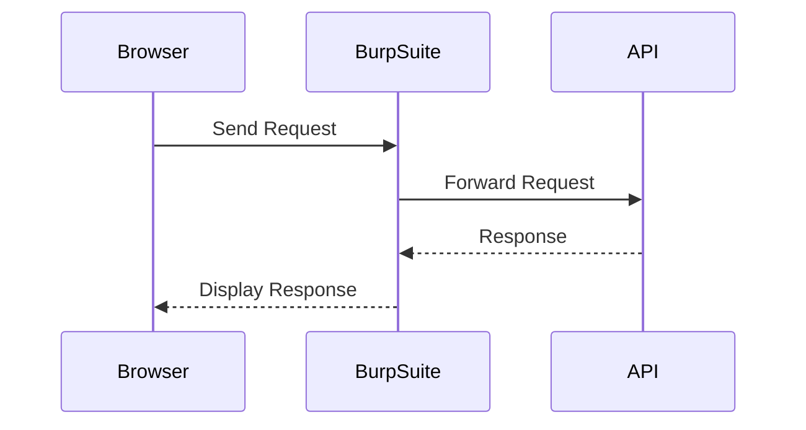

## Introduction to Hidden API Functionality Exposure

Hidden API functionality exposure refers to the scenario where certain functionalities or endpoints within an API are not publicly documented but can still be accessed. This can lead to security vulnerabilities as attackers may discover and exploit these hidden endpoints. In this chapter, we will delve into the details of hidden API functionality exposure, including its causes, potential impacts, and methods to prevent and defend against such vulnerabilities.

### What is an API?

An Application Programming Interface (API) is a set of protocols, routines, and tools for building software applications. APIs specify how software components should interact. They define the methods and data formats that can be used to request services from an operating system, application, or other service.

### Why Hidden API Functionality Exposure Matters

Hidden API functionality exposure is significant because it can expose sensitive operations or data that were not intended to be accessible. Attackers can exploit these hidden endpoints to perform unauthorized actions, access confidential information, or even cause denial of service (DoS).

#### Real-World Example: CVE-2021-21972

In 2021, a vulnerability was discovered in the Jenkins Continuous Integration server (CVE-2021-21972). This vulnerability allowed attackers to execute arbitrary code by exploiting hidden API endpoints. The attackers could bypass authentication mechanisms and gain full control over the Jenkins instance. This demonstrates the severe consequences of hidden API functionality exposure.

### How Hidden API Functionality Exposure Works

Hidden API functionality exposure typically occurs due to the following reasons:

1. **Incomplete Documentation**: Developers may forget to document certain endpoints or functionalities.
2. **Legacy Code**: Old codebases might contain unused or undocumented endpoints.
3. **Development Mistakes**: Developers might inadvertently leave debugging or testing endpoints active in production environments.
4. **Third-Party Libraries**: Third-party libraries or frameworks might introduce hidden endpoints.

### Detecting Hidden API Endpoints

To detect hidden API endpoints, security professionals often use tools like Burp Suite, which includes features such as Repeater and Intruder. These tools help in identifying and testing various endpoints to determine if they are accessible and what kind of data they return.

#### Using Burp Suite to Detect Hidden Endpoints

Let's walk through an example using Burp Suite to detect hidden API endpoints.

1. **Setup Burp Suite**:
    - Install and configure Burp Suite.
    - Set up your browser to use Burp Suite as a proxy.

2. **Capture Traffic**:
    - Navigate to the API endpoints you suspect might be hidden.
    - Capture the HTTP traffic in Burp Suite.

3. **Use Repeater**:
    - Select a captured request in the Proxy tab.
    - Right-click and choose "Send to Repeater".
    - Modify the request to test different endpoints.

4. **Use Intruder**:
    - Select a captured request in the Proxy tab.
    - Right-click and choose "Send to Intruder".
    - Configure the Intruder to test various payloads.

Here is an example of a Burp Suite Intruder setup:



### Example Scenario

Let's consider a scenario where we are testing an API for hidden endpoints. Suppose we have already identified two endpoints: `/users` and `/admin`.

1. **Initial Setup**:
    - Capture the request to `/users` and `/admin` in Burp Suite.
    - Use the Repeater to modify the request and test other potential endpoints.

2. **Using Intruder**:
    - Set up Intruder to test various payloads for the `/admin` endpoint.
    - Add payloads like `admin/somepath`, `admin/anotherpath`, etc.

Here is an example of a full HTTP request and response:

```http
POST /admin HTTP/1.1
Host: example.com
Content-Type: application/json
Authorization: Bearer <token>

{
    "action": "list"
}
```

Response:

```http
HTTP/1.1 200 OK
Date: Mon, 23 Jan 2023 12:00:00 GMT
Content-Type: application/json
Content-Length: 1024

{
    "data": [
        {
            "id": 1,
            "name": "Admin User",
            "role": "admin"
        }
    ]
}
```

### Common Pitfalls and Mistakes

1. **Overlooking Legacy Code**: Developers might overlook old or unused code that introduces hidden endpoints.
2. **Incomplete Testing**: Insufficient testing can lead to undiscovered hidden endpoints.
3. **Misconfigured Tools**: Incorrectly configured security tools can miss potential vulnerabilities.

### How to Prevent / Defend Against Hidden API Functionality Exposure

#### Detection

1. **Automated Scanning**: Use automated scanning tools like Burp Suite, OWASP ZAP, or commercial scanners to identify hidden endpoints.
2. **Code Reviews**: Conduct thorough code reviews to ensure all endpoints are properly documented and tested.
3. **Logging and Monitoring**: Implement logging and monitoring to detect unusual activity or unauthorized access attempts.

#### Prevention

1. **Documentation**: Ensure all API endpoints are thoroughly documented.
2. **Access Control**: Implement strict access controls and authentication mechanisms to restrict access to sensitive endpoints.
3. **Regular Audits**: Perform regular security audits to identify and remediate hidden endpoints.

#### Secure Coding Fixes

Here is an example of a vulnerable API endpoint and its secure counterpart:

**Vulnerable Code**:

```python
@app.route('/admin/<path:path>', methods=['GET'])
def admin_path(path):
    # Vulnerable code that allows unauthorized access
    return jsonify({"message": f"Accessing {path}"})
```

**Secure Code**:

```python
from flask import abort

@app.route('/admin/<path:path>', methods=['GET'])
def admin_path(path):
    if not current_user.is_admin:
        abort(403)
    # Secure code that restricts access to admin users
    return jsonify({"message": f"Accessing {path}"})
```

### Real-World Examples and Breaches

#### Example: Equifax Data Breach (2017)

The Equifax data breach in 2017 exposed sensitive personal information of millions of individuals. One of the contributing factors was the presence of hidden API endpoints that were not properly secured. This highlights the importance of thorough security practices to prevent such breaches.

### Conclusion

Hidden API functionality exposure is a critical security concern that can lead to severe vulnerabilities. By understanding the causes, detecting hidden endpoints, and implementing robust preventive measures, organizations can significantly reduce the risk of such exposures. Regular audits, thorough documentation, and strict access controls are essential steps in securing APIs against hidden functionality exposure.

### Practice Labs

For hands-on practice, consider the following labs:

- **PortSwigger Web Security Academy**: Offers comprehensive modules on API security, including hidden endpoint detection.
- **OWASP Juice Shop**: Provides a vulnerable web application for practicing various security techniques, including API security.
- **DVWA (Damn Vulnerable Web Application)**: Another excellent resource for practicing web application security, including API-related vulnerabilities.

By engaging in these labs, you can gain practical experience in identifying and mitigating hidden API functionality exposure.

---
<!-- nav -->
[[API Security/25-Hidden API Functionality Exposure/04-Hidden API/00-Overview|Overview]] | [[API Security/25-Hidden API Functionality Exposure/04-Hidden API/02-Practice Questions & Answers|Practice Questions & Answers]]
