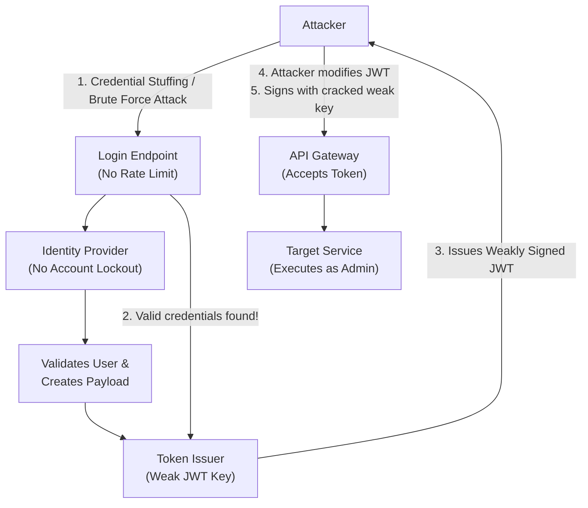

# 31.02 API2 — Broken Authentication

## 1. Executive Summary
Broken Authentication in the context of APIs refers to structural, implementational, or architectural flaws in how an application verifies the identity of a client. APIs inherently operate statelessly in many modern architectures, relying heavily on tokens (like JSON Web Tokens - JWT) or API keys rather than traditional session cookies. When authentication mechanisms are poorly implemented, attackers can bypass them entirely, compromise tokens, or impersonate legitimate users. This vulnerability is catastrophic, as authentication is the gateway to authorization; failing here means the entire security model collapses.

## 2. Core Mechanics of API Authentication
Unlike web applications that utilize stateful sessions (Session IDs stored in memory or databases), APIs predominantly use stateless authentication. The client authenticates once, receives a token, and presents this token with every subsequent request.

### 2.1 The Authentication Lifecycle
1. **Registration/Provisioning:** The user or service account is created.
2. **Credential Exchange:** The client sends a secret (password, API key, biometric data) to the authorization server.
3. **Token Issuance:** The server verifies the secret and issues a token (e.g., JWT).
4. **Token Verification:** For every API call, the gateway or microservice mathematically verifies the token's signature and expiration.
5. **Token Revocation:** Mechanisms to invalidate a token before its natural expiry (often poorly implemented or missing in stateless designs).

### 2.2 Common Authentication Flaws
- **Weak Passwords & Lack of Brute Force Protection:** Allowing trivial passwords and not rate-limiting the login endpoint.
- **Insecure Token Generation:** Using predictable algorithms, weak signing keys (e.g., secret='123456'), or allowing the `alg: "none"` vulnerability in JWTs.
- **Credential Stuffing:** APIs often lack CAPTCHAs or behavioral analysis, making them prime targets for automated credential stuffing using breached databases.
- **Token Leakage:** Passing tokens in URLs (e.g., `GET /api/data?token=xyz`), logging tokens, or exposing them via Cross-Site Scripting (XSS).

## 3. Architectural Context



## 4. Attack Vectors and Threat Modeling

### 4.1 JWT (JSON Web Token) Vulnerabilities
JWTs are the de facto standard for API authentication, but they are fraught with implementation pitfalls:
- **Algorithm Confusion:** Forcing the server to use an asymmetric public key as a symmetric HMAC secret key.
- **The "None" Algorithm:** Modifying the JWT header to `{"alg": "none"}` and stripping the signature. Vulnerable parsers will accept this as a valid token.
- **Weak HMAC Keys:** Offline brute-forcing of HS256 signatures using tools like `hashcat` or `jwt_tool`.
- **Kid Parameter Injection:** The `kid` (Key ID) header parameter can be manipulated to point to attacker-controlled files (Directory Traversal) or injected with SQL commands (SQLi).

### 4.2 API Key Mishandling
API keys are often treated as both authentication and authorization mechanisms. Flaws include:
- Hardcoding API keys in mobile applications or client-side JavaScript.
- Exposing keys in public GitHub repositories.
- Lack of key rotation policies and scoping (e.g., a key meant for reading analytics can also delete databases).

### 4.3 Microservices Trust Failures
In internal networks, microservices often trust each other implicitly. If an attacker breaches the perimeter, they can forge requests between internal APIs without presenting valid external authentication tokens, bypassing security completely.

## 5. Step-by-Step Testing Methodology

### 5.1 Endpoint Discovery
Identify all endpoints responsible for authentication:
- `/api/v1/login`
- `/api/v1/auth/token`
- `/oauth/token`
- `/password-reset`

### 5.2 Token Analysis
1. **Decode the Token:** If it's a JWT, paste it into jwt.io or use CLI tools. Examine the payload for sensitive data (PII) and the header for algorithms.
2. **Signature Verification:** Attempt to alter the payload and send it back. If accepted, the signature isn't being checked.
3. **Alg: None Testing:** Modify the algorithm to `none`, remove the signature, and observe the API response.
4. **Brute Force the Secret:** Use `hashcat -m 16500 jwt.txt rockyou.txt` to see if the HS256 secret is weak.

### 5.3 Login Endpoint Testing
1. **Rate Limiting Check:** Send 100 login requests in 5 seconds using Burp Intruder. Observe if the API blocks you or returns 429 Too Many Requests.
2. **Account Enumeration:** Test login responses for discrepancies. Does a valid username return "Incorrect password" while an invalid one returns "User not found"? Are there timing differences?
3. **Password Policy:** Attempt to register users with 1-character passwords.

## 6. Source Code Analysis

### 6.1 Vulnerable Implementation (Python / Flask)
```python
import jwt
from flask import request, jsonify

app.config['SECRET_KEY'] = 'secret' # VULNERABLE: Weak, easily guessable key

@app.route('/api/v1/data', methods=['GET'])
def get_data():
    token = request.headers.get('Authorization').split()[1]
    try:
        # VULNERABLE: algorithms parameter is missing, susceptible to alg confusion
        decoded = jwt.decode(token, app.config['SECRET_KEY']) 
        return jsonify({"data": "Sensitive API Data", "user": decoded['username']})
    except Exception as e:
        return jsonify({"error": "Invalid token"}), 401
```

### 6.2 Secure Implementation (Python / Flask)
```python
import jwt
import os
from flask import request, jsonify

# SECURE: Environment variable for strong, complex key
app.config['SECRET_KEY'] = os.environ.get('JWT_STRONG_SECRET') 

@app.route('/api/v1/data', methods=['GET'])
def get_data():
    auth_header = request.headers.get('Authorization')
    if not auth_header or not auth_header.startswith('Bearer '):
        return jsonify({"error": "Missing token"}), 401
        
    token = auth_header.split()[1]
    try:
        # SECURE: Explicitly defining the allowed algorithm
        decoded = jwt.decode(token, app.config['SECRET_KEY'], algorithms=["HS256"])
        return jsonify({"data": "Sensitive API Data", "user": decoded['username']})
    except jwt.ExpiredSignatureError:
        return jsonify({"error": "Token expired"}), 401
    except jwt.InvalidTokenError:
        return jsonify({"error": "Invalid token"}), 401
```

## 7. Advanced Exploitation Techniques

### 7.1 OAuth 2.0 Misconfigurations
OAuth 2.0 and OpenID Connect (OIDC) are complex. Common flaws include:
- **Implicit Flow Token Leakage:** The token is returned in the URL fragment, which can be stolen via XSS or browser history.
- **Lack of State Parameter:** Making the flow vulnerable to Cross-Site Request Forgery (CSRF).
- **Insecure Redirect URIs:** Allowing attackers to redirect the authorization code to their own servers.

### 7.2 Bypassing Authentication via Graph QL
GraphQL endpoints often sit behind a single `/graphql` route. Sometimes the authentication middleware checks for specific queries but fails to inspect batched queries or deeply nested alias structures, allowing unauthorized execution.

## 8. Mitigation and Defense in Depth

### 8.1 Robust Authentication Standards
Implement OpenID Connect (OIDC) or strict OAuth 2.0 flows (Authorization Code Flow with PKCE) instead of rolling custom authentication.

### 8.2 Strict Token Validation
- Always enforce algorithm validation in JWT libraries.
- Use asymmetric encryption (RS256) where the private key signs the token and the public key verifies it.
- Keep token lifetimes short (e.g., 15 minutes) and use Refresh Tokens for long-term sessions.

### 8.3 Endpoint Hardening
- Implement aggressive rate limiting and account lockout mechanisms using Redis or specialized API gateways.
- Standardize generic error messages ("Invalid credentials") to prevent user enumeration.
- Enforce MFA (Multi-Factor Authentication) for all API access, especially for administrative endpoints.

## 9. Chaining Opportunities
- **Broken Auth -> BFLA:** Stealing an admin's token immediately grants access to privileged functions.
- **XSS -> Broken Auth:** Using Cross-Site Scripting to extract JWTs stored in `localStorage` or `sessionStorage`.
- **Information Disclosure -> Broken Auth:** Finding hardcoded JWT secrets in public source code repositories to forge super-admin tokens.

## 10. Related Notes
- [[01 - API1 — Broken Object Level Authorization (BOLA)]]
- [[04 - API4 — Unrestricted Resource Consumption]]
- [[05 - API5 — Broken Function Level Authorization (BFLA)]]
