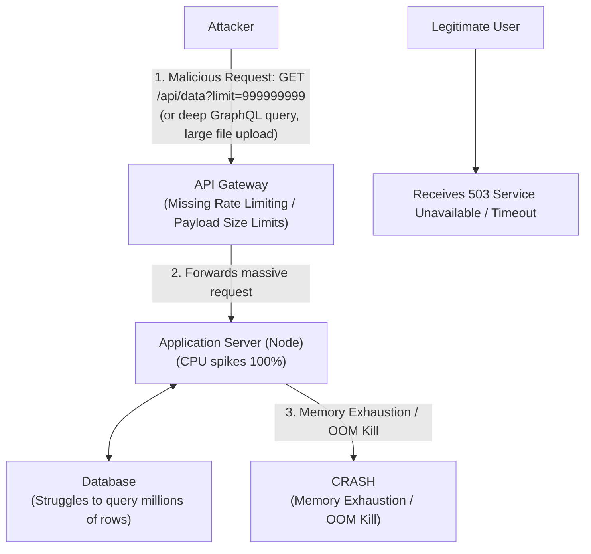

# 31.04 API4 — Unrestricted Resource Consumption

## 1. Executive Summary
Unrestricted Resource Consumption (formerly Lack of Resources & Rate Limiting) occurs when an API endpoint does not impose adequate restrictions on the volume, size, or complexity of requests it processes. Because APIs often serve as frontends to resource-intensive backend operations (database queries, image processing, cryptographic hashing), allowing users to dictate the workload without limits can lead to severe service degradation, infrastructure cost spikes (Denial of Wallet), and complete Denial of Service (DoS).

This vulnerability transcends simple network-layer DDoS attacks; it operates at the application layer (Layer 7), where even a small number of carefully crafted requests can exhaust CPU, memory, storage, or external API quotas.

## 2. Core Mechanics
APIs consume computational resources for every request. Without constraints, an attacker can intentionally or unintentionally drain these resources.

### 2.1 The Dimensions of Resource Consumption
1. **Execution Time (CPU):** Requests that require complex calculations or massive database joins.
2. **Memory:** Uploading massive files or requesting the API to return millions of records in a single JSON array, leading to Out-Of-Memory (OOM) crashes.
3. **Storage:** Repeatedly uploading files or creating records without limits, exhausting disk space.
4. **Network Bandwidth:** Forcing the server to download large external resources or stream massive amounts of data.
5. **Third-Party Costs:** Triggering endpoints that call paid third-party APIs (e.g., SMS gateways, geolocation services), causing financial damage.

### 2.2 Why it Happens
Developers often build APIs with "happy path" assumptions, expecting clients to use pagination, respect UI limits, and send reasonably sized payloads. However, API endpoints are directly accessible and bypass UI-enforced constraints.

## 3. Architectural Context



## 4. Attack Vectors and Threat Modeling

### 4.1 Pagination and Limit Flaws
APIs often support pagination using `limit` and `offset` parameters. If the API doesn't enforce a maximum value for `limit` (e.g., `?limit=1000000`), the database will attempt to fetch and serialize an enormous dataset, crashing the service.

### 4.2 GraphQL Query Depth and Batching
GraphQL gives immense power to the client to define the shape of the response.
- **Deeply Nested Queries:** Requesting `User -> Posts -> Comments -> User -> Posts...` indefinitely can create exponential database load.
- **Query Batching:** Sending hundreds of queries in a single HTTP request to bypass rudimentary rate limiting.

### 4.3 Algorithmic Complexity Attacks
Exploiting endpoints that perform sorting, searching, or regex matching. Sending worst-case inputs (e.g., ReDoS - Regular Expression Denial of Service) can lock up a CPU thread for seconds or minutes per request.

### 4.4 Mass Registration and SMS Bombing
Automating requests to `/api/register` or `/api/send_otp`. This exhausts database space, consumes SMS gateway quotas, and can be used to harass third parties.

## 5. Step-by-Step Testing Methodology

### 5.1 Analyzing Rate Limits
1. **Intruder Testing:** Send 100-500 requests to a specific endpoint (e.g., Login, Search) within seconds using Burp Intruder.
2. **Response Analysis:** Look for HTTP `429 Too Many Requests`. If the server returns `200 OK` for all requests, rate limiting is absent.
3. **Bypass Techniques:** If rate limits exist, try bypassing them by:
   - Appending dummy parameters (`?v=1`, `?v=2`).
   - Modifying headers like `X-Forwarded-For`, `X-Real-IP`, or `Client-IP` to spoof different origins.

### 5.2 Payload and Pagination Stress Testing
1. **Modify Limits:** Change `?limit=10` to `?limit=1000000`. Observe response times. If the response time scales linearly or the server times out/crashes, it's vulnerable.
2. **Large JSON Payloads:** Send a JSON payload with a massive array or deeply nested objects. `{"data": ["A", "A", ... 100,000 times]}`.
3. **String Expansion:** If the API accepts strings, send a string of 10MB to test input validation and memory allocation.

### 5.3 GraphQL Introspection and Depth Testing
1. **Introspection:** Run introspection queries to map the schema.
2. **Recursive Queries:** Craft a nested query exploiting relationships (e.g., author -> books -> author). Send it and monitor response time.

## 6. Source Code Analysis

### 6.1 Vulnerable Implementation (Node.js / Express)
```javascript
app.get('/api/v1/logs', async (req, res) => {
    // VULNERABLE: Takes the limit directly from the user without a ceiling.
    const limit = parseInt(req.query.limit) || 10;
    
    try {
        // If a user sends ?limit=9999999, the DB will attempt to fetch it all.
        const logs = await Log.find().limit(limit);
        res.json(logs);
    } catch (error) {
        res.status(500).send('Server Error');
    }
});
```

### 6.2 Secure Implementation (Node.js / Express)
```javascript
const rateLimit = require('express-rate-limit');

// SECURE: Enforcing connection rate limits at the middleware level
const apiLimiter = rateLimit({
    windowMs: 15 * 60 * 1000, // 15 minutes
    max: 100 // limit each IP to 100 requests per windowMs
});

app.use('/api/', apiLimiter);

app.get('/api/v1/logs', async (req, res) => {
    let limit = parseInt(req.query.limit) || 10;
    
    // SECURE: Enforcing a hard maximum limit
    const MAX_LIMIT = 100;
    if (limit > MAX_LIMIT) {
        limit = MAX_LIMIT; 
    }
    
    try {
        const logs = await Log.find().limit(limit);
        res.json(logs);
    } catch (error) {
        res.status(500).send('Server Error');
    }
});
```

## 7. Advanced Exploitation Techniques

### 7.1 Denial of Wallet (DoW)
In cloud environments with auto-scaling (AWS, Azure, GCP), overwhelming an API might not crash it. Instead, the infrastructure scales up to handle the load, resulting in massive, unexpected billing charges for the organization. Attackers intentionally design slow, resource-heavy requests to trigger auto-scaling continuously.

### 7.2 Asynchronous Task Starvation
If an API places tasks into a background worker queue (e.g., generating a PDF, sending an email) based on user input, an attacker can flood the queue. This prevents legitimate asynchronous tasks from processing, disrupting business logic without directly crashing the web server.

## 8. Mitigation and Defense in Depth

### 8.1 Multi-Layered Rate Limiting
Implement rate limiting not just by IP address, but by:
- Authenticated User ID / API Key.
- Endpoint specificity (e.g., `/login` should be stricter than `/public/articles`).
- Geographic location or ASN.

### 8.2 Execution and Payload Constraints
- **Max Payload Size:** Configure API gateways (NGINX, AWS API Gateway) to reject payloads larger than a sensible threshold (e.g., 2MB).
- **Timeouts:** Set strict execution timeouts for database queries and external API calls.
- **Pagination Limits:** Always enforce server-side maximums for limits and pagination boundaries.

### 8.3 GraphQL Specific Defenses
- Implement Query Cost Analysis: Assign a cost to each field in the schema and reject queries exceeding a maximum total cost.
- Restrict query depth (e.g., maximum 5 levels of nesting).

## 9. Chaining Opportunities
- **Unrestricted Resource Consumption -> BFLA:** Flooding a system to trigger a failsafe state where security controls are temporarily bypassed.
- **Broken Authentication -> Resource Consumption:** Brute-forcing login endpoints is only possible if rate limiting (Resource Consumption) is missing.
- **Resource Consumption -> Blind SQLi:** Slowing down the database to make time-based blind SQL injection measurements more reliable.

## 10. Related Notes
- [[02 - API2 — Broken Authentication]]
- [[01 - API1 — Broken Object Level Authorization (BOLA)]]
