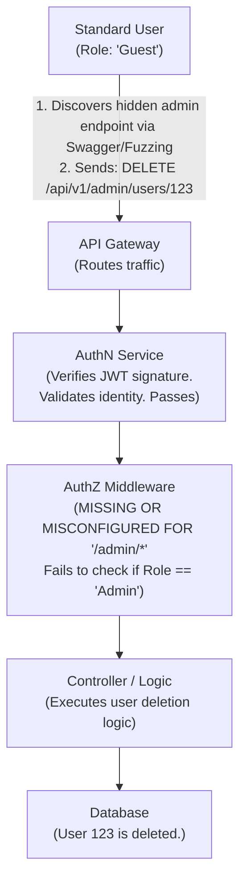

# 31.05 API5 — Broken Function Level Authorization (BFLA)

## 1. Executive Summary
Broken Function Level Authorization (BFLA) occurs when an API fails to adequately verify whether an authenticated user has the required roles or privileges to execute a specific administrative or sensitive function. While BOLA (API1) deals with unauthorized access to specific *data objects*, BFLA deals with unauthorized access to the *endpoints or actions* themselves. 

In a BFLA scenario, a standard user might successfully send a request to a highly privileged endpoint—such as `/api/v1/admin/delete_user` or `/api/v1/system/config`—and the server executes the action because it solely checked if the user was authenticated, completely neglecting to check their authorization level or role. This leads to vertical privilege escalation and full system compromise.

## 2. Core Mechanics
Modern applications divide functionality based on roles (User, Manager, Administrator). APIs group these functions into distinct endpoints or utilize different HTTP methods to distinguish actions.

### 2.1 The Hierarchy of Endpoints
APIs often structure URLs hierarchically:
- `GET /api/v1/users` (Standard User)
- `DELETE /api/v1/users/{id}` (Administrator)
- `POST /api/v1/admin/roles` (Super Administrator)

### 2.2 Why BFLA Occurs
1. **Complex Role Matrices:** As applications grow, maintaining an accurate matrix of who can do what becomes chaotic. Developers might implement a new endpoint but forget to attach the authorization middleware.
2. **Obscurity Reliance:** Assuming that because an administrative UI element is hidden from standard users, the underlying API endpoint is safe. Attackers do not use the UI; they interact directly with the API.
3. **HTTP Method Negligence:** An endpoint might secure the `GET` method but leave the `PUT` or `DELETE` method unprotected, allowing a user who can view a resource to arbitrarily delete it.

## 3. Architectural Context



## 4. Attack Vectors and Threat Modeling

### 4.1 Endpoint Discovery
Attackers locate hidden or administrative endpoints through:
- **API Documentation:** Analyzing exposed Swagger/OpenAPI files (`/api/docs`, `/swagger.json`).
- **Reverse Engineering:** Decompiling Mobile Apps (APK/IPA) or analyzing Single Page Application (SPA) JavaScript bundles to extract API routes that are never shown to normal users.
- **Directory/Endpoint Fuzzing:** Using wordlists to brute-force endpoints (e.g., fuzzing `/api/v1/FUZZ` with terms like `admin`, `manage`, `sys`, `config`).

### 4.2 Method Overriding
Sometimes APIs block direct `DELETE` requests but accept them if tunnelled through a `POST` request using specific headers, bypassing poorly implemented web application firewalls or routing rules:
- `X-HTTP-Method-Override: DELETE`
- `X-Method-Override: DELETE`

### 4.3 Versioning Vulnerabilities
APIs often maintain older versions for backward compatibility. While `/api/v2/admin/delete` might be properly secured with role checks, an attacker might discover that `/api/v1/admin/delete` was never patched and remains vulnerable to BFLA.

## 5. Step-by-Step Testing Methodology

### 5.1 Mapping the Attack Surface
1. **Spidering and JS Analysis:** Browse the application extensively. Extract all API routes from `app.js` or `main.js`.
2. **Privileged Account Analysis:** If possible, obtain an administrative account. Map all the endpoints the admin account uses.

### 5.2 Cross-Role Execution Testing
1. **Baseline Creation:** Capture a sensitive request made by the Administrator (e.g., `POST /api/settings/update`).
2. **Role Swap:** Replace the Administrator's session token/JWT with a standard user's token.
3. **Execution:** Replay the request.
4. **Analysis:**
   - If the server returns `200 OK` and the action is performed: **Vulnerable (BFLA).**
   - If the server returns `401 Unauthorized` or `403 Forbidden`: **Secure.**

### 5.3 Method Tampering Testing
1. Take a known standard endpoint: `GET /api/v1/profile`.
2. Change the method to `POST`, `PUT`, `PATCH`, or `DELETE`.
3. If an unexpected state change occurs or an administrative action is triggered, the endpoint lacks method-level authorization.

## 6. Source Code Analysis

### 6.1 Vulnerable Implementation (Python / FastAPI)
```python
from fastapi import APIRouter, Depends, HTTPException
from security import get_current_user

router = APIRouter()

# Secure: Normal users can view data
@router.get("/users")
def get_users(current_user: User = Depends(get_current_user)):
    return fetch_all_users()

# VULNERABLE: Only checks if the user is logged in (get_current_user).
# Fails to check if the current_user has administrative privileges.
@router.delete("/admin/users/{user_id}")
def delete_user(user_id: int, current_user: User = Depends(get_current_user)):
    db.delete_user(user_id)
    return {"status": "User deleted successfully"}
```

### 6.2 Secure Implementation (Python / FastAPI)
```python
from fastapi import APIRouter, Depends, HTTPException
from security import get_current_user, verify_admin_role

router = APIRouter()

# Secure: Normal users can view data
@router.get("/users")
def get_users(current_user: User = Depends(get_current_user)):
    return fetch_all_users()

# SECURE: Implements an explicit dependency to verify the user's role
# before allowing the function to execute.
@router.delete("/admin/users/{user_id}")
def delete_user(user_id: int, current_user: User = Depends(get_current_user)):
    # Role-based access control enforcement
    if not current_user.role == 'admin':
        raise HTTPException(status_code=403, detail="Insufficient privileges")
        
    db.delete_user(user_id)
    return {"status": "User deleted successfully"}
```

## 7. Advanced Exploitation Techniques

### 7.1 Exploiting GraphQL Mutations
In GraphQL, queries fetch data, and mutations alter data. A GraphQL endpoint might restrict access to certain queries but fail to secure mutations. An attacker maps the schema and fires unauthorized mutations (e.g., `mutation { deleteUser(id: 5) { success } }`) using a low-privileged token.

### 7.2 RESTful Action Appends
Sometimes actions are appended to RESTful paths.
- `GET /api/v1/users/123/export`
An attacker might fuzz the action parameter. If they find `POST /api/v1/users/123/make_admin` and it executes without role checks, it's a severe BFLA.

## 8. Mitigation and Defense in Depth

### 8.1 Default Deny Approach
By default, all API endpoints should deny access. Access must be explicitly granted based on roles. Use middleware that universally enforces authorization unless explicitly bypassed (e.g., for login endpoints).

### 8.2 Centralized Authorization Engine
Avoid embedding complex `if/else` role checks in every controller. Utilize centralized authorization engines or Policy-as-Code frameworks like Open Policy Agent (OPA). This abstracts authorization logic away from business logic.

### 8.3 Consistent API Gateway Routing
Configure API Gateways to strictly route and block access to `/admin/*` paths based on header or token signatures before the request even reaches the internal microservices.

## 9. Chaining Opportunities
- **BFLA -> RCE:** Accessing an unprotected administrative configuration endpoint to upload malicious scripts or alter system paths, leading to Remote Code Execution.
- **BFLA -> BOLA:** Once administrative access is gained via BFLA, BOLA checks are often bypassed naturally, granting access to all data.
- **Information Disclosure -> BFLA:** Leaking API documentation reveals the existence and required parameters of hidden administrative endpoints.

## 10. Related Notes
- [[01 - API1 — Broken Object Level Authorization (BOLA)]]
- [[03 - API3 — Broken Object Property Level Authorization]]
- [[02 - API2 — Broken Authentication]]
