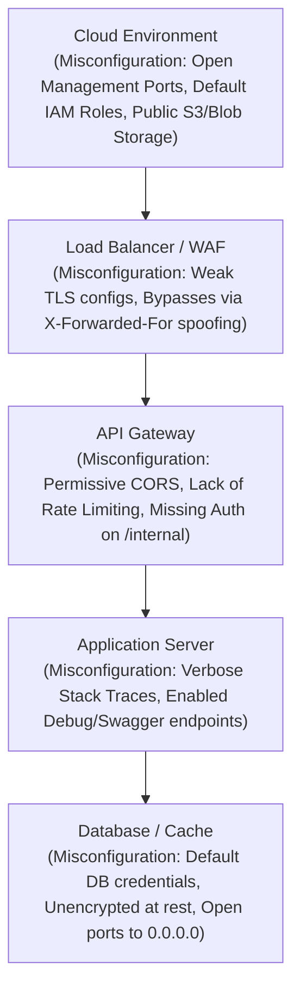

# API8:2023 — Security Misconfiguration

## 1. Executive Summary

Security Misconfiguration (API8:2023) is one of the most pervasive vulnerabilities in modern API ecosystems. It acts as a catch-all category for flaws stemming from insecure default settings, incomplete or ad-hoc configurations, open cloud storage, misconfigured HTTP headers, permissive Cross-Origin Resource Sharing (CORS) policies, and unnecessarily verbose error messages.

APIs are rarely deployed in isolation. The modern API stack includes load balancers, API gateways, container orchestrators (Kubernetes), caching layers, serverless functions, and managed databases. A misconfiguration at *any* level of this complex stack can expose the API to compromise, data leakage, or total system takeover, regardless of how secure the actual application code is.

## 2. Deep Dive: Core Concepts & The Complexity of the Stack

The core issue driving API8 is the friction between rapid deployment and secure hardening. Developers and DevOps engineers often rely on default configurations to get services running quickly, intending to "lock them down later." Later never comes. 

### Common Misconfiguration Vectors:
1.  **Unpatched Systems:** Running outdated operating systems, application frameworks, or third-party libraries containing known vulnerabilities.
2.  **Insecure Defaults:** Using default passwords (e.g., `admin:admin` on administrative interfaces), default sample applications, or default permissive access controls in cloud storage (e.g., public AWS S3 buckets).
3.  **Verbose Error Handling:** APIs returning raw stack traces, database syntax errors, or debug information in JSON payloads.
4.  **Missing TLS / Insecure Ciphers:** Transmitting sensitive data over unencrypted channels or supporting obsolete protocols like TLS 1.0 or RC4.
5.  **Misconfigured HTTP Headers:** Missing security headers (HSTS, CSP, X-Content-Type-Options) or implementing overly permissive CORS policies.
6.  **Unprotected HTTP Verbs:** Failing to restrict HTTP methods like `PUT`, `DELETE`, or `TRACE` when they are not required.

### Visualizing the Attack Surface



## 3. Real-World Exploitation Scenarios

### Scenario A: Overly Permissive CORS Policies
APIs intended to be accessed by web browsers rely on CORS to dictate which external domains can read their responses. A common misconfiguration is setting `Access-Control-Allow-Origin: *` dynamically based on user input, along with `Access-Control-Allow-Credentials: true`.

**The Exploit:** 
An attacker hosts a malicious website (`http://evil.com`). An authenticated victim visits this site. The malicious site sends an asynchronous XHR request to the vulnerable API (`https://api.target.com/user/profile`).
Because the API echoes back the attacker's origin (`Access-Control-Allow-Origin: http://evil.com`) and accepts credentials, the browser attaches the victim's session cookies. The API responds with the victim's private data, which the malicious JavaScript reads and exfiltrates to the attacker.

### Scenario B: Verbose Error Messages (Information Disclosure)
An attacker intentionally sends malformed JSON to an endpoint.
**The Request:**
```http
POST /api/v1/users/create HTTP/1.1
Host: api.target.com
Content-Type: application/json

{ "username": "admin", "age": "twenty" } 
```

**The Misconfigured Response:**
```json
{
  "status": "500 Internal Server Error",
  "error": "java.lang.NumberFormatException: For input string: \"twenty\"",
  "trace": "at java.lang.NumberFormatException.forInputString(NumberFormatException.java:65)\n at org.hibernate.exception.SQLGrammarException... \n Caused by: org.postgresql.util.PSQLException: ERROR: column \"age\" is of type integer but expression is of type character varying\n  Position: 114"
}
```
**The Consequence:** The attacker now knows the backend language (Java), the ORM framework (Hibernate), the database type (PostgreSQL), and the exact schema data types. This vastly reduces the attacker's guesswork for formulating SQL Injection or Deserialization attacks.

### Scenario C: Exposed Debug Endpoints (Spring Boot Actuators)
A development team deploys a Spring Boot Java microservice but forgets to restrict the `/actuator` endpoints in production.
**The Exploit:** The attacker discovers `/actuator/env` and `/actuator/heapdump`. They download the memory heap dump of the running API, load it into a memory analyzer tool (like Eclipse MAT), and extract plaintext AWS access keys, JWT signing secrets, and database passwords from the API's memory.

## 4. Deep Dive: HTTP Verb Tampering

Many APIs define routing rules specifically for `GET` or `POST` methods but fail to secure other methods. Consider an API Gateway rule:
`Rule: Deny unauthenticated POST requests to /api/admin/*`

An attacker might send:
```http
HEAD /api/admin/users/delete?id=5 HTTP/1.1
Host: api.target.com
```
If the backend web server processes the `HEAD` request by routing it through the same logic as a `GET` or `POST` (but simply dropping the response body), the attacker might successfully trigger the deletion of user ID 5, entirely bypassing the API Gateway's misconfigured authorization rule.

## 5. Detection and Identification

Finding security misconfigurations heavily relies on automated scanning and meticulous manual review.
*   **Header Scanners:** Tools like `curl`, `Postman`, or specialized scanners evaluating CORS (`Access-Control-Allow-Origin`), HSTS, and Content Security Policy.
*   **Fuzzing for Errors:** Sending unexpected data types (strings instead of ints, massively long payloads, special characters like `'`, `"`, `%`) to trigger unhandled exceptions and observe stack traces.
*   **Directory/Endpoint Brute Forcing:** Using tools like `ffuf`, `gobuster`, or `Kiterunner` with API-specific wordlists to find exposed Swagger UI (`/swagger-ui.html`), GraphQL Introspection endpoints, or management interfaces (`/health`, `/metrics`, `/server-status`).
*   **Cloud Security Posture Management (CSPM):** Using tools like Prowler or CloudSploit to scan AWS/GCP/Azure environments for open ports, public S3 buckets, and overly permissive IAM roles.

## 6. Defense in Depth and Mitigation

Mitigating API8 requires shifting from reactive patching to proactive, automated hardening and infrastructure-as-code (IaC) governance.

### Hardening the Application & Framework
1.  **Standardized Error Handling:** Implement global exception handlers. Ensure that unhandled exceptions are caught and generic, uniform error messages are returned to the client (e.g., `{"error": "An unexpected error occurred. Reference ID: 9A8B7C"}`). The actual stack trace should be written securely to internal logs.
2.  **Strict CORS Configuration:** 
    * Never use wildcard `*` with `Allow-Credentials: true`.
    * Validate the `Origin` header against a hardcoded, whitelist of trusted domains. Do not dynamically reflect user-supplied Origins.
3.  **Disable Debug Features:** Ensure all debugging features, framework management endpoints, and verbose logging are strictly disabled in production builds.

### Hardening the Infrastructure
1.  **Repeatable Hardening Processes:** Use tools like Ansible, Chef, or Terraform to deploy infrastructure. Apply CIS (Center for Internet Security) Benchmarks to the OS, container daemon (e.g., Docker), and database.
2.  **Network Segmentation & Least Privilege:** The API server should only have network access to the specific database ports it requires. Ensure cloud storage accounts are private by default and require IAM authentication.
3.  **Security Headers:** Enforce headers at the API Gateway or Load Balancer level:
    * `Strict-Transport-Security: max-age=31536000; includeSubDomains`
    * `X-Content-Type-Options: nosniff`
    * `Cache-Control: no-store` (for endpoints returning sensitive PII data)

### DevSecOps Integration
*   Implement continuous security scanning in the CI/CD pipeline using DAST (Dynamic Application Security Testing) tools like OWASP ZAP to catch missing headers and verbose errors before deployment.
*   Use IaC scanning tools (like Checkov or tfsec) to identify misconfigured cloud resources before they are provisioned.

## 7. Chaining Opportunities

Misconfigurations are the "glue" that allows other vulnerabilities to reach their maximum potential:
*   **[[07 - API7 — Server Side Request Forgery (SSRF)]]:** SSRF relies on misconfigured internal network boundaries and lack of egress filtering to succeed.
*   **[[01 - API1 — Broken Object Level Authorization (BOLA)]]:** Verbose errors often reveal the precise format of object IDs or the underlying database schema, making it easier to craft BOLA payloads.
*   **[[09 - API9 — Improper Inventory Management]]:** Leaving older, vulnerable API versions exposed (like `/v1/`) is a severe misconfiguration in lifecycle management.

## 8. Related Notes
- [[CORS Vulnerabilities Deep Dive]]
- [[Securing Spring Boot Actuators]]
- [[Implementing Global Exception Handling in APIs]]
- [[Cloud Security Posture Management (CSPM)]]

---
*End of Note*
