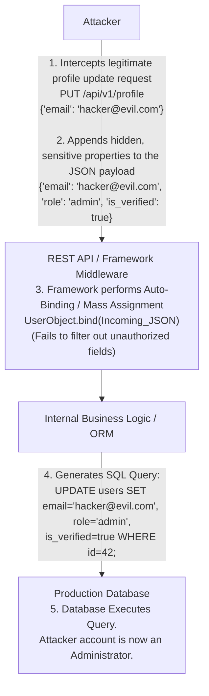

# 14 - Mass Assignment in REST APIs

## 1. Executive Summary

Mass Assignment (also known as Auto-Binding, Object Injection, or Mass Binding) is a critical vulnerability that arises when an API endpoint blindly binds client-provided data (typically JSON or XML payloads) directly to internal application objects or database models without proper filtering or allow-listing. 

Modern web frameworks (such as Spring Boot, Ruby on Rails, ASP.NET, and NodeJS Express) provide convenience features designed to automatically map incoming HTTP request parameters to backend object properties. While this drastically reduces boilerplate code, it introduces severe risk. If a developer fails to explicitly define which properties a user is authorized to modify, an attacker can inject additional, hidden fields into their payload (e.g., `"role": "admin"`, `"is_verified": true`, `"balance": 999999`). The framework will obediently apply these unintended properties to the underlying model, leading to catastrophic privilege escalation, financial manipulation, and data corruption.

## 2. Anatomy of the Vulnerability

### 2.1 The Framework Convenience Feature
Consider a typical registration or profile update flow. A user model in the database might have dozens of columns: `id`, `username`, `email`, `password_hash`, `role`, `created_at`, `account_balance`.

When updating a profile, the client sends a JSON payload:
```json
{
  "username": "john_doe",
  "email": "john@example.com"
}
```

In a vulnerable NodeJS/Express application using an ORM like Sequelize or TypeORM, a developer might write:
```javascript
// VULNERABLE CODE
app.put('/api/users/:id', async (req, res) => {
  const user = await User.findByPk(req.params.id);
  
  // The framework blindly merges the entire req.body into the user object
  await user.update(req.body); 
  
  res.json(user);
});
```

### 2.2 The Attacker's Payload
The vulnerability exists because `req.body` is completely controlled by the client. The backend logic implicitly trusts that the client will only send the fields presented in the legitimate UI form.

An attacker intercepts the request and maliciously modifies the JSON payload:
```json
{
  "username": "john_doe",
  "email": "john@example.com",
  "role": "administrator",
  "account_balance": 1000000
}
```
Because the `user.update()` function iterates over every key provided in the payload and applies it to the database model, the attacker instantly grants themselves administrator privileges and artificially inflates their financial balance.

## 3. Attack Architecture & Flow



## 4. Deep Dive: Exploitation Methodologies

### 4.1 Parameter Guessing and Fuzzing
The primary challenge for an attacker is knowing the exact names of the internal properties they wish to manipulate. Attackers use several techniques to discover these hidden fields:

1. **Information Disclosure / Excessive Data Exposure:** Often, a `GET /api/users/me` request will return the full database object, revealing internal property names (e.g., `{"role_id": 2, "isAdmin": false, "status": "pending"}`). The attacker takes these exact names and injects them into the `PUT` or `POST` requests.
2. **Brute-Forcing / Fuzzing:** Using tools like Burp Suite's Param Miner or custom scripts, attackers inject hundreds of common parameter names into the JSON payload (`admin`, `is_admin`, `role`, `permissions`, `group`, `status`) with boolean `true` or string `"admin"` values, monitoring the response to see if privilege escalation was successful.

### 4.2 Bypassing Security Mechanisms (Ownership Modification)
Mass Assignment is not limited to privilege escalation; it is frequently used to bypass object ownership, effectively chaining with Broken Object Level Authorization (BOLA).

Imagine a system where a user creates a support ticket:
```json
POST /api/tickets
{
  "subject": "Need help",
  "body": "My account is locked"
}
```
The server is supposed to automatically assign the ticket to the currently authenticated user based on their JWT token. However, if the server uses auto-binding, the attacker can inject the foreign key:
```json
{
  "subject": "Need help",
  "body": "My account is locked",
  "user_id": 1  // The ID of the CEO or Admin
}
```
The framework blindly binds `user_id`, allowing the attacker to forge tickets on behalf of other users.

### 4.3 Framework-Specific Nuances
- **Ruby on Rails:** Historically notorious for this. The `update_attributes` method would blindly update everything. Rails later introduced `Strong Parameters` to combat this.
- **Spring Boot (Java):** The `@ModelAttribute` annotation can automatically bind request parameters to Java POJOs. If the POJO contains sensitive fields, they can be overwritten.
- **ASP.NET:** The `TryUpdateModel` or model binding directly to Entity Framework entities exposes all public properties.

## 5. Case Studies and Real-World Impact

### 5.1 The GitHub Public Key Mass Assignment
One of the most famous examples of Mass Assignment occurred in GitHub. A researcher realized that the API endpoint used to update a user's public SSH keys relied on a vulnerable Ruby on Rails controller. By injecting an array of public keys into the `public_key` parameter of a different user's repository update request (by passing the internal `user_id`), the researcher was able to forcefully append his own SSH key to the Rails core repository, gaining commit access to the entire framework.

### 5.2 E-Commerce Price Manipulation
In a common bug bounty scenario, an e-commerce checkout API processes a cart payload:
```json
{"item_id": 55, "quantity": 2}
```
By injecting the internal `price` property into the payload:
```json
{"item_id": 55, "quantity": 2, "price": 0.01}
```
The auto-binding framework overrides the database-fetched price with the attacker's supplied price, allowing the attacker to purchase high-value goods for pennies.

## 6. Mitigation & Defensive Strategies

### 6.1 The Data Transfer Object (DTO) Pattern
The most robust and universally recommended mitigation is the strict use of Data Transfer Objects (DTOs). A DTO is a localized object specifically designed to hold exactly and only the data expected from the client request.

Instead of binding the HTTP request directly to the Database Entity, the framework binds it to the DTO. The backend logic then explicitly maps only the safe fields from the DTO to the Database Entity.

**Secure Implementation (Java / Spring Boot):**
```java
// DTO strictly defines allowed fields
public class UserUpdateDTO {
    public String username;
    public String email;
}

@PutMapping("/users/{id}")
public ResponseEntity<?> updateUser(@PathVariable Long id, @RequestBody UserUpdateDTO dto) {
    User dbUser = userRepository.findById(id);
    
    // Explicit mapping - ignores any extra fields sent by the attacker
    dbUser.setUsername(dto.username);
    dbUser.setEmail(dto.email);
    
    userRepository.save(dbUser);
    return ResponseEntity.ok(dbUser);
}
```

### 6.2 Allow-Listing (Permitted Parameters)
If DTOs are not feasible, frameworks provide mechanisms to explicitly allow-list accepted parameters.

**Secure Implementation (NodeJS / Express):**
Using a utility like Lodash's `pick` function ensures only explicitly authorized properties are extracted from the request body.
```javascript
const _ = require('lodash');

app.put('/api/users/:id', async (req, res) => {
  const user = await User.findByPk(req.params.id);
  
  // ONLY extract 'username' and 'email'. Drop everything else.
  const safeData = _.pick(req.body, ['username', 'email']);
  
  await user.update(safeData);
  res.json(user);
});
```

### 6.3 Schema Validation
Implement robust JSON schema validation (e.g., using Joi, Yup, or Zod in JavaScript) at the API Gateway or controller level. Configure the validator to explicitly reject the request if it contains any unrecognized properties (`additionalProperties: false`). This provides an immediate 400 Bad Request if an attacker attempts parameter injection.

## 7. Chaining Opportunities
- **[[15 - Excessive Data Exposure]]**: Exposed JSON responses give attackers the exact internal property names they need to craft successful Mass Assignment payloads.
- **[[01 - Broken Object Level Authorization (BOLA)]]**: Injecting foreign keys (`account_id`, `user_id`) via Mass Assignment allows attackers to seize ownership of other users' resources.
- **[[02 - Broken User Authentication]]**: Mass assigning properties like `password_reset_token` or `is_mfa_enabled` can lead to complete account takeover.

## 8. Related Notes
- [[Object Relational Mapping (ORM) Security]]
- [[Input Validation & Schema Enforcement]]
- [[OWASP API Security Top 10]]
