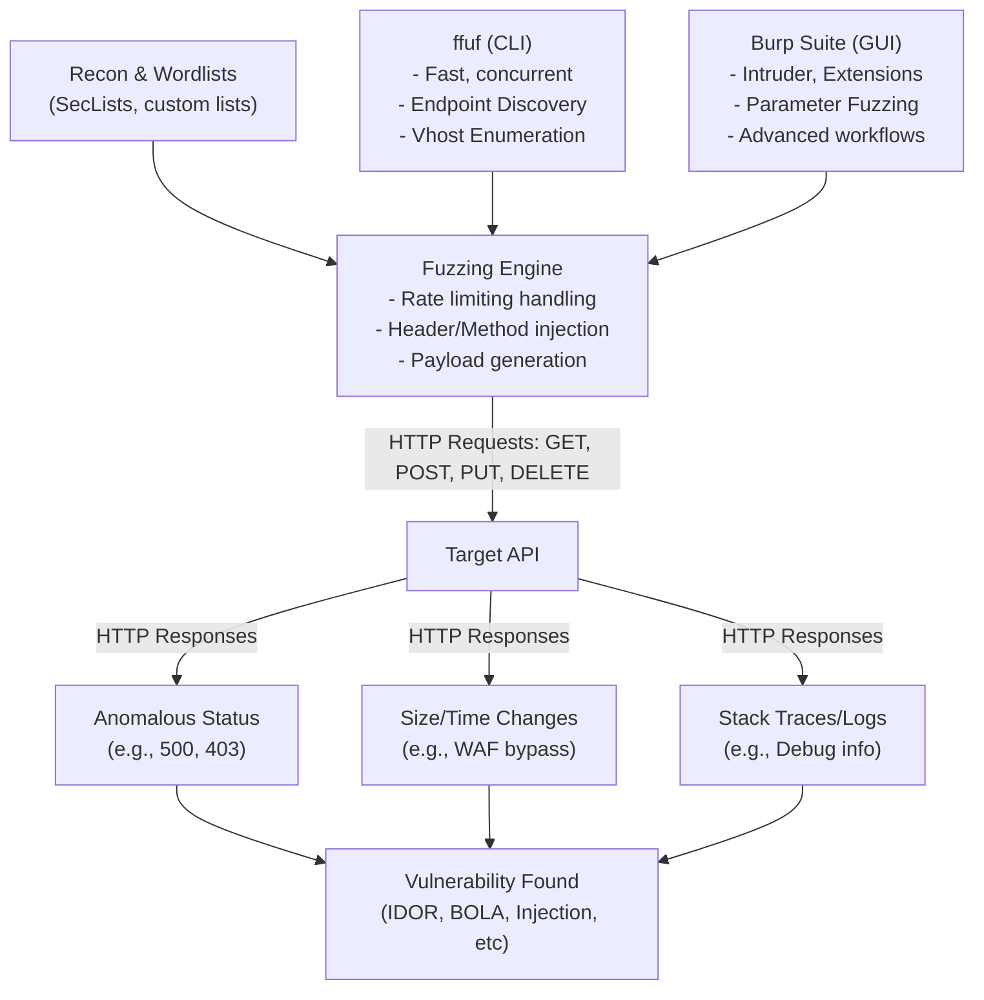

# 17 - API Fuzzing with ffuf and Burp

## Introduction

API Fuzzing is a highly aggressive and dynamic methodology used to uncover hidden endpoints, undocumented parameters, unhandled exceptions, and potentially catastrophic vulnerabilities within an API. Unlike web application fuzzing, which often relies on crawling HTML links, API fuzzing requires a more structured approach because APIs do not natively advertise all their routes and accepted parameters unless a documentation file (like Swagger/OpenAPI) is strictly provided.

Fuzzing involves throwing vast amounts of semi-random, unexpected, or structurally manipulated data at an API to observe its responses. The goal is to induce anomalous behavior, such as `500 Internal Server Error` (indicating crashes or unhandled input), `200 OK` on hidden administrative endpoints, or excessively slow response times indicating potential DoS vulnerabilities.

In the API hacking workflow, `ffuf` (Fuzz Faster U Fool) and Burp Suite (specifically Intruder and various extensions) are the industry standard tools.

---

## ASCII Diagram: API Fuzzing Methodology Workflow



---

## Fuzzing with `ffuf`

`ffuf` is a ridiculously fast web fuzzer written in Go. Its speed comes from extreme concurrency, making it ideal for the massive wordlists required to brute-force API routes.

### 1. Basic Endpoint Discovery
When you know the base API URL but lack documentation, you must brute-force the directories and endpoints.
```bash
ffuf -w /usr/share/seclists/Discovery/Web-Content/api/api-endpoints.txt -u https://api.target.com/v1/FUZZ -mc 200,401,403
```
- `-w`: Wordlist path.
- `-u`: Target URL with the `FUZZ` keyword indicating the injection point.
- `-mc`: Match specific HTTP status codes (200 OK, 401 Unauthorized, 403 Forbidden).

### 2. Advanced Multi-Wordlist Fuzzing
APIs often use a combination of object names and actions (e.g., `/users/create`, `/admin/delete`). `ffuf` allows you to use multiple wordlists simultaneously.
```bash
ffuf -w objects.txt:W1 -w actions.txt:W2 -u https://api.target.com/api/W1/W2
```

### 3. Fuzzing API Versions
APIs frequently maintain legacy, deprecated versions (e.g., v1, v2) that lack the security controls of the current version.
```bash
ffuf -w /usr/share/seclists/Discovery/Web-Content/api/api-versions.txt -u https://api.target.com/FUZZ/users -mc 200
```
*(Wordlist might contain: `v1`, `v2`, `v3`, `v1.1`, `beta`, `internal`)*

### 4. Fuzzing POST JSON Data
APIs predominantly consume JSON. You can fuzz values within a JSON body to test for SQLi, XSS, or unexpected type handling (e.g., sending an integer where a string is expected).
```bash
ffuf -w payloads.txt -u https://api.target.com/api/v1/login \
     -X POST -H "Content-Type: application/json" \
     -d '{"username": "admin", "password": "FUZZ"}'
```

### 5. HTTP Header and Method Fuzzing
Fuzzing headers can reveal hidden debugging features, bypass WAFs, or exploit Host header injections.
```bash
ffuf -w /usr/share/seclists/Discovery/Web-Content/BurpSuite-ParamMiner/lowercase-headers -u https://api.target.com/v1/users \
     -H "FUZZ: 127.0.0.1" -mc 200
```
Fuzzing the HTTP Method:
```bash
ffuf -w methods.txt -u https://api.target.com/v1/users/1 -X FUZZ
```
*(Methods: GET, POST, PUT, DELETE, PATCH, OPTIONS, TRACE, CONNECT)*

### 6. Filtering and Calibration
APIs often return `200 OK` for everything but include an error message in the JSON body, or a WAF returns a `403 Forbidden` for everything. You must filter out false positives.
- `-fc 404,403`: Filter out status codes.
- `-fs 1024`: Filter out responses with a specific byte size.
- `-fw 50`: Filter out responses with a specific word count.
- `-fl 10`: Filter out responses with a specific line count.
- `-fr "Error"`: Filter by regular expression.
- `-ac`: Auto-calibration. `ffuf` sends a few random requests first to determine the baseline response and automatically filters it out.

---

## Fuzzing with Burp Suite

While `ffuf` excels at speed and raw endpoint discovery, Burp Suite is unmatched for deep, surgical fuzzing of complex API requests, especially authenticated ones.

### 1. Burp Intruder Attack Types

- **Sniper**: The default. Iterates through the wordlist and places the payload into one marked position at a time. Ideal for fuzzing a single parameter.
- **Battering Ram**: Places the *same* payload from the wordlist into *all* marked positions simultaneously. Useful if the API requires the username and an email parameter to match.
- **Pitchfork**: Uses multiple wordlists simultaneously (one for each position). Payload 1 from Wordlist 1 goes into Position 1, while Payload 1 from Wordlist 2 goes into Position 2. Great for testing known username/password pairs.
- **Cluster Bomb**: Uses multiple wordlists and tests *all possible combinations* of payloads. Highly intensive but thorough. Useful for fuzzing multiple ID parameters simultaneously (e.g., `/api/org/§org_id§/user/§user_id§`).

### 2. Parameter Discovery with Param Miner
APIs often accept undocumented parameters that developers use for debugging or hidden features (e.g., `?debug=true`, `?admin=1`, `?test_mode=on`).
Using the **Param Miner** extension in Burp Suite, you can automatically guess hidden GET/POST parameters and headers. It utilizes advanced techniques like cache poisoning detection and heuristic analysis to find parameters without requiring a massive dictionary attack.

### 3. Fuzzing Content-Types
APIs might strictly require `application/json`, but sometimes the underlying framework still parses `application/xml`, `application/x-www-form-urlencoded`, or `multipart/form-data`.
Switching the Content-Type to XML can open the door to **XXE (XML External Entity)** attacks, even on a supposedly JSON-only API. Burp's "Content Type Converter" extension simplifies this testing.

### 4. Bypassing WAFs during Fuzzing
When fuzzing through Burp, WAFs will frequently ban your IP. To bypass this:
- **IP Rotate Extension**: Routes every Burp request through a different AWS API Gateway endpoint, changing your IP dynamically.
- **Sleep/Throttle**: In Intruder -> Resource Pool, set a delay between requests (e.g., 500ms) to stay under rate limit thresholds.
- **Header Injection**: Use Burp match/replace rules to append `X-Forwarded-For: <random-ip>` to every fuzzed request.

---

## Advanced API Fuzzing Techniques

### 1. Type Juggling and Mass Assignment Fuzzing
APIs written in weakly typed languages (like older versions of PHP or Node.js) can misbehave if you change the JSON data types.
If an API expects: `{"id": "123"}`
Fuzzing variations:
- Integer: `{"id": 123}`
- Array: `{"id": ["123"]}`
- Boolean: `{"id": true}`
- Object: `{"id": {"$gt": 0}}` (Common NoSQL Injection payload)
- Null: `{"id": null}`

### 2. Boundary and Edge Case Fuzzing
Test the limits of the API's parsing engines:
- **Overly long strings**: `{"username": "A" * 10000}` (Testing for Buffer Overflows or DoS).
- **Special Characters**: `!@#$%^&*()_+-=[]{}|;':",./<>?` (Testing for WAF triggers or unhandled exceptions).
- **Unicode / Homoglyphs**: Injecting complex unicode characters or emojis to break backend database encodings or bypass input validation.

### 3. Fuzzing for BOLA / IDOR
When you identify an endpoint that accesses an object via an ID (e.g., `/api/invoices/1042`), you use Intruder to fuzz the integer from `1` to `2000`. By filtering the response sizes and status codes, you can instantly identify which invoices you can access that do not belong to your user account.

---

## Recommended Wordlists

A fuzzer is only as good as its wordlist. SecLists (`/usr/share/seclists/`) is the gold standard:
- **API Endpoints**: `Discovery/Web-Content/api/api-endpoints.txt`
- **Common Parameters**: `Discovery/Web-Content/burp-parameter-names.txt`
- **GraphQL**: `Discovery/Web-Content/graphql.txt`
- **JSON Web Tokens**: `Fuzzing/JSON.Fuzzing.txt`
- **NoSQLi**: `Fuzzing/SQLi/Generic-Blind-SQLi.txt`

For highly targeted testing, use tools like **Cewl** or **Trashcompactor** to generate custom wordlists scraped directly from the target company's website or public GitHub repositories, ensuring the fuzzer guesses terminology specific to their business logic.

---

## Chaining Opportunities

- **[[18 - API Documentation Discovery]]**: Fuzzing is the primary method for discovering hidden Swagger files or WSDL documents.
- **[[16 - Lack of Resource Rate Limiting]]**: If rate limiting is absent, fuzzing can be done at maximum speed without fear of IP bans.
- **[[24 - API Injection Attacks]]**: Fuzzing parameters with special character wordlists is the fastest way to detect SQL, NoSQL, or Command injection points.

## Related Notes

- [[01 - API1 — Broken Object Level Authorization (BOLA)]]
- [[19 - REST API Method Override Attacks]]
- [[12 - Mass Assignment Vulnerabilities]]

---
