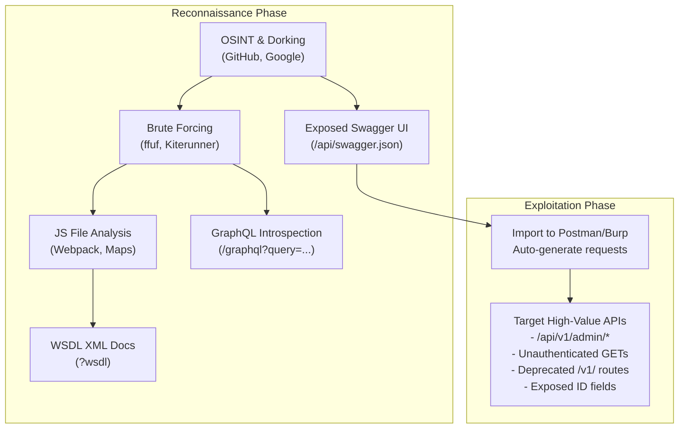

# 18 - API Documentation Discovery

## Introduction

In the realm of API penetration testing, information is power. The absolute holy grail of the reconnaissance phase is discovering the target's API documentation. API documentation serves as a complete map of the API's architecture, revealing every endpoint, expected HTTP methods, required parameters, authentication schemes, and precise data models.

Developers frequently generate these documentation files automatically using frameworks like Swagger/OpenAPI, GraphQL Introspection, or Postman. Often, these docs are left publicly accessible by mistake, intended only for internal developers or partners, but inadvertently exposed to the internet. Finding these documents transforms a blind, black-box assessment into a highly focused, white-box (or gray-box) assessment.

---

## Types of API Documentation

Understanding what you are looking for is the first step in discovery.

1. **Swagger / OpenAPI**: The industry standard for RESTful APIs. Usually served as a JSON or YAML file (`swagger.json`, `openapi.yaml`) and often paired with a graphical web interface known as "Swagger UI."
2. **GraphQL Introspection**: GraphQL APIs have a built-in feature called Introspection. If enabled, an attacker can query the API to return its entire schema (all queries, mutations, and types). Furthermore, graphical IDEs like GraphiQL or GraphQL Playground might be exposed.
3. **WSDL (Web Services Description Language)**: Used for legacy SOAP APIs. It is an XML document describing the functions, arguments, and endpoints of the web service.
4. **Postman Collections**: JSON files containing a curated list of API requests, often shared among developers. Sometimes leaked on public forums, GitHub, or public Postman workspaces.
5. **RAML & API Blueprint**: Alternative documentation formats, less common than OpenAPI but still utilized in specific enterprise environments.

---

## ASCII Diagram: Documentation Discovery to Exploitation Pipeline



---

## Discovery Techniques

Discovering hidden API documentation requires a blend of brute-forcing, open-source intelligence (OSINT), and deep technical analysis of the target application.

### 1. Directory and File Brute-Forcing

Using tools like `ffuf`, `dirb`, or `gobuster` combined with highly specific API wordlists, attackers probe the web server for common documentation paths.

**Common REST/Swagger Paths:**
- `/api/swagger.json`
- `/swagger-ui.html`
- `/v1/api-docs`
- `/v2/api-docs`
- `/openapi.json`
- `/docs/`
- `/api/docs/`
- `/redoc`

**Common GraphQL Paths:**
- `/graphql`
- `/graphiql`
- `/altair`
- `/playground`

**Example ffuf command:**
```bash
ffuf -w /usr/share/seclists/Discovery/Web-Content/swagger.txt -u https://api.target.com/FUZZ -mc 200
```

### 2. Kiterunner (Advanced API Fuzzing)

Standard directory brute-forcing falls short for APIs because APIs rely heavily on specific HTTP methods and deep routing (e.g., GET `/api/v1/users/1/profile`). `Kiterunner` is a tool specifically designed to discover API endpoints and documentation by utilizing massive datasets of known API routes compiled from public Swagger files.

```bash
kr scan https://api.target.com -w routes-large.kite
```
Kiterunner intelligently tests multiple HTTP methods per route and can easily uncover hidden `swagger.json` files that standard fuzzers miss.

### 3. JavaScript File Analysis

Modern Single Page Applications (SPAs) built with React, Angular, or Vue interact heavily with backend APIs. The frontend JavaScript files contain the API routes hardcoded within them.

- **Manual Analysis**: Open Developer Tools (F12) -> Network Tab. Look for `.js` files. Search within them for strings like `"/api/"`, `"/v1/"`, `"bearer"`, `"swagger"`.
- **Source Maps**: If `.js.map` files are exposed, attackers can reconstruct the unminified original source code of the frontend application, easily extracting all API endpoints and developer comments.
- **Automated Extraction**: Tools like `LinkFinder` or `JSParser` can be run against a URL to automatically extract all hidden endpoints from JavaScript files.
  ```bash
  python3 linkfinder.py -i https://target.com/app.js -o cli
  ```

### 4. Search Engine Dorking (Google & Shodan)

Search engines continuously index the web, occasionally capturing exposed API documentation before the developers realize their mistake.

**Google Dorks for Swagger:**
- `intitle:"Swagger UI" site:target.com`
- `inurl:"/swagger-ui.html" site:target.com`
- `intext:"openapi" ext:json site:target.com`

**Shodan Dorks:**
- `title:"Swagger UI"`
- `http.html:"Swagger"`

### 5. GitHub and GitLab Reconnaissance

Developers often commit sensitive files to public repositories or paste API configurations into public Gists or issues.

- Search GitHub for: `"swagger.json" org:TargetCorp`, `"openapi.yaml" org:TargetCorp`.
- Search for Postman collections: `"postman_collection" org:TargetCorp`.
- Look into developers' personal GitHub accounts linked to the target organization; they often host staging configurations containing the documentation links.

### 6. WayBack Machine and Web Archives

A target might have recently secured their Swagger UI, removing it from public access. However, web archives like the WayBack Machine might have snapshotted the `swagger.json` file when it was briefly exposed.
Tools like `waybackurls` or `gau` (GetAllUrls) can be used to query these archives.
```bash
echo target.com | waybackurls | grep -i "swagger"
```

---

## Exploiting Discovered Documentation

Finding the documentation is only the beginning. The next step is weaponizing it.

### Importing to Postman / Burp Suite
Once a `swagger.json` or `openapi.yaml` file is found, you should immediately import it into Postman or Burp Suite (using the "OpenAPI Parser" extension). This will instantly generate a structured tree of every API request, complete with the correct headers, parameters, and example JSON bodies.

### Identifying Vulnerability Hotspots
With the documentation parsed, look for:
1. **Unauthenticated Endpoints**: Cross-reference the required authentication schemes. Are there administrative endpoints that accidentally lack the security requirement tag?
2. **Deprecated Versions**: Endpoints mapping to `/v1/` when the app uses `/v3/`. Legacy endpoints often lack modern access controls (BOLA/IDOR).
3. **Mass Assignment / BOPLA Vectors**: The documentation explicitly lists all properties of an object. If a `User` object shows properties like `"is_admin": boolean` or `"role": string`, you immediately know what hidden parameters to inject during a POST/PUT request to attempt privilege escalation.
4. **Hidden Admin Functions**: Endpoints like `/api/v1/internal/debug`, `/api/v1/system/health`, or `/api/v1/users/force-delete`.
5. **Method Mismatches**: If the documentation says an endpoint accepts GET and POST, but you discover it also implicitly processes PUT or DELETE, it could lead to unexpected state changes.

---

## Defensive Strategies and Remediation

To prevent API documentation from falling into the hands of attackers:

1. **Restrict Access**: Swagger UI and raw documentation files (`.json`, `.yaml`) must never be accessible on production environments without strict authentication and authorization. Place them behind a VPN, an IP whitelist, or require administrative Single Sign-On (SSO).
2. **Disable GraphQL Introspection**: In production environments, GraphQL Introspection must be strictly disabled. Attackers cannot easily map a GraphQL API without it.
3. **Remove Swagger from Production Builds**: Ensure that the build pipeline strips out Swagger libraries and static documentation assets before deploying to production servers.
4. **Obfuscate Frontend Code**: Ensure source maps (`.js.map`) are not deployed to production. While JS code can still be analyzed, obfuscation makes the extraction of API routes significantly harder.
5. **Continuous Monitoring**: Use automated scanners to continuously check external perimeters for exposed `/swagger-ui.html` or `/graphql` endpoints.

---

## Chaining Opportunities

- **[[17 - API Fuzzing with ffuf and Burp]]**: Fuzzing is the primary method used to discover undocumented paths leading to documentation files.
- **[[12 - Mass Assignment Vulnerabilities]]**: Documentation reveals the exact JSON object schema, providing the exact variable names needed to execute Mass Assignment attacks.
- **[[01 - API1 — Broken Object Level Authorization (BOLA)]]**: By viewing the documentation, an attacker immediately knows which endpoints take IDs (e.g., `/api/user/{id}`), highlighting immediate targets for BOLA testing.

## Related Notes

- [[19 - REST API Method Override Attacks]]
- [[24 - API Injection Attacks]]
- [[02 - JWT Security and Vulnerabilities]]

---
