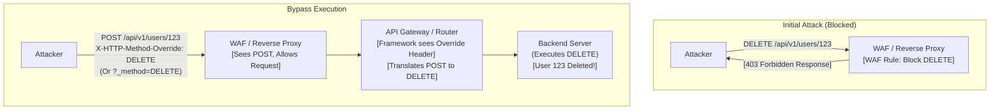

# 19 - REST API Method Override Attacks

## Introduction

REST APIs rely fundamentally on standard HTTP methods (GET, POST, PUT, DELETE, PATCH) to perform CRUD (Create, Read, Update, Delete) operations on resources. However, not all network infrastructures are built equal. Historically, many corporate firewalls, proxy servers, and legacy web application systems were rigidly configured to only allow basic HTTP methods: `GET` and `POST`. They would outright drop or block more "destructive" methods like `PUT`, `DELETE`, or `PATCH`.

To circumvent these archaic network restrictions and allow modern REST APIs to function, framework developers introduced a workaround: **HTTP Method Overriding**.

This feature allows a client to send an allowed method (usually POST, sometimes GET) while instructing the backend API framework to interpret and execute the request as a different method (e.g., DELETE). While convenient for legacy compatibility, poorly implemented or forgotten Method Override features create massive security loopholes, allowing attackers to bypass Web Application Firewalls (WAFs), Access Control Lists (ACLs), and Cross-Site Request Forgery (CSRF) protections.

---

## How Method Overriding Works

Method overriding is typically achieved by passing a specific HTTP header or a URL/body parameter. When the backend API framework (like Spring, Express.js, Ruby on Rails, or Laravel) parses the incoming request, it intercepts these specific flags and silently changes the HTTP method context before passing the request to the application logic.

### Common Override Headers:
- `X-HTTP-Method-Override: DELETE`
- `X-HTTP-Method: DELETE`
- `X-Method-Override: DELETE`

### Common Override Parameters:
- URL Query String: `POST /api/v1/users/123?_method=DELETE`
- Form/JSON Body: `{"_method": "DELETE", "username": "admin"}`

If an API framework is configured to accept these, an attacker can manipulate the perceived action at different layers of the infrastructure.

---

## ASCII Diagram: Method Override WAF Bypass Flow



---

## Exploitation Scenarios

### 1. Bypassing WAFs and Perimeter Security
As demonstrated in the diagram above, perimeter security devices (WAFs, Load Balancers, API Gateways) often make security decisions based on the *actual* HTTP method used in the request line. 

If a WAF is configured with a rule to block all `DELETE` requests to the `/api/v1/admin/*` endpoint to prevent unauthorized data destruction, an attacker can bypass this entirely by sending a `POST` request (which the WAF allows) equipped with `X-HTTP-Method-Override: DELETE`. The WAF inspects the `POST` and passes it through, but the backend framework respects the override header and deletes the resource.

### 2. Bypassing Access Control Lists (ACLs)
Sometimes, API gateways or custom authentication middleware evaluate user permissions based on the incoming method.
For example:
- `GET /api/users` -> Allowed for standard users.
- `POST /api/users` -> Only allowed for admins.

If the middleware only checks the primary HTTP method but the backend framework supports overriding, an attacker might send a `GET` request with an override header:
```http
GET /api/users HTTP/1.1
Host: api.target.com
X-HTTP-Method-Override: POST
Content-Type: application/json

{"username":"newadmin", "role":"admin"}
```
The middleware sees a `GET` request and allows it based on the standard user's permissions. The backend framework translates it to a `POST` and creates the new admin user. *(Note: Overriding from GET to POST is less common but highly critical when supported).*

### 3. Cross-Site Request Forgery (CSRF) Bypass
CSRF protections often rely on the assumption that state-changing actions (POST, PUT, DELETE) require an Anti-CSRF token, while "safe" actions (GET) do not.
If an attacker finds that they can change state using a GET request by appending `?_method=POST` or `?_method=DELETE`, they can execute a classic CSRF attack using simple image tags or links.

```html
<!-- CSRF Attack payload embedded in a malicious site -->

```
When the victim's browser loads the image, it sends a GET request. The backend framework reads the `_method` parameter, overrides it to a DELETE, and destroys the user's account without checking for a CSRF token (since it originally arrived as a GET).

### 4. CORS Preflight Bypass
Cross-Origin Resource Sharing (CORS) requires a "preflight" `OPTIONS` request for complex methods like `PUT` or `DELETE`. If the server doesn't allow cross-origin `DELETE` requests, the browser blocks the action.
However, `POST` is considered a "Simple Request" under certain conditions (like using `application/x-www-form-urlencoded`) and does not trigger a preflight. An attacker can use a simple `POST` request with a method override parameter to execute a `PUT` or `DELETE` cross-origin, bypassing the browser's CORS restrictions entirely.

---

## Detection and Reconnaissance

Testing for Method Override vulnerabilities is straightforward and should be a standard part of any API security assessment.

1. **Identify a target endpoint**: Find an endpoint that responds differently to different methods. For example, a resource that exists:
   - `GET /api/items/1` -> `200 OK`
   - `DELETE /api/items/1` -> `401 Unauthorized` or `403 Forbidden` (If you are not admin).
2. **Attempt the Override**: Send a `POST` request to the endpoint and inject the override headers/parameters.
   ```http
   POST /api/items/1 HTTP/1.1
   Host: api.target.com
   X-HTTP-Method-Override: DELETE
   ```
3. **Analyze the Response**: 
   - If the response is `401 Unauthorized` or `403 Forbidden` (matching the actual `DELETE` response), the server is actively processing the override.
   - If the response is `405 Method Not Allowed` or a standard `POST` response, the override was likely ignored.

**Burp Suite Automation**: You can use Burp Suite's Intruder or extensions like "HTTP Method Override" to automatically inject these headers across all requests during a crawl or fuzzing session.

---

## Defensive Strategies and Remediation

1. **Disable Method Overriding**: If your infrastructure supports modern HTTP methods (which almost all do today), completely disable the method override features in your API framework (e.g., Express.js `method-override` middleware, Spring `HiddenHttpMethodFilter`). It is a legacy feature that provides zero benefit in modern architectures.
2. **Normalize Methods at the Gateway**: If overriding *must* be supported for legacy client compatibility, the API Gateway or WAF must be configured to inspect the override headers/parameters and normalize the request method *before* applying security rules or ACLs. The security device must evaluate the intended method (e.g., DELETE), not the carrier method (e.g., POST).
3. **Strict CSRF Protections**: Ensure that Anti-CSRF tokens are required and validated regardless of whether the method was overridden. Never allow state-changing operations to be triggered via a `GET` request, even with override parameters.

---

## Chaining Opportunities

- **[[17 - API Fuzzing with ffuf and Burp]]**: Fuzzing HTTP methods and override headers is a primary technique to discover hidden functionalities.
- **[[01 - API1 — Broken Object Level Authorization (BOLA)]]**: Method overriding can be used to convert a benign `GET` BOLA test into a malicious `DELETE` BOLA attack, bypassing restrictive WAF rules.
- **[[06 - Cross-Site Request Forgery (CSRF)]]**: Method overrides via GET parameters (`?_method=POST`) are classic vectors for bypassing CSRF defenses on APIs relying on cookie-based authentication.

## Related Notes

- [[08 - Broken Authentication]]
- [[12 - Mass Assignment Vulnerabilities]]
- [[16 - Lack of Resource Rate Limiting]]

---
