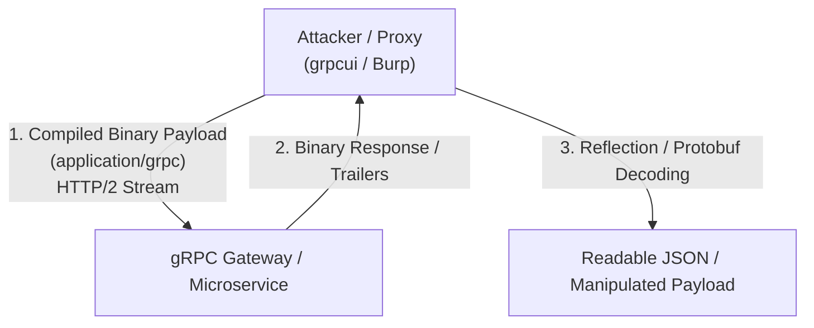

# gRPC Security Testing

## Introduction
gRPC (gRPC Remote Procedure Calls) is a modern, high-performance, open-source framework developed by Google. Unlike REST, which relies on text-based JSON and HTTP/1.1, gRPC uses **Protocol Buffers (Protobuf)** as its interface definition language and underlying message interchange format, and it runs exclusively over **HTTP/2**. 

Because gRPC is heavily binary, strongly typed, and heavily multiplexed, traditional web proxies (like standard Burp Suite setups without specific configurations/extensions) and standard API testing tools often fail to interact with it effectively. This creates a "security through obscurity" scenario where microservices communicate via gRPC with minimal security oversight. Understanding how to intercept, decode, and manipulate Protobuf streams is essential for modern API security testing.

## gRPC Architecture and the Protobuf Concept

### How gRPC Works
1. **The `.proto` File:** Developers define the service, the methods (RPCs), and the request/response message structures in a `.proto` file.
2. **Code Generation:** The `.proto` file is compiled into client and server code in almost any language (Go, Python, Java, C++).
3. **Serialization:** When a client makes a call, the request data is serialized into a highly compact binary format (Protobuf).
4. **Transport:** The binary payload is transmitted over HTTP/2 streams.

### HTTP/2 and Protobuf Semantics
gRPC uses HTTP/2 POST requests.
- **Path:** `/PackageName.ServiceName/MethodName`
- **Content-Type:** `application/grpc` or `application/grpc+proto`
- **Trailers:** HTTP/2 trailers are heavily used to convey the final status code of the RPC call (e.g., `grpc-status: 0` for OK).

## Architecture and Attack Flow

## Security Testing Methodology

Testing gRPC requires translating the binary gibberish into something human-readable, manipulating it, and re-encoding it.

### 1. Interception and Tooling Setup
Standard Burp Suite struggles with raw gRPC because it cannot easily modify the serialized binary.
- **Burp Suite + gRPC Extension:** Install the "gRPC" or "Protobuf" extensions from the BApp store. These extensions attempt to decode the binary protobuf payload into a JSON-like structure within the Burp repeater, allowing you to edit values, and then automatically re-encode it to binary before sending.
- **grpcui / grpcurl:** Command-line and web-UI tools (similar to `curl` and `Postman` but for gRPC). `grpcui` provides an interactive web interface to explore and interact with a gRPC server.

### 2. Reconnaissance and Server Reflection
To interact with a gRPC service, you need to know the message structure. You need the `.proto` files. How do you get them?
- **Server Reflection:** gRPC supports a feature called "Server Reflection." If enabled (often left on by developers for debugging), the server will literally tell you its entire API structure upon request.
  - Test: `grpcurl -plaintext <target_ip>:<port> list`
  - If reflection is enabled, this lists all available services. You can then query the methods and message structures.
- **Client-Side Extraction:** If reflection is disabled, extract the `.proto` definitions from client applications. For web clients using `grpc-web`, look at the JavaScript bundles. For mobile apps, decompile the APK/IPA; the generated protobuf classes are usually heavily identifiable.
- **Blind Protobuf Reversing:** If you capture raw gRPC traffic but lack the `.proto` schema, you can use tools like `protoc --decode_raw` to guess the structure. Protobuf includes field tags (numbers) and wire types, so you can see strings and integers, but you lose the field names (e.g., `field 1: "admin"`, `field 2: 123`).

### 3. Authentication and Authorization (BOLA/BFLA)
gRPC uses "metadata" (analogous to HTTP headers) to pass authentication tokens (like JWTs).
- Extract the JWT from the metadata.
- Test for Broken Object Level Authorization (BOLA) by changing ID fields in the Protobuf message payload while authenticated as a low-level user.
- Test for Broken Function Level Authorization (BFLA) by attempting to call administrative RPC methods (e.g., `/AdminService/DeleteUser`) discovered via reflection.

### 4. Injection Attacks
Just because the transport is binary doesn't mean the backend isn't vulnerable to classic injections.
- Once you can modify the decoded payload in Burp, inject SQLi, XSS, or Command Injection payloads into string fields.
- The binary serialization *prevents* transport-layer character escaping issues, but when the backend application deserializes the string and passes it to a database query, SQLi will execute perfectly.

### 5. HTTP/2 Specific Attacks
gRPC's reliance on HTTP/2 opens it up to protocol-level attacks.
- **Stream Multiplexing Abuse:** Attempt to open thousands of concurrent HTTP/2 streams to exhaust server memory (HTTP/2 Rapid Reset or similar DoS vectors).
- **Header Compression (HPACK) Abuse:** Send massive amounts of compressed headers to cause CPU spikes during decompression.

### 6. Streaming RPC Vulnerabilities
gRPC supports unary (one request, one response) and streaming (client streaming, server streaming, bidirectional streaming) RPCs.
- **Race Conditions:** In bidirectional streaming, test for race conditions by sending overlapping, conflicting state changes rapidly over the stream.
- **Resource Exhaustion:** In client-streaming RPCs, stream an infinite loop of data to see if the server enforces maximum message sizes or timeouts.

## Remediation and Secure Design

### 1. Disable Server Reflection in Production
Server reflection is a massive information disclosure vulnerability in production. It hands attackers the exact blueprint of the API. Disable it entirely in production builds.

### 2. Enforce Strict Message Size Limits
To prevent DoS via massive payload deserialization or infinite streams, configure strict limits on the maximum message size (`MaxRecvMsgSize`) for both clients and servers.

### 3. Implement Interceptors for Security
In gRPC, middleware is implemented via "Interceptors."
- Implement authentication and authorization interceptors to validate metadata (JWTs, API keys) *before* the request reaches the specific RPC handler.
- Do not rely on individual RPC handlers to verify permissions.

### 4. Input Validation
Protobuf guarantees type safety (e.g., it ensures an integer field receives an integer), but it does *not* validate the business logic or format of the data.
- Validate the length, format, and content of strings (e.g., ensure an email string is actually an email and doesn't contain SQL injection payloads) within the application logic after deserialization.

### 5. Secure HTTP/2 Configurations
Configure the reverse proxy or API gateway (like Envoy or Nginx) handling the gRPC traffic to aggressively limit concurrent streams, enforce timeouts, and mitigate HTTP/2 specific DoS attacks.

## Chaining Opportunities
- **[[01 - API1 — Broken Object Level Authorization (BOLA)]]**: Once the `.proto` structure is reversed via reflection, manipulating object IDs in the binary payload is a primary vector.
- **[[04 - API4 — Unrestricted Resource Consumption]]**: Exploiting client-streaming gRPC methods without size limits to crash the microservice pod.

## Related Notes
- [[HTTP2 and HTTP3 Security]]
- [[Microservice Architecture Vulnerabilities]]
- [[API Gateway Security Patterns]]
