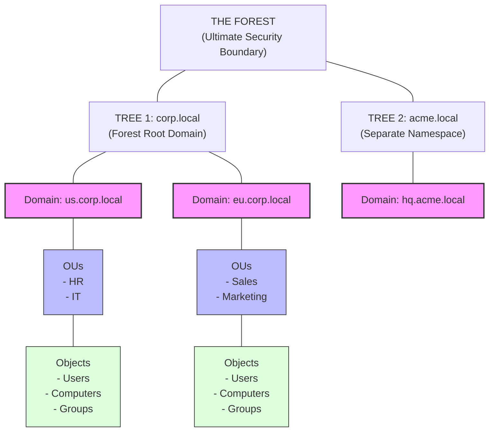

# Active Directory Overview

## 1. Introduction to Active Directory

Active Directory (AD) is Microsoft's proprietary directory service. It runs on Windows Server and enables administrators to manage permissions and control access to network resources. In enterprise networks, Active Directory acts as the centralized identity provider and access management system.

The core function of Active Directory is to store data as objects. An object is a single element, such as a user, group, application, or device such as a printer. AD provides the mechanisms to organize these objects, control access to them, and enforce security policies globally across the network environment.

Active Directory is not just a single service but a collection of services, the most prominent being Active Directory Domain Services (AD DS). AD DS is the foundational service that provides the directory structure, authentication services, and management capabilities. 

Understanding the architecture and inner workings of Active Directory is paramount for any penetration tester or red teamer, as the majority of corporate networks rely heavily on AD. Compromising AD often equates to full control over the target's infrastructure.

## 2. Logical Architecture

The logical structure of Active Directory allows administrators to organize elements without being constrained by their physical locations. This structure scales from a single small office to multinational corporations.

### 2.1 Objects and Attributes
Everything in AD is an object. Each object represents a distinct entity on the network (e.g., a User, a Computer, a Printer, a Group). Every object is defined by a set of attributes. For example, a User object might have attributes like `sAMAccountName`, `userPrincipalName`, `mail`, `pwdLastSet`, and `memberOf`.

### 2.2 Domains
A domain is a logical group of network objects (computers, users, devices) that share the same Active Directory database. Domains act as administrative boundaries. Objects within the same domain are managed together, and policies can be applied to the domain as a whole.
- **Domain Name:** Domains are identified by a DNS name structure, such as `corp.local` or `emea.corp.com`.
- **Security Boundary:** While often considered a security boundary, in modern AD architecture, the Forest is the true security boundary, not the domain.

### 2.3 Trees
A domain tree is a collection of one or more domains that share a contiguous namespace. If you have a root domain `corp.local`, you can create child domains like `us.corp.local` and `eu.corp.local`. These form a tree. The parent and child domains automatically have a two-way transitive trust established between them.

### 2.4 Forests
A forest is a collection of one or more domain trees that do not share a contiguous namespace but share a common logical structure, directory schema, and global catalog. The forest is the highest-level container and represents the ultimate security boundary in an Active Directory implementation. A domain administrator in one domain can potentially compromise the entire forest if misconfigurations exist.

### 2.5 Organizational Units (OUs)
An Organizational Unit is a container object used to organize objects within a domain. OUs provide a way to group objects logically (e.g., by department or geographical location) so that administrators can easily apply Group Policy Objects (GPOs) and delegate administrative authority.

## 3. Physical Architecture

While the logical architecture dictates how objects are grouped administratively, the physical architecture defines how the network traffic is routed and how replication occurs.

### 3.1 Domain Controllers (DCs)
A Domain Controller is a server that runs the Active Directory Domain Services (AD DS) role. DCs store a replica of the directory database (`NTDS.dit`) and handle authentication requests. They are the most critical servers in a Windows network.
- **Read-Only Domain Controllers (RODCs):** Special DCs that hold a read-only copy of the database, often placed in less secure physical locations like branch offices.

### 3.2 Sites and Subnets
Sites represent the physical topology of the network. A site is defined as one or more highly reliable and fast TCP/IP subnets. AD uses sites to optimize replication traffic between DCs and to ensure clients authenticate against the closest available DC to minimize latency.

## 4. Core Protocols and Services

Active Directory heavily relies on standard protocols to function:

### 4.1 DNS (Domain Name System)
DNS is the locator service for AD. When a client needs to authenticate, it queries DNS for the SRV records of the domain controllers. Without a functioning DNS, Active Directory completely breaks down.

### 4.2 LDAP (Lightweight Directory Access Protocol)
LDAP is the core protocol used to query and modify objects in Active Directory. It operates over port 389 (TCP/UDP) and port 636 for LDAP over SSL (LDAPS). Attackers frequently use LDAP for enumeration to map the AD structure.

### 4.3 Kerberos
Kerberos is the default authentication protocol in modern Active Directory. It relies on a trusted third party (the Key Distribution Center, or KDC, running on the DC) to issue tickets (TGTs and TGSs) that prove a user's identity to network services.

### 4.4 NTLM (NT LAN Manager)
NTLM is a legacy challenge-response authentication protocol. Although Microsoft strongly recommends Kerberos, NTLM is still widely supported and used as a fallback, making it a frequent target for relay attacks and Pass-the-Hash.

### 4.5 SMB and RPC
- **SMB (Server Message Block):** Used for file sharing and accessing sysvol for GPO updates.
- **RPC (Remote Procedure Call):** Used heavily for management and remote execution.

## 5. Trust Relationships

Trusts allow users in one domain to access resources in another domain. 
- **Directional Trusts:** Can be one-way or two-way.
- **Transitive Trusts:** If Domain A trusts Domain B, and Domain B trusts Domain C, then Domain A automatically trusts Domain C.
- **Intra-forest Trusts:** Created automatically between parent/child domains and root domains in different trees within the same forest.
- **Inter-forest Trusts:** Created manually between domains in entirely different forests.

## 6. Access Control and Security Principals

### 6.1 Security Identifiers (SIDs)
Every security principal (user, group, computer) is assigned a unique, immutable string called a SID. Even if an object is renamed, the SID remains the same. The SID ends in a Relative Identifier (RID), which uniquely identifies the object within the domain.
Example: `S-1-5-21-3623811015-3361044348-30300820-1001` (where 1001 is the RID).

### 6.2 Discretionary Access Control Lists (DACLs)
A DACL determines who is allowed or denied access to an object. It is made up of Access Control Entries (ACEs). When you right-click a folder or an AD object and go to "Security", you are interacting with the DACL.

### 6.3 Group Policy Objects (GPOs)
GPOs are a collection of settings that define what a system will look like and how it will behave for a defined group of users. GPOs can enforce password policies, deploy software, configure registry keys, and restrict user access. Misconfigured GPOs are a common vector for lateral movement.

## 7. Architecture ASCII Diagram

## 8. Chaining Opportunities

Understanding the AD structure is the prerequisite for all Active Directory attacks. The logical next step after grasping the overview is to actively map the environment.
- From a general understanding, proceed to **[[02 - AD Enumeration]]** to map out the domains, trusts, OUs, and users in the target environment.
- Once users are identified, you can proceed with **[[04 - Kerberoasting]]** or **[[05 - AS-REP Roasting]]** based on the properties of those user objects.
- If lateral movement is required across the domain architecture mapped out, refer to **[[06 - Pass the Hash (PtH)]]**.

## 9. Related Notes

- **[[02 - AD Enumeration]]**
- **[[03 - Kerberosable Accounts — SPN Scanning]]**
- **[[04 - Kerberoasting]]**
- **[[05 - AS-REP Roasting]]**
- **[[06 - Pass the Hash (PtH)]]**

## Real-World Attack Scenario
## Real-World Attack Scenario

The engagement began with a successful spear-phishing campaign that dropped a lightweight beacon on a standard user's workstation.
The attacker, operating as the unprivileged user `jdoe` within the `megacorp.local` environment, needed to gain situational awareness without triggering the heavily monitored EDR solutions.
Instead of immediately attempting privilege escalation, the attacker focused on mapping the Active Directory landscape to understand the target's topology.
The attacker started by identifying the primary domain controllers using built-in Windows commands to blend in with normal administrative traffic.
Running `nltest /dsgetdc:` provided the name and IP address of the primary DC (`DC01.megacorp.local`), establishing the central authority of the domain.
Next, the attacker needed to understand the domain's size and complexity.
Using `net user /domain`, they pulled a complete list of active user accounts, saving the output to a local text file for offline parsing.
They followed this by querying the domain's administrative groups to identify high-value targets.
Executing `net group "Domain Admins" /domain` revealed three key accounts: `Administrator`, `jsmith_adm`, and `bkhan_adm`.
The attacker noticed that `jsmith_adm` was actively used based on the last logon timestamps.
To check the password policy and determine the viability of password spraying or brute-forcing, the attacker ran `net accounts /domain`.
The results showed a lockout threshold of 5 attempts and a minimum password length of 12 characters.
Realizing that brute-forcing was too noisy and risky, the attacker shifted their strategy towards finding misconfigurations or extracting credentials from memory.
They also queried the domain trusts using `nltest /domain_trusts` to see if `megacorp.local` was part of a larger forest.
The command revealed a two-way trust with a parent domain, `global.megacorp.local`, expanding the potential attack surface.
With this foundational knowledge, the attacker had a clear map of the environment.
They knew the IP addresses of the DCs, the names of the domain admins, and the strictness of the password policy.
This intelligence was gathered entirely using Living off the Land (LotL) binaries, generating zero alerts in the SIEM.
The attacker's next phase would involve more targeted enumeration, specifically looking for kerberoastable accounts and vulnerable ACLs, using the initial overview as their guide.
The ultimate outcome of this phase was a comprehensive understanding of the AD structure, allowing the attacker to plan a precise, stealthy route to Domain Admin.

