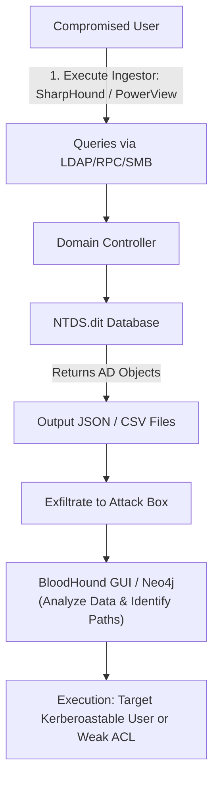

# Active Directory Enumeration

## 1. Introduction to AD Enumeration

Active Directory Enumeration is the process of systematically querying the AD environment to map out objects, permissions, trust relationships, and misconfigurations. It is the crucial first step in any internal penetration test or red team engagement. Without proper enumeration, an attacker is flying blind.

The goal of enumeration is to gather actionable intelligence: identifying high-value targets (like Domain Admins), finding vulnerable configurations (like Kerberoastable accounts), mapping out weak ACLs, and discovering viable attack paths for lateral movement and privilege escalation.

AD enumeration typically requires a valid set of domain credentials or a foothold on a domain-joined machine operating under the context of a domain user. Since AD is designed to be queryable by any authenticated user, enumeration is inherently built into the protocol's functionality.

## 2. Enumeration Categories

Effective AD enumeration targets several specific categories of information:

### 2.1 User Enumeration
Identifying valid domain users, their group memberships, description fields (which sometimes contain passwords), logon hours, password policies, and attributes like `adminCount=1` or `servicePrincipalName`.

### 2.2 Group Enumeration
Locating high-value groups beyond just `Domain Admins`. Groups such as `Enterprise Admins`, `DnsAdmins`, `Backup Operators`, `Server Operators`, and custom Helpdesk groups often hold significant privileges that can be leveraged.

### 2.3 Computer & Host Enumeration
Finding all registered computer objects. This helps identify workstations vs. servers, operating system versions, and high-value targets like Exchange servers, SCCM servers, and File servers.

### 2.4 Access Control Lists (ACLs) & Permissions
Querying the security descriptors on AD objects to find misconfigured permissions. For example, finding a standard user who has `GenericAll` or `ForceChangePassword` rights over a Domain Admin account.

### 2.5 Trust Relationships
Identifying trusts between domains and forests. Enumerating trusts is critical for cross-domain lateral movement and forest compromise.

### 2.6 Group Policy Objects (GPOs)
Analyzing GPOs can reveal mapped drives, local administrator assignments, software deployment scripts, and potentially exposed credentials in SYSVOL (e.g., GPP cPassword vulnerabilities).

## 3. Core Enumeration Tools

The offensive security community has developed powerful toolsets to automate and graph AD enumeration. 

### 3.1 BloodHound and SharpHound
BloodHound is the gold standard for AD enumeration. It uses graph theory to reveal hidden and complex relationships within Active Directory.
- **SharpHound:** The C# data collector (ingestor) for BloodHound. It queries AD via LDAP and RPC to pull all users, computers, groups, ACLs, trusts, and sessions.
- **Data Analysis:** The collected JSON files are loaded into the BloodHound GUI (backed by a Neo4j database), allowing attackers to query paths like "Shortest Path to Domain Admin."

**Execution Example:**
```powershell
# Running SharpHound locally on a compromised host
Invoke-BloodHound -CollectionMethod All -OutputDirectory C:\temp\
```

### 3.2 PowerView / PowerSploit
PowerView is a PowerShell tool designed to gain network situational awareness on Windows domains. It heavily utilizes ADSI and standard LDAP queries, minimizing the reliance on built-in executables which are often monitored.

**Common PowerView Commands:**
- `Get-DomainUser` : Enumerates all domain users.
- `Get-DomainGroup` : Enumerates all domain groups.
- `Get-DomainComputer` : Enumerates all domain computers.
- `Get-DomainTrust` : Enumerates domain trusts.
- `Find-LocalAdminAccess` : Finds machines where the current user holds local admin rights.
- `Get-DomainObjectAcl` : Enumerates ACLs for specific objects to find abuse paths.

### 3.3 Impacket Suite
When attacking from a non-Windows machine (e.g., Kali Linux), Impacket provides Python scripts to interact with AD.
- `GetADUsers.py` : Gather data about domain users.
- `FindDelegation.py` : Identify accounts configured for Kerberos delegation.
- `bloodhound-python` : A Python ingestor for BloodHound.

**Execution Example:**
```bash
bloodhound-python -u 'username' -p 'password' -ns 192.168.1.10 -d corp.local -c All
```

### 3.4 PingCastle
PingCastle is an Active Directory security auditing tool. While often used defensively, attackers can use its generated HTML reports to quickly identify structural vulnerabilities, stale accounts, and weak trusts.

## 4. OPSEC Considerations

Enumeration is inherently noisy. Defenders using tools like Microsoft Defender for Identity (MDI), formerly ATA, or advanced SIEMs can detect aggressive enumeration.

- **LDAP vs SAMR:** Tools like BloodHound historically used SAMR for session enumeration, which is highly scrutinized. Modern OPSEC favors stealthy LDAP queries and targeted API calls.
- **Rate Limiting:** Pulling down the entire AD database in a large environment generates a massive volume of traffic. Targeted enumeration (e.g., `-CollectionMethod DCOnly` in SharpHound) reduces noise.
- **Honeytokens:** Defenders may deploy fake admin accounts or fake SPNs. Interacting with these objects triggers immediate alerts.

## 5. ASCII Workflow Diagram



## 6. Real-World Execution Examples

### Targeted Enumeration with PowerView
If an attacker wants to find all users with a specific attribute, such as those vulnerable to AS-REP roasting:
```powershell
Get-DomainUser -PreauthNotRequired -Verbose
```

### Finding GPO Abuses
An attacker looks for GPOs where they have write privileges:
```powershell
Get-DomainGPO | Get-DomainObjectAcl -ResolveGUIDs | Where-Object {
    $_.SecurityIdentifier -eq $MyUserSID -and 
    $_.ActiveDirectoryRights -match "WriteProperty|GenericAll|GenericWrite"
}
```

## 7. Chaining Opportunities

Enumeration directly informs subsequent attacks. It is never an isolated step.
- Discovering users with `servicePrincipalName` attributes directly leads to **[[03 - Kerberosable Accounts — SPN Scanning]]** and **[[04 - Kerberoasting]]**.
- Discovering users with `userAccountControl` flagging `DONT_REQ_PREAUTH` leads to **[[05 - AS-REP Roasting]]**.
- Discovering a path where a compromised user has administrative rights over a target machine allows for **[[06 - Pass the Hash (PtH)]]** to move laterally.

## 8. Related Notes

- **[[01 - Active Directory Overview]]**
- **[[03 - Kerberosable Accounts — SPN Scanning]]**
- **[[04 - Kerberoasting]]**
- **[[05 - AS-REP Roasting]]**
- **[[06 - Pass the Hash (PtH)]]**

## Real-World Attack Scenario
## Real-World Attack Scenario

Operating from a compromised developer workstation, the attacker aimed to map out the `megacorp.local` domain to find a path to Domain Admin.
They decided to use BloodHound, a graph theory-based tool, to identify hidden relationships and misconfigurations.
To avoid dropping the C# `Sharphound.exe` binary directly onto the disk, which would likely be flagged by the local AV, the attacker used a PowerShell-based ingestor.
They bypassed AMSI and executed the script in memory: `Invoke-BloodHound -CollectionMethod All -Domain megacorp.local`.
The script queried LDAP and the local SAM databases of accessible machines, gathering data on users, groups, computers, and active sessions.
The process took approximately 15 minutes, generating a ZIP file containing several JSON files.
The attacker exfiltrated this ZIP file over a covert C2 channel to their local analyzing machine.
Upon importing the data into the BloodHound GUI, they ran the built-in query: "Find Shortest Paths to Domain Admins."
The graph revealed a complex, non-obvious path to compromise.
The compromised user, `dev_jdoe`, was a member of the `IT_Support` group.
The `IT_Support` group had `GenericWrite` privileges over the `Helpdesk_Admins` group.
Furthermore, the `Helpdesk_Admins` group was part of the local `Administrators` group on `SRV-UTIL-01`.
Crucially, BloodHound showed that a Domain Admin, `bkhan_adm`, had an active, disconnected RDP session on `SRV-UTIL-01`.
The attacker's path was clear: escalate privileges to control the `Helpdesk_Admins` group, take over `SRV-UTIL-01`, and dump the Domain Admin's credentials.
To confirm the `GenericWrite` privilege, the attacker used PowerView: `Get-ObjectAcl -Identity "Helpdesk_Admins" | Where-Object {$_.SecurityIdentifier -eq "S-1-5-21-..."}`.
The output confirmed the misconfiguration.
The attacker then used PowerView's `Add-DomainGroupMember` cmdlet to add `dev_jdoe` to the `Helpdesk_Admins` group.
With the new group membership, the attacker laterally moved to `SRV-UTIL-01` using WinRM.
Once on the server, they dumped the LSASS memory, extracting the plaintext credentials of the `bkhan_adm` account.
The AD enumeration phase successfully transformed a low-privileged developer account into a Domain Admin by exposing hidden permission chains.

