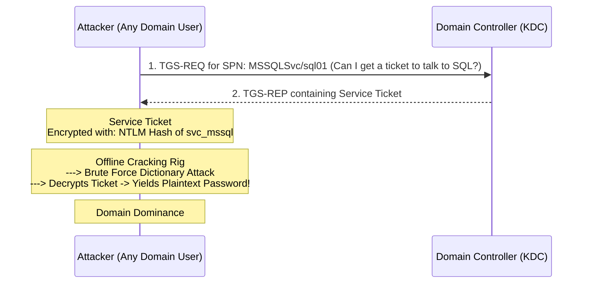

# Kerberoasting

## 1. Introduction to Kerberoasting

Kerberoasting is one of the most reliable, widespread, and devastating attacks against Microsoft Active Directory environments. Discovered by Tim Medin in 2014, Kerberoasting allows any authenticated domain user to request access to a service and, in the process, extract a cryptographic hash of the service account's password. This hash can then be taken offline and cracked using brute-force techniques.

Because the attack relies on the fundamental design of the Kerberos protocol rather than a software bug or misconfiguration, there is no simple "patch" for Kerberoasting. The vulnerability stems entirely from the use of weak passwords on Active Directory user accounts that have Service Principal Names (SPNs) assigned to them.

## 2. The Mechanics of the Attack

To understand Kerberoasting, one must understand a specific portion of the Kerberos authentication flow: the TGS-REQ and TGS-REP exchange.

### 2.1 The Vulnerability in Kerberos
When a user wants to access a service (e.g., an SQL database), they send a Ticket Granting Service Request (TGS-REQ) to the Domain Controller. The DC validates the user's TGT and responds with a Ticket Granting Service Reply (TGS-REP). 

The TGS-REP contains a Service Ticket. This Service Ticket is intended to be handed to the target service so the service can verify the user. 
Crucially, **a portion of this Service Ticket is encrypted using the password hash (NTLM hash) of the account running the service.**

Kerberos assumes that only the target service knows its own password hash to decrypt the ticket. However, the DC hands this encrypted ticket directly to the user (the attacker) to deliver it to the service.

The attacker simply stops the process here. They save the ticket to disk, take it to a high-powered GPU rig, and attempt to decrypt it using dictionary attacks. Since the encryption relies on the account's password, successfully decrypting the ticket reveals the password.

### 2.2 Encryption Types: RC4 vs AES
Kerberos supports multiple encryption types:
- **RC4-HMAC (Type 23):** Older, weaker encryption. The hash format is significantly faster to crack using GPUs. Attackers heavily prefer extracting RC4 tickets.
- **AES256-CTS-HMAC-SHA1-96 (Type 18 / 12):** Modern, stronger encryption. It is much slower to crack.

Many modern environments support AES, but attackers can often perform an **Encryption Downgrade Attack** by specifying in their TGS-REQ that they only support RC4, forcing the KDC to issue an RC4 encrypted ticket.

## 3. Exploitation and Execution

Kerberoasting requires a valid domain user account (any unprivileged user will do). The exploitation phase involves requesting the tickets, followed by the cracking phase.

### 3.1 Exploitation with Rubeus
Rubeus is a powerful C# toolset for raw Kerberos interaction and abuses. It is the premier tool for Windows-based Kerberoasting.

**Indiscriminate Kerberoasting (Loud):**
```cmd
Rubeus.exe kerberoast /outfile:hashes.txt
```
This queries LDAP for all user SPNs and requests a TGS for every single one. This is extremely noisy and likely to be caught by SOCs.

**Targeted Kerberoasting (Stealthy):**
```cmd
Rubeus.exe kerberoast /user:svc_mssql /nowrap /outfile:hash.txt
```
This targets a specific user, making minimal noise. 

**Forcing RC4 Downgrade with Rubeus:**
```cmd
Rubeus.exe kerberoast /user:svc_mssql /rc4opsec /outfile:hash.txt
```

### 3.2 Exploitation with Impacket
From a Linux attack machine, `GetUserSPNs.py` from the Impacket suite automates the SPN discovery and ticket extraction in one command.

```bash
GetUserSPNs.py corp.local/johndoe:password123 -dc-ip 192.168.1.10 -request -outputfile hashes.txt
```

## 4. Offline Cracking

Once the tickets are extracted in a format like `$krb5tgs$23$...`, they must be cracked offline. This is completely invisible to the target organization's defenders.

### 4.1 Using Hashcat
Hashcat is the standard for GPU-based cracking.
- **Mode 13100:** For RC4 (Type 23) tickets.
- **Mode 19600:** For AES128 tickets.
- **Mode 19700:** For AES256 tickets.

**Command Example:**
```bash
hashcat -m 13100 -a 0 hashes.txt rockyou.txt --force
```

### 4.2 Using John the Ripper
```bash
john --format=krb5tgs --wordlist=rockyou.txt hashes.txt
```

## 5. ASCII Workflow Diagram



## 6. OPSEC and Detection

Kerberoasting generates specific Windows Event Logs.
- **Event ID 4769:** A Kerberos service ticket was requested. 
SOCs hunt for Kerberoasting by looking for an anomalous volume of 4769 events requested by a single user in a short timeframe, specifically requesting tickets for services with `Ticket Encryption Type: 0x17` (RC4).

To maintain OPSEC:
1. Never roast all accounts at once.
2. Target specific, high-value accounts (identified via **[[02 - AD Enumeration]]** and **[[03 - Kerberosable Accounts — SPN Scanning]]**).
3. Be wary of Honey SPNs.

## 7. Mitigation and Defense

Since Kerberoasting abuses the protocol's design, mitigation focuses on password strength and architecture:
1. **Strong Passwords:** Service account passwords should be 30+ characters long, generated randomly. This renders offline cracking mathematically infeasible.
2. **Managed Service Accounts (gMSAs):** The ultimate solution. gMSAs allow Active Directory to automatically manage and rotate 120-character passwords for service accounts. 
3. **Disable RC4:** Enforce AES encryption via Group Policy. While AES tickets can be cracked, it is exponentially slower than RC4.
4. **Least Privilege:** Ensure service accounts are not members of high-privileged groups like Domain Admins.

## 8. Chaining Opportunities

- Kerberoasting relies entirely on identifying accounts first through **[[03 - Kerberosable Accounts — SPN Scanning]]**.
- Once a service account password is cracked, if that account has local admin rights on servers or is a Domain Admin, the attacker will proceed to use **[[06 - Pass the Hash (PtH)]]** or outright log in to pivot further into the network.

## 9. Related Notes

- **[[01 - Active Directory Overview]]**
- **[[02 - AD Enumeration]]**
- **[[03 - Kerberosable Accounts — SPN Scanning]]**
- **[[05 - AS-REP Roasting]]**
- **[[06 - Pass the Hash (PtH)]]**

## Real-World Attack Scenario
## Real-World Attack Scenario

Following the successful SPN scan, the attacker identified the `svc_sqladmin` account as a high-value target.
This account had the SPN `MSSQLSvc/sql01.megacorp.local:1433` registered to it.
The attacker's goal was to extract the Service Ticket (TGS) for this service and crack it offline to obtain the account's plaintext password.
Since the attacker had a foothold on a Linux machine within the network, they decided to use Impacket's `GetUserSPNs.py` script.
They executed the command: `GetUserSPNs.py megacorp.local/jdoe:Password123 -dc-ip 10.0.0.5 -request`.
This script authenticated to the Domain Controller using the compromised `jdoe` credentials.
It then requested a TGS for the `MSSQLSvc/sql01.megacorp.local:1433` service.
The Domain Controller, following the Kerberos protocol, retrieved the password hash of the `svc_sqladmin` account.
The DC used this hash to encrypt the TGS and sent it back to the attacker's machine.
The script outputted the encrypted ticket in a format ready for Hashcat (`$krb5tgs$23$*...`).
The attacker immediately disconnected from the target network to perform the cracking offline, ensuring zero risk of detection during this intensive process.
They loaded the hash into a specialized cracking rig equipped with multiple high-end GPUs.
Using Hashcat with a massive wordlist and rule-based mutations, they executed: `hashcat -m 13100 hashes.txt rockyou.txt -r rules/best64.rule`.
The cracking process was intense, leveraging the parallel processing power of the GPUs.
After approximately 45 minutes, Hashcat successfully cracked the hash, revealing the password: `Winter2023!`.
The password was relatively complex but had been reused across seasons, a common organizational flaw.
The attacker now possessed the plaintext credentials for `svc_sqladmin`.
They reconnected to the target network and used `psexec.py` to authenticate to the `sql01` server using the cracked credentials.
Because the account had administrative privileges on the SQL server, the attacker gained an interactive SYSTEM shell.
The Kerberoasting attack had successfully escalated the attacker's privileges from a standard user to a local administrator on a critical database server.
From there, they could access sensitive financial data stored in the SQL databases.

