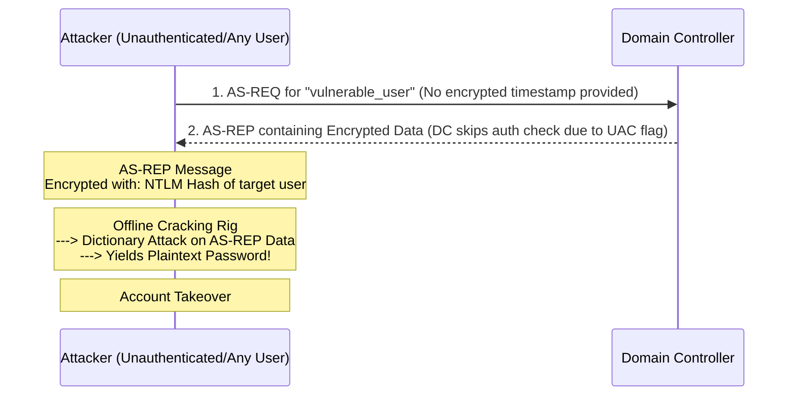

# AS-REP Roasting

## 1. Introduction to AS-REP Roasting

AS-REP Roasting is an offensive technique against Kerberos that targets a specific user misconfiguration in Active Directory. Unlike Kerberoasting (which requires the target to have an SPN), AS-REP Roasting requires a target user account to have the **"Do not require Kerberos preauthentication"** (`DONT_REQ_PREAUTH`) flag set in its User Account Control (UAC) properties.

When this flag is enabled, an attacker can request an initial authentication ticket (AS-REP) for that user from the Domain Controller without needing to provide the user's password. The Domain Controller responds with an AS-REP message that contains data encrypted with the user's password hash. The attacker can capture this data and crack it offline, similar to Kerberoasting.

## 2. Understanding Kerberos Pre-Authentication

To understand the vulnerability, one must understand standard Kerberos authentication.

### 2.1 The Standard AS-REQ/AS-REP Flow
By default, Kerberos Pre-Authentication is **enabled** for all Active Directory accounts to prevent offline password guessing attacks. 

1. **AS-REQ (Request):** When a user logs in, the client encrypts a timestamp using the user's password hash and sends it to the Key Distribution Center (KDC/DC). 
2. **KDC Verification:** The KDC looks up the user, retrieves their hash from the NTDS.dit database, and attempts to decrypt the timestamp. If successful, it proves the client knows the password.
3. **AS-REP (Response):** The KDC then replies with an Authentication Service Reply (AS-REP), containing the Ticket Granting Ticket (TGT) and a session key encrypted with the user's hash.

### 2.2 The Vulnerability: DONT_REQ_PREAUTH
If an administrator checks the "Do not require Kerberos preauthentication" box on a user account, Step 1 changes dramatically.

The attacker sends an AS-REQ for the target user **without** an encrypted timestamp. Because pre-authentication is disabled, the DC does not verify if the requester actually knows the password. It immediately proceeds to Step 3 and sends back the AS-REP. 

A portion of this AS-REP (the encrypted session key data) is encrypted using the target user's RC4 or AES hash. The attacker saves this offline and brute-forces the hash.

## 3. Why Does DONT_REQ_PREAUTH Exist?

Why would an administrator ever check this box?
1. **Legacy Compatibility:** Some very old Unix systems, legacy applications, or custom smart-card implementations do not support Kerberos pre-authentication.
2. **Misconfiguration:** Administrators troubleshooting authentication issues often toggle security settings randomly and forget to revert them.
3. **Backdoors:** Persistence mechanisms left by prior attackers or rogue administrators.

## 4. Exploitation and Execution

AS-REP Roasting can be performed seamlessly from both Windows and Linux attack platforms.

### 4.1 Enumeration
Before exploiting, you must find vulnerable accounts.
Using **PowerView**:
```powershell
Get-DomainUser -PreauthNotRequired -Verbose
```
This queries LDAP for users where the UAC flag `0x00400000` (DONT_REQ_PREAUTH) is present.

### 4.2 Exploitation with Rubeus
Rubeus can automatically find vulnerable users and request the AS-REP hashes in format ready for Hashcat.

**Command:**
```cmd
Rubeus.exe asreproast /format:hashcat /outfile:asrep_hashes.txt
```
This is a loud operation if there are many vulnerable accounts. For targeted exploitation:
```cmd
Rubeus.exe asreproast /user:vulnerable_user /format:hashcat /outfile:hash.txt
```

### 4.3 Exploitation with Impacket
From a Linux host, `GetNPUsers.py` (Get No Preauth Users) is used to harvest the hashes.

**Command:**
```bash
GetNPUsers.py corp.local/ -dc-ip 192.168.1.10 -request -format hashcat -outputfile hashes.txt
```
*Note: You do not even need valid credentials to perform this attack if the domain allows anonymous LDAP binding, though typically you need a valid user to query LDAP for the vulnerable accounts.*

## 5. Offline Cracking

The exported AS-REP hash is taken offline to be cracked.
The hash usually starts with `$krb5asrep$23$...` (for RC4).

### 5.1 Using Hashcat
- **Mode 18200:** For AS-REP (RC4)
- **Mode 19600/19700:** For AS-REP (AES)

**Command:**
```bash
hashcat -m 18200 -a 0 hashes.txt rockyou.txt --force
```

### 5.2 Using John the Ripper
```bash
john --format=krb5asrep --wordlist=rockyou.txt hashes.txt
```

## 6. ASCII Workflow Diagram



## 7. OPSEC, Detection, and Mitigation

### 7.1 Detection
- **Event ID 4768:** A Kerberos authentication ticket (TGT) was requested. 
If pre-authentication is disabled, the `Pre-Authentication Type` field in the event logs will be `0` or empty. Security teams can alert on any Event 4768 where pre-authentication was bypassed.

### 7.2 Mitigation
1. **Enforce Pre-Authentication:** Ensure the `DONT_REQ_PREAUTH` UAC flag is never checked. Periodically audit Active Directory using PowerShell to hunt for this flag.
2. **Strong Passwords:** If pre-authentication absolutely must be disabled for a legacy application, the password for that account must be exceptionally long and randomly generated to defeat offline cracking.
3. **AES Enforcment:** Forcing AES over RC4 makes the cracking process significantly slower, though not impossible.

## 8. Chaining Opportunities

- AS-REP roasting is typically identified during the initial **[[02 - AD Enumeration]]** phase.
- Successfully cracking an AS-REP hash provides a set of valid credentials. Depending on the privileges of that user, the attacker can proceed to **[[06 - Pass the Hash (PtH)]]** or map the environment further.
- This is a parallel attack path to **[[04 - Kerberoasting]]**, but targets a different misconfiguration.

## 9. Related Notes

- **[[01 - Active Directory Overview]]**
- **[[02 - AD Enumeration]]**
- **[[04 - Kerberoasting]]**
- **[[06 - Pass the Hash (PtH)]]**

## Real-World Attack Scenario
## Real-World Attack Scenario

During the initial reconnaissance phase, the attacker sought to identify misconfigured user accounts that could be exploited without needing to interact with target services.
They focused on finding accounts with the "Do not require Kerberos preauthentication" attribute enabled (`DONT_REQ_PREAUTH`).
This misconfiguration allows anyone to request an Authentication Service Response (AS-REP) for the user directly from the Domain Controller.
The AS-REP contains a piece of data encrypted with the user's password hash, which can be cracked offline.
From their compromised Windows workstation, the attacker loaded the PowerView module into memory.
They executed `Get-DomainUser -PreauthNotRequired -Properties sAMAccountName` to sweep the domain for vulnerable accounts.
The query quickly returned a single result: `svc_backup`.
This account was likely configured without preauthentication to support a legacy backup application that did not fully support the Kerberos standard.
Realizing the opportunity, the attacker switched to their Linux attacking machine to extract the hash.
They used Impacket's `GetNPUsers.py` tool, executing: `GetNPUsers.py megacorp.local/svc_backup -no-pass -dc-ip 10.0.0.5`.
The script sent a crafted AS-REQ to the Domain Controller on behalf of the `svc_backup` user.
Because preauthentication was disabled, the DC did not require the attacker to prove they knew the password.
The DC responded with the AS-REP, and the script parsed it, outputting the hash in Hashcat format (`$krb5asrep$23$...`).
The attacker took the hash offline to their dedicated cracking rig.
They ran Hashcat against a targeted wordlist containing common corporate passwords and permutations: `hashcat -m 18200 hash.txt corp_wordlist.txt`.
Within minutes, the weak password `Backup1!` was recovered.
The attacker quickly analyzed the privileges of the `svc_backup` account using BloodHound data gathered previously.
They discovered that the backup service account was a member of the `Backup Operators` domain group.
This group membership granted the account the ability to bypass file system security to back up files on all domain controllers.
The attacker used the compromised credentials to connect to the primary DC via SMB and extract the `NTDS.DIT` database.
The AS-REP roasting attack, exploiting a single legacy misconfiguration, led directly to a full domain compromise.

