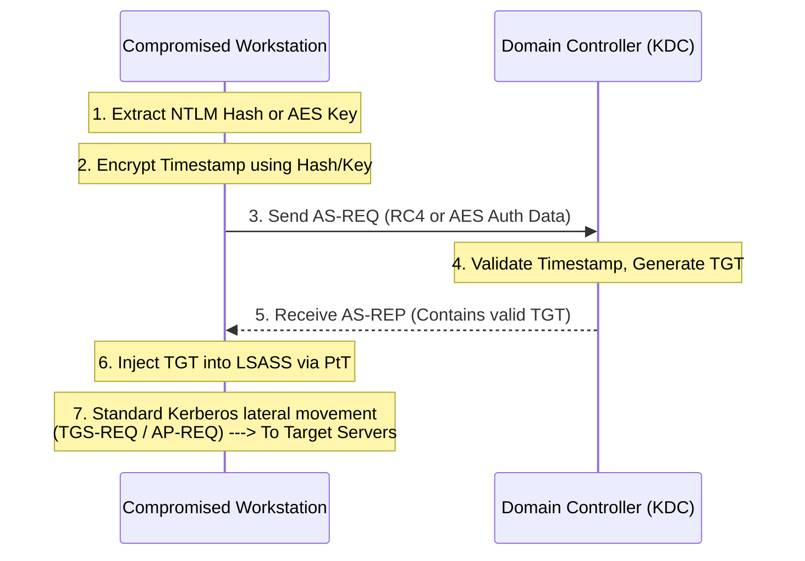

# 36.08 Overpass the Hash (Pass the Key)

## 1. Executive Summary

Overpass the Hash (also known as Pass the Key) is an advanced Active Directory attack technique that bridges the gap between NTLM and Kerberos authentication. When an attacker compromises a system and extracts a user's NTLM hash (or AES keys), but the environment enforces Kerberos authentication (disabling or restricting NTLM), the attacker cannot perform a standard Pass the Hash (PtH) attack. Overpass the Hash solves this by using the extracted NTLM hash or AES key to request a legitimate Kerberos Ticket Granting Ticket (TGT) from the Domain Controller. This effectively upgrades an NTLM-based credential into a Kerberos-based credential.

## 2. Theoretical Background and Core Concepts

### NTLM vs. Kerberos Authentication
Active Directory supports two primary authentication protocols:
1. **NTLM**: Challenge-response protocol relying on the user's NTLM hash. Pass the Hash (PtH) exploits this by sending the hash directly in response to challenges.
2. **Kerberos**: Ticket-based protocol. It uses encrypted timestamps to authenticate and issue tickets. 

### The Bridge: Generating the Authenticator
In the initial step of Kerberos authentication (AS-REQ), the client must encrypt a timestamp with their "long-term key" to prove their identity to the KDC. 
The KDC accepts multiple encryption types for this long-term key:
- RC4 (RC4-HMAC) -> This is mathematically identical to the NTLM hash.
- AES128 / AES256 -> Derived from the user's plaintext password and a salt (the domain name + username).

If an attacker has the NTLM hash, they essentially possess the RC4 key. They can use this RC4 key to encrypt the timestamp in the AS-REQ, tricking the KDC into issuing a valid TGT. If the environment disables RC4 (a common hardening practice), the attacker must use the AES keys instead.

## 3. The Mechanics of the Attack

The Overpass the Hash attack sequence:
1. **Extraction**: Extract the NTLM hash (RC4 key) or AES keys from a compromised host (e.g., via SAM database or LSASS).
2. **AS-REQ Generation**: Use a tool to construct a raw AS-REQ packet. The tool encrypts the current timestamp using the extracted hash/key.
3. **KDC Communication**: Send the AS-REQ to the Domain Controller.
4. **TGT Reception**: The DC decrypts the timestamp, validates the authentication, and replies with an AS-REP containing a TGT.
5. **Injection**: Inject the newly acquired TGT into the current session memory.
6. **Lateral Movement**: Use the TGT to request Service Tickets (TGS) and access network resources.

## 4. ASCII Architecture Diagram



## 5. Prerequisites and Required Tools

**Prerequisites:**
- Elevated privileges on the source machine to extract hashes/keys.
- The NTLM hash (for RC4) or AES128/256 keys of the target user.
- Direct network connectivity to the Domain Controller (KDC) over port 88.

**Tools:**
- **Mimikatz**: For both extraction and requesting/injecting the TGT.
- **Rubeus**: `asktgt` module is highly effective for this.
- **Impacket**: `getTGT.py` for performing the attack from a Linux machine.

## 6. Step-by-Step Execution

### Scenario A: Using Mimikatz (RC4 / NTLM Hash)
Assume we have the NTLM hash: `cf3a5525ee9414229e66279623ed5c58` for the user `Administrator`.

1. Launch Mimikatz.
2. Execute the `sekurlsa::pth` module. Despite the name, when you specify `/ptt`, it performs Overpass the Hash.
```cmd
sekurlsa::pth /user:Administrator /domain:DOMAIN.LOCAL /ntlm:cf3a5525ee9414229e66279623ed5c58 /run:cmd.exe
```
This spawns a new `cmd.exe` process with the generated TGT injected into its memory space.

### Scenario B: Using Mimikatz (AES Keys)
If RC4 is disabled on the domain, you must use AES keys.
```cmd
sekurlsa::pth /user:Administrator /domain:DOMAIN.LOCAL /aes256:1a2b3c... /run:cmd.exe
```

### Scenario C: Using Rubeus
Rubeus gives you fine-grained control and avoids creating suspicious processes like Mimikatz does.
```cmd
Rubeus.exe asktgt /user:Administrator /domain:DOMAIN.LOCAL /rc4:cf3a5525ee9414229e66279623ed5c58 /ptt
```
Or with AES256:
```cmd
Rubeus.exe asktgt /user:Administrator /domain:DOMAIN.LOCAL /aes256:1a2b3c... /ptt
```

### Scenario D: Using Impacket (Linux)
From an attacker's Linux machine, request the TGT and save it as a `.ccache` file.
```bash
getTGT.py DOMAIN.LOCAL/Administrator -hashes :cf3a5525ee9414229e66279623ed5c58
```
Export the resulting `Administrator.ccache` variable and use other Impacket tools:
```bash
export KRB5CCNAME=Administrator.ccache
psexec.py DOMAIN.LOCAL/Administrator@target.domain.local -k -no-pass
```

## 7. Detection and Artifacts

1. **Event ID 4768 (A Kerberos authentication ticket (TGT) was requested)**:
   - **Encryption Type Anomalies**: If a TGT is requested using RC4 encryption (0x17 or 23), this is highly suspicious in modern environments where AES is the default. Alerting on Event 4768 where `Ticket Encryption Type` is `0x17` is a strong indicator of Overpass the Hash (or older legacy systems).
2. **Event ID 4624 (Logon)**:
   - When Mimikatz spawns a new process with `sekurlsa::pth`, it creates a Logon Type 9 (NewCredentials). This allows the process to run as the current user locally but authenticate as the target user on the network.
3. **Process Creation (Event ID 4688)**:
   - Monitoring for command-line arguments containing `/user:`, `/domain:`, `/ntlm:`, or `/aes256:` can catch unmodified Mimikatz or Rubeus execution.

## 8. Mitigation and Prevention

1. **Disable RC4**: The most effective mitigation is to disable RC4-HMAC encryption in Active Directory via Group Policy (`Network security: Configure encryption types allowed for Kerberos`). This forces attackers to acquire AES keys, which are generally harder to crack and extract than NTLM hashes.
2. **Credential Guard**: Windows Defender Credential Guard prevents the extraction of NTLM hashes and AES keys from LSASS, stopping the attack at the prerequisite stage.
3. **LAPS (Local Administrator Password Solution)**: Prevents lateral movement by ensuring local administrator passwords are unique across all endpoints, limiting the usefulness of extracted local hashes.
4. **Account Tiering**: Restrict where high-value accounts (like Domain Admins) can log on to prevent their hashes from being exposed on easily compromised workstations.

## 9. Chaining Opportunities

- **[[07 - Pass the Ticket (PtT)]]**: Overpass the Hash is essentially the prerequisite step to generate the ticket, which is then injected using Pass the Ticket methodologies.
- **[[06 - Pass the Hash (PtH)]]**: Often compared to PtH, but used specifically to bypass environments that mandate Kerberos.
- **[[05 - Kerberoasting]]**: After using Overpass the Hash to obtain a TGT, the attacker can request TGS tickets for service accounts to crack them offline.

## 10. Related Notes

- [[01 - Active Directory Basics]]
- [[04 - Kerberos Authentication Deep Dive]]
- [[15 - Lateral Movement Techniques]]

---
*Note: This material is for educational and authorized penetration testing purposes only.*

## Real-World Attack Scenario
## Real-World Attack Scenario

The attacker had compromised a workstation (`WKSTN-05`) and extracted the NTLM hash for the user `jdoe`: `cf3a5525ee9414229e66279623ed5c58`.
They needed to access an internal web application that hosted sensitive financial documents.
However, the environment was hardened: NTLM authentication was strictly disabled across the domain to prevent Pass the Hash attacks.
All services, including the target web app, required Kerberos authentication.
A standard PtH attack using tools like CrackMapExec or Impacket's SMB clients would fail because the target servers would reject the NTLM negotiation.
To bypass this restriction, the attacker needed to "upgrade" their NTLM hash into a valid Kerberos Ticket Granting Ticket (TGT).
This technique is known as Overpass the Hash or Pass the Key.
The attacker used Rubeus, a powerful C# toolset for Kerberos manipulation, executing it in memory to evade detection.
They ran the command: `Rubeus.exe asktgt /user:jdoe /domain:megacorp.local /rc4:cf3a5525ee9414229e66279623ed5c58 /ptt`.
Rubeus used the provided NTLM hash (the RC4 key) to encrypt the timestamp required for the initial Authentication Service Request (AS-REQ).
The Domain Controller received the AS-REQ, successfully decrypted the timestamp using `jdoe`'s stored hash, and validated the request.
The DC then issued an AS-REP containing a valid TGT for `jdoe`.
The `/ptt` flag in the Rubeus command automatically injected this newly acquired TGT into the attacker's current logon session.
The attacker verified the ticket's presence using `klist`.
With a valid TGT injected, the attacker opened a browser session from the compromised workstation.
They navigated to the internal web application (`https://finance.megacorp.local`).
The browser transparently presented the TGT to the KDC, requested a Service Ticket (TGS) for the web service, and authenticated seamlessly via Kerberos.
The attacker successfully bypassed the NTLM restriction, gaining access to the sensitive documents.
This attack demonstrated that disabling NTLM is not a silver bullet if attackers can extract the hashes and use them to forge Kerberos requests.

