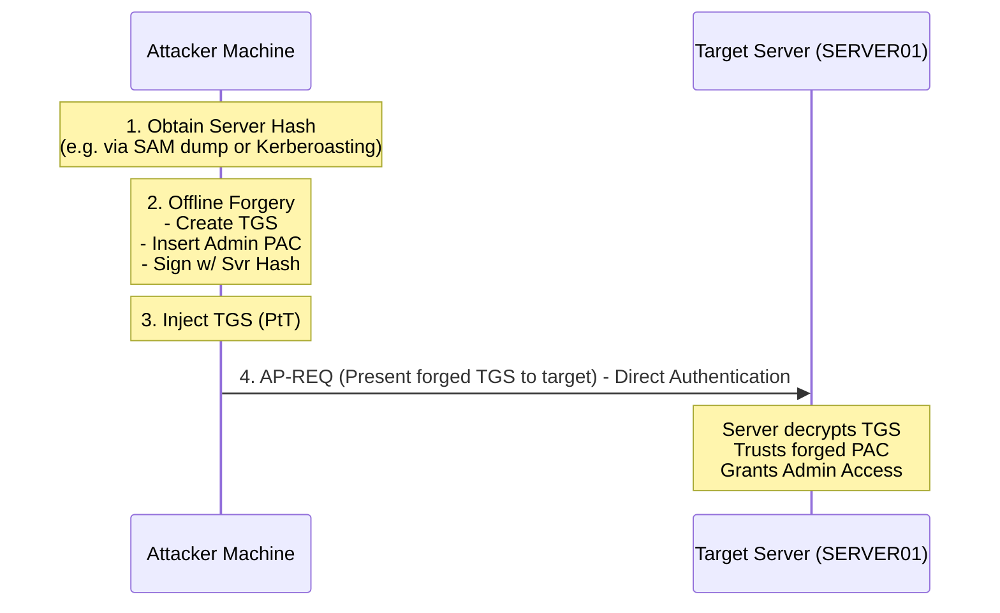

# 36.10 Silver Ticket Attack

## 1. Executive Summary

A Silver Ticket Attack is a Kerberos forgery technique where an attacker creates a forged Ticket Granting Service (TGS) ticket. Unlike a Golden Ticket, which requires the `krbtgt` hash and grants domain-wide access, a Silver Ticket only requires the NTLM hash (or AES key) of a specific target computer account (or service account). By forging a TGS ticket, the attacker grants themselves administrative access to specific services hosted on that machine (e.g., CIFS, WMI, HOST, HTTP) without ever needing to interact with the Domain Controller (KDC). Because the KDC is bypassed entirely, Silver Ticket attacks are exceptionally stealthy and leave minimal forensic artifacts in standard domain controller logs.

## 2. Theoretical Background and Core Concepts

### Service Tickets and Service Account Passwords
In the standard Kerberos flow, when a user wants to access a service (e.g., a file share on `SERVER01`), they present their TGT to the KDC and request a TGS for `cifs/SERVER01`. The KDC validates the TGT, packages the user's authorization data (PAC) into a new TGS, and encrypts this TGS using the password hash of the target service account (in this case, the machine account `SERVER01$`).

The target service (`SERVER01`) does not communicate with the KDC to validate the ticket. It simply relies on its ability to decrypt the TGS using its own machine account hash. If decryption is successful, the service implicitly trusts the authorization data contained within the ticket (the PAC).

### The Forgery Mechanism
If an attacker obtains the NTLM hash of `SERVER01$`, they can construct their own TGS. They manually craft a PAC containing high-privileged SIDs (e.g., Domain Admins, local administrators), encrypt it with the `SERVER01$` hash, and present it directly to `SERVER01` via an AP-REQ. `SERVER01` decrypts it, sees the forged Admin SIDs, and grants administrative access.

## 3. The Mechanics of the Attack

The attack sequence follows these phases:
1. **Hash Extraction**: The attacker obtains the machine account hash or service account hash. This is often done via local compromise of the target system (dumping SAM/LSA), Kerberoasting, or exploiting misconfigurations.
2. **Reconnaissance**: The attacker identifies the domain SID and the target service SPN (Service Principal Name, e.g., `cifs/server01.domain.local`).
3. **Forgery**: The attacker uses a tool to craft the TGS locally. The forged ticket bypasses the KDC entirely.
4. **Injection**: The forged TGS is injected into the attacker's session memory.
5. **Execution**: The attacker connects directly to the target service. The service accepts the ticket, granting the requested privileges.

## 4. ASCII Architecture Diagram



## 5. Prerequisites and Required Tools

**Prerequisites:**
- The NTLM hash (RC4) or AES 128/256 key of the target service account (machine account for HOST/CIFS/WMI, or user account for SQL/HTTP).
- The Fully Qualified Domain Name (FQDN).
- The Domain SID.
- The target Service Principal Name (SPN) (e.g., `cifs/target.domain.local`).

**Tools:**
- **Mimikatz**: For local generation and injection.
- **Impacket**: `ticketer.py` for Linux-based offline generation.
- **Rubeus**: For C#-based memory injection and ticket management.

## 6. Step-by-Step Execution

### Step 1: Gathering Prerequisites
Extract the target machine hash. If you have local admin on the target:
```cmd
mimikatz # sekurlsa::logonpasswords
```
Assume we extracted the NTLM hash for `SERVER01$`: `e52cac67419a9a224a3b108f3fa6cb6d`.
Obtain the Domain SID (e.g., using `whoami /user` or PowerView).

### Step 2: Creating and Injecting the Silver Ticket
Using Mimikatz, forge the ticket for the `cifs` service (allowing file system access):
```cmd
mimikatz # kerberos::golden /domain:domain.local /sid:S-1-5-21-123456789-987654321-1122334455 /target:server01.domain.local /service:cifs /rc4:e52cac67419a9a224a3b108f3fa6cb6d /user:Administrator /ptt
```
*Note: The command is `kerberos::golden`, but because we specify `/target` and `/service`, it generates a Silver Ticket (TGS) instead of a Golden Ticket (TGT).*

### Step 3: Verification
Verify the TGS is in memory:
```cmd
klist
```
Access the target system's administrative share:
```cmd
dir \\server01.domain.local\C$
```

### Expanding the Attack Surface
You can create tickets for various services on the same machine to gain different types of execution:
- `cifs`: File access (SMB)
- `host`: Scheduled tasks, Service Control Manager (Psexec)
- `rpcss` / `wmi`: Windows Management Instrumentation (WMI)
- `wsman`: PowerShell Remoting (WinRM)

## 7. Detection and Artifacts

Detecting Silver Tickets is extremely difficult because the malicious authentication bypasses the Domain Controller. The logs will only appear on the target server itself.

1. **Missing KDC Logs**: The most distinct indicator of a Silver Ticket is an Event ID 4624 (Logon) or 4634 (Logoff) on the target server with a Kerberos authentication package, where there is **no corresponding Event ID 4769 (Service Ticket Requested)** on any Domain Controller for that user and service.
2. **PAC Validation Anomalies**: If the target server is configured to validate the PAC with the KDC (a setting that is increasingly enabled by default in modern Windows updates), Event ID 4624 will fail, or an error will be generated (Event ID 7 or Event ID 46 from the Kerberos-Key-Distribution-Center).
3. **Encryption Downgrades**: If the environment forces AES, seeing a logon event where the Ticket Encryption Type is RC4 (0x17) on the target server is highly suspicious.

## 8. Mitigation and Prevention

1. **PAC Validation**: Enable PAC validation globally. When enabled, the service receiving the TGS will send the PAC back to the KDC to verify the signature. Since the attacker does not have the `krbtgt` hash, they cannot sign the PAC correctly, and the forgery will be detected and rejected.
2. **Enforce AES**: Disable RC4 at the domain level. This forces attackers to extract AES keys, which are harder to obtain, especially on hardened endpoints.
3. **Service Account Hygiene**: Frequently rotate service account passwords. For services running under user accounts (e.g., SQL), use Group Managed Service Accounts (gMSAs) which automatically rotate complex, 120-character passwords, neutralizing Kerberoasting and Silver Ticket attacks against those accounts.
4. **Credential Guard**: Protects machine account hashes from being easily dumped from LSASS.

## 9. Chaining Opportunities

- **[[05 - Kerberoasting]]**: Kerberoasting is the primary method for obtaining the service account hash needed to forge a Silver Ticket against services like SQL or HTTP.
- **[[07 - Pass the Ticket (PtT)]]**: The mechanism used to load the forged Silver Ticket into the attacker's session.
- **[[09 - Golden Ticket Attack]]**: The Silver Ticket is the service-specific variant of the Golden Ticket.

## 10. Related Notes

- [[01 - Active Directory Basics]]
- [[04 - Kerberos Authentication Deep Dive]]
- [[17 - Active Directory Persistence Mechanisms]]

---
*Note: This material is for educational and authorized penetration testing purposes only.*

## Real-World Attack Scenario
## Real-World Attack Scenario

The attacker had infiltrated a branch office and compromised a print server (`PRINT-SRV-02`).
While exploring the server, they managed to extract the local SAM database, which contained the NTLM hash of the machine account: `e52cac67419a9a224a3b108f3fa6cb6d`.
The attacker's ultimate goal was to access the CEO's workstation (`CEO-WKS-01`) to steal confidential merger documents.
However, the Domain Controllers were heavily monitored, and any suspicious TGT requests (like Golden Tickets or Overpass the Hash) would trigger SIEM alerts.
To maintain absolute stealth, the attacker opted for a Silver Ticket attack, which bypasses the Domain Controller entirely.
A Silver Ticket is a forged Service Ticket (TGS) that is presented directly to the target service.
The attacker first needed the NTLM hash of the CEO's workstation machine account (`CEO-WKS-01$`).
They used their access on the print server to run a targeted Kerberoasting attack against a weak service account that had administrative rights on the CEO's machine, eventually dumping the `CEO-WKS-01$` hash.
With the target machine's hash in hand, the attacker moved to their offline cracking rig.
They used Mimikatz to forge a TGS specifically for the CIFS (Common Internet File System) service on the CEO's workstation.
The command was: `kerberos::golden /domain:megacorp.local /sid:S-1-5-21... /target:ceo-wks-01.megacorp.local /service:cifs /rc4:[CEO-WKS-01_HASH] /user:Administrator /ptt`.
This command constructed a TGS containing a Privilege Attribute Certificate (PAC) that falsely claimed the user was a Domain Admin.
Crucially, the ticket was encrypted with the `CEO-WKS-01$` hash, not the `krbtgt` hash.
The `/ptt` flag injected this forged Silver Ticket into the attacker's current session memory on the compromised print server.
The attacker then executed `dir \\ceo-wks-01.megacorp.local\C$`.
The CEO's workstation received the request, decrypted the TGS using its own machine hash, and trusted the forged PAC.
It granted the attacker full administrative access to the file system.
The attacker navigated to the CEO's Documents folder and exfiltrated the sensitive merger files.
Because the Domain Controller was completely bypassed in this interaction, no Kerberos ticket request logs (Event ID 4768 or 4769) were generated on the DC.
The Silver Ticket attack achieved the objective with surgical precision and zero central logging, demonstrating the danger of compromised service or machine account hashes.

