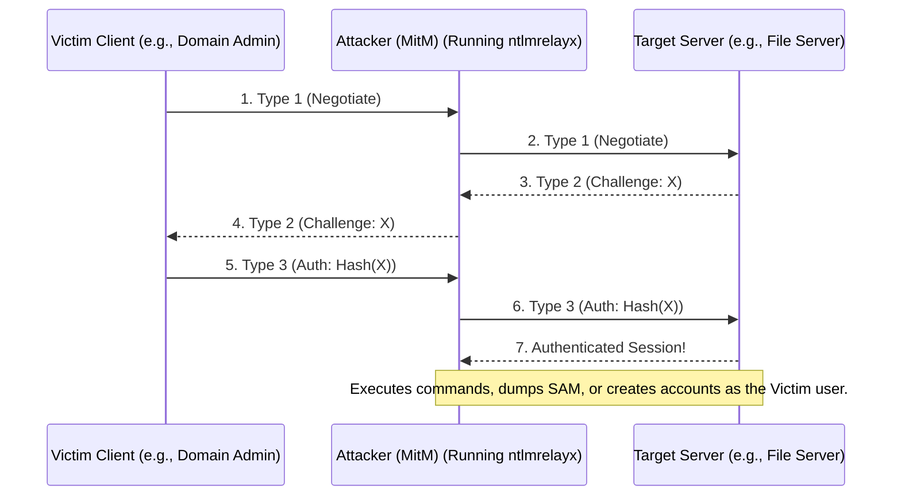

# 36.11 NTLM Relay Attack

## 1. Executive Summary

NTLM Relay is a potent Man-in-the-Middle (MitM) attack specifically targeting the NTLM authentication protocol in Windows domains. Instead of attempting to crack an intercepted NTLM hash, the attacker intercepts the authentication traffic and blindly forwards (relays) it to a target server. If the relayed authentication belongs to an account with administrative privileges on the target server, the attacker instantly gains administrative access to that system. This attack exploits the inherent lack of mutual authentication in standard NTLM over non-secured protocols, making it one of the most reliable methods for lateral movement and privilege escalation in misconfigured Active Directory environments.

## 2. Theoretical Background and Core Concepts

### NTLM Challenge-Response Flow
To understand NTLM Relay, we must review the NTLM authentication process (Type 1, Type 2, Type 3 messages):
1. **Type 1 (Negotiate)**: The client attempts to access a service and sends a Negotiate message containing supported features.
2. **Type 2 (Challenge)**: The server responds with a 16-byte random Challenge.
3. **Type 3 (Authenticate)**: The client encrypts the Challenge using its NTLM password hash and sends this response back to the server. The server verifies the response (often by passing it to the DC via Netlogon) and grants access.

### The Relay Concept
In an NTLM Relay attack, the attacker places themselves between the Victim (Client) and the Target (Server):
1. The Victim attempts to authenticate to the Attacker (believing the attacker is a legitimate resource, e.g., via LLMNR/NBT-NS poisoning).
2. The Attacker receives the Type 1 message and initiates a separate connection to the Target, sending a Type 1 message.
3. The Target replies with a Type 2 Challenge to the Attacker.
4. The Attacker forwards this exact Challenge to the Victim.
5. The Victim encrypts the Challenge with their hash and sends the Type 3 Response to the Attacker.
6. The Attacker forwards the Victim's Response to the Target.
7. The Target validates the response. Because the response is mathematically valid for the Challenge, the Target grants the Attacker a session authenticated as the Victim.

## 3. The Mechanics of the Attack

The attack typically relies on two distinct phases:
1. **Coercion / Poisoning**: Getting the victim to authenticate to the attacker's machine. This is commonly achieved through:
   - LLMNR, NBT-NS, or mDNS poisoning (e.g., using Responder).
   - Coercion RPC calls (e.g., PetitPotam, PrinterBug) forcing a machine account to authenticate.
   - Malicious shortcuts (.LNK files), injected UNC paths in Word documents, or internal phishing.
2. **Relaying**: Catching the inbound NTLM authentication and shuttling it to a pre-defined target over various protocols (SMB, HTTP, LDAP, MSSQL).

## 4. ASCII Architecture Diagram



## 5. Prerequisites and Required Tools

**Prerequisites:**
- The target server must **not** enforce protocol signing (e.g., SMB Signing must be Disabled or Enabled but not Required).
- The victim account being relayed must have sufficient privileges (e.g., Local Admin) on the target server for the attack to yield code execution.
- You cannot relay an NTLM authentication back to the machine that generated it (unless exploiting specific cross-protocol vulnerabilities like MS08-068, which are mostly patched).

**Tools:**
- **ntlmrelayx.py** (Impacket): The most versatile and robust relay tool, supporting multiple target protocols (SMB, HTTP, LDAP).
- **Responder**: Used for poisoning name resolution protocols to force the victim to send NTLM auth to the attacker.
- **Inveigh**: A PowerShell/C# alternative to Responder for Windows environments.

## 6. Step-by-Step Execution

### Step 1: Identifying Targets
Identify systems on the network that do not require SMB Signing. Tools like CrackMapExec or nmap can do this.
```bash
nmap --script smb-security-mode.nse -p445 192.168.1.0/24
```
Create a list of vulnerable IP addresses (`targets.txt`).

### Step 2: Configuring the Relay
Set up `ntlmrelayx.py` to relay inbound authentications to the targets identified in step 1. By default, upon successful relay, it dumps the local SAM hashes.
```bash
ntlmrelayx.py -tf targets.txt -smb2support
```
To execute a specific command instead of dumping hashes:
```bash
ntlmrelayx.py -tf targets.txt -smb2support -c "powershell -enc JABzACA..."
```

### Step 3: Triggering Authentication
Run Responder to poison LLMNR/NBT-NS and capture stray traffic. **Crucial:** You must disable SMB and HTTP servers in `Responder.conf` so they don't clash with `ntlmrelayx`.
```bash
python3 Responder.py -I eth0 -dwv
```
When a victim mistypes a UNC path (e.g., `\\filserver`), Responder poisons the request, directing the victim to the attacker. The victim authenticates, `ntlmrelayx` intercepts, relays to `targets.txt`, and executes the payload.

### Step 4: Protocol Switching (Cross-Protocol Relay)
NTLM Relay is not limited to SMB-to-SMB. You can capture SMB and relay it to HTTP, LDAP, or MSSQL.
For example, relaying an incoming SMB connection to an AD Certificate Services (ADCS) HTTP endpoint to request a client certificate (ESC8):
```bash
ntlmrelayx.py -t http://adcs.domain.local/certsrv/certfnsh.asp -smb2support --adcs
```

## 7. Detection and Artifacts

1. **Event ID 4624 (Logon)**: Look for successful network logons (Type 3) using NTLM where the Source IP is the attacker's machine, but the user account belongs to an administrator or machine account from a *different* machine.
2. **Anomalous Network Traffic**: Detect high volumes of LLMNR (UDP 5355) and NBT-NS (UDP 137) traffic originating from a single anomalous host (the attacker running Responder).
3. **SMB Session Anomalies**: Advanced EDR tools can detect when the negotiated SMB session IP differs from the expected IP of the user's registered workstation.

## 8. Mitigation and Prevention

1. **Require SMB Signing**: The most effective defense against SMB-to-SMB relay. Enforce `Microsoft network server: Digitally sign communications (always)` via GPO. This ensures the Type 3 response is cryptographically bound to the specific session, breaking the relay.
2. **Enable LDAP Signing and LDAP Channel Binding**: Prevents SMB-to-LDAP relay attacks, which are commonly used to create new domain accounts or modify ACLs.
3. **Disable LLMNR and NBT-NS**: Disable these legacy multicast protocols via GPO to prevent the poisoning phase of the attack.
4. **Enforce EPA (Extended Protection for Authentication)**: Protects HTTP endpoints (like AD CS or Exchange) from NTLM relay by cryptographically binding the NTLM authentication to the TLS session.
5. **Tiered Administration**: Ensure highly privileged accounts (Domain Admins) cannot log on to standard workstations, minimizing the chance their credentials can be coerced and relayed.

## Real-World Attack Scenario

In a simulated penetration test, the objective was to demonstrate the risk of disabled SMB signing on internal application servers. The attacker started from a low-privileged position on the user network segment.

**The Context**
A scan using `nmap` or `crackmapexec` identified several legacy application servers that did not enforce SMB signing. The network also relied heavily on legacy broadcast protocols for name resolution.

**The Execution**
1.  **Preparation:** The attacker configured `ntlmrelayx.py` to target the vulnerable application servers, setting it to dump the local SAM database upon a successful relay connection.
    `ntlmrelayx.py -tf targets.txt -smb2support`
2.  **Poisoning Phase:** To coerce authentication, the attacker started `Responder` with HTTP and SMB servers disabled to avoid port conflicts with `ntlmrelayx`.
    `responder -I eth0 -dwv`
3.  **The Trigger:** A Helpdesk administrator mistyped a network share path (`\\fileservvv`), triggering an LLMNR request. Responder immediately replied, claiming to be the requested server.
4.  **The Relay:** The Helpdesk administrator's workstation sent their NTLMv2 hash to the attacker's machine. `ntlmrelayx` intercepted this authentication and forwarded it to a vulnerable application server.
5.  **The Outcome:** The target server accepted the relayed authentication because the Helpdesk administrator had Local Admin rights on that machine. The SAM database was dumped, revealing local administrator hashes that could be used for lateral movement.

## 9. Chaining Opportunities

- **[[12 - SMB Relay]]**: The specific subset of NTLM relay targeting the SMB protocol.
- **[[24 - AD CS Attacks (ESC8)]]**: NTLM relay targeting Active Directory Certificate Services HTTP web enrollment endpoints to obtain valid certificates.
- **[[25 - Resource-Based Constrained Delegation (RBCD)]]**: Relaying to LDAP to modify the `msDS-AllowedToActOnBehalfOfOtherIdentity` attribute.

## 10. Related Notes

- [[01 - Active Directory Basics]]
- [[03 - NTLM Authentication Deep Dive]]
- [[15 - Lateral Movement Techniques]]

---
*Note: This material is for educational and authorized penetration testing purposes only.*

## Real-World Attack Scenario
## 11. Real-World Attack Scenario

In an internal penetration test for a mid-sized healthcare provider, the assessment began with a standard low-privileged position on the internal network. The goal was to demonstrate realistic lateral movement and privilege escalation without relying on unpatched software exploits.

**The Context**
The environment utilized a flat network architecture for workstations and file servers. Crucially, a preliminary scan using `netexec smb 10.10.10.0/24 --gen-relay-list targets.txt` revealed that SMB signing was disabled across almost all workstations and several legacy application servers. 

**The Execution**
1.  **Preparation:** The attacker configured `ntlmrelayx.py` to target the systems identified in `targets.txt`, instructing it to dump the local SAM database upon a successful relay connection:
    ```bash
    ntlmrelayx.py -tf targets.txt -smb2support
    ```
2.  **Poisoning Phase:** To coerce authentication, the attacker started `Responder` with HTTP and SMB servers disabled in `Responder.conf` (to avoid port conflicts with `ntlmrelayx`). 
    ```bash
    sudo responder -I eth0 -dwv
    ```
3.  **The Trigger:** A Helpdesk administrator, attempting to access a non-existent network share (`\\fileservvv`), triggered an LLMNR request. Responder immediately replied, claiming to be the requested server.
4.  **The Relay:** The Helpdesk administrator's workstation automatically sent their NTLMv2 hash to the attacker's machine. `ntlmrelayx` intercepted this authentication and immediately forwarded it to `10.10.10.45` (a vulnerable application server). 
5.  **The Outcome:** The target server accepted the relayed authentication because the Helpdesk administrator happened to have Local Admin rights on that specific machine. `ntlmrelayx` dumped the SAM database of `10.10.10.45`, revealing the plaintext password of a shared local administrator account (`Admin-AppServ`) which was subsequently reused to compromise multiple other servers in the same subnet.

