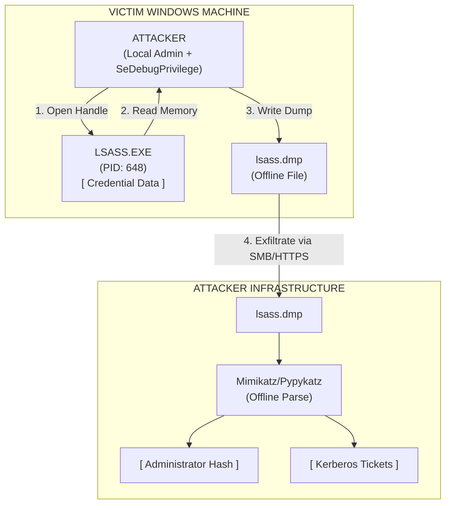

# LSASS Dumping

## 1. Introduction to LSASS

The **Local Security Authority Subsystem Service (LSASS.exe)** is a core Windows process responsible for enforcing security policy on the system. It verifies users logging on to a Windows computer or server, handles password changes, and creates access tokens.

From an offensive perspective, LSASS is the ultimate treasure trove. To facilitate Single Sign-On (SSO) and prevent users from having to re-type their passwords for every network resource, LSASS stores credentials in its memory space. Depending on the OS version and configuration, this memory can contain:
- Plaintext passwords (via WDigest, TsPkg).
- NTLM Hashes (via MSV1_0).
- Kerberos Ticket Granting Tickets (TGTs) and session keys.

**LSASS Dumping** refers to the technique of reading the memory space of the `lsass.exe` process and saving it to a file (a `.dmp` file). Unlike running standard Mimikatz locally (which injects into LSASS and extracts data live), LSASS dumping is often an *evasion* tactic. Attackers dump the memory using highly stealthy or built-in tools, exfiltrate the `.dmp` file to their own attacking infrastructure, and parse it offline. This avoids triggering behavioral alerts associated with executing Mimikatz on a victim machine.

---

## 2. Visual Architecture: The Dumping Workflow



---

## 3. Techniques for Dumping LSASS

Because local credential dumping is a highly monitored event, attackers have developed numerous ways to dump LSASS, ranging from noisy GUI tools to stealthy API calls.

### 3.1 Task Manager (The GUI Method)
The simplest, albeit manual and noisy, method is to use the built-in Windows Task Manager.
1. RDP into the target machine.
2. Open Task Manager as Administrator.
3. Navigate to the Details tab, find `lsass.exe`.
4. Right-click -> "Create dump file".
5. The dump is saved to `%AppData%\Local\Temp\lsass.DMP`.
*OpSec Note: Highly visible, requires GUI access, but uses 100% Microsoft-signed binaries.*

### 3.2 Comsvcs.dll (The Living Off The Land Method)
`comsvcs.dll` is a legitimate Windows DLL that contains a function called `MiniDumpW`. Attackers can use `rundll32.exe` to invoke this function directly from the command line to dump LSASS.

First, you must find the Process ID (PID) of LSASS:
```cmd
tasklist | findstr lsass.exe
```
Assume the PID is 648. To dump using `comsvcs.dll`, you must have `SeDebugPrivilege`. Attackers often run this from an elevated command prompt:
```cmd
rundll32.exe C:\windows\System32\comsvcs.dll, MiniDump 648 C:\temp\lsass.dmp full
```
*OpSec Note: EDRs actively monitor `rundll32.exe` calling `comsvcs.dll` with the word `MiniDump`. Attackers often obfuscate this by renaming the DLL or using PowerShell to call the API dynamically.*

### 3.3 ProcDump (Sysinternals)
ProcDump is an official Microsoft Sysinternals tool designed for capturing process dumps for debugging. Because it is digitally signed by Microsoft, it historically bypassed many AV filters.
```cmd
procdump.exe -ma lsass.exe C:\temp\lsass.dmp
```
*OpSec Note: Procdump dropping a dump of LSASS is now universally signatured by Defender and EDRs. Attackers will often rename the executable (e.g., `pd.exe`) or dump to a disguised extension.*

### 3.4 API Calls and Custom Code (Direct Syscalls)
To bypass user-land API hooking implemented by EDRs (like hooks on `MiniDumpWriteDump` or `NtReadVirtualMemory`), modern malware uses Direct Syscalls. 
Attackers write custom loaders in C/C++ or C# that map the `ntdll.dll` from disk, resolve the system call numbers dynamically, and invoke the kernel directly. This completely blinds EDRs that rely on user-land DLL hooking to monitor `OpenProcess` and memory read operations. Tools like **Dumpert** and **NanoDump** operate on this principle.

### 3.5 Bypassing LSA Protection (PPL)
If RunAsPPL is enabled, even `comsvcs.dll` and `procdump` will fail with an "Access Denied" error. Attackers must use a vulnerable kernel driver (BYOVD) to patch the EPROCESS structure in the kernel and remove the PPL flag from LSASS before dumping, using tools like **PPLDump** or Mimikatz's `mimidrv.sys`.

---

## 4. Offline Extraction

Once the `lsass.dmp` file is exfiltrated to the attacker's machine, it can be parsed safely without triggering the victim's EDR.

### 4.1 Parsing with Mimikatz
Mimikatz supports reading a `.dmp` file instead of active memory:
```text
mimikatz # sekurlsa::minidump lsass.dmp
mimikatz # sekurlsa::logonpasswords
```
*Note: The architecture of the attacker's Mimikatz (32-bit vs 64-bit) must match the architecture of the dumped LSASS process.*

### 4.2 Parsing with Pypykatz
Pypykatz is a pure Python implementation of Mimikatz. It is excellent for Linux-based attacking machines (like Kali Linux) and script automation.
```bash
pypykatz lsa minidump lsass.dmp
```
This will parse the dump and output all extracted NTLM hashes, WDigest cleartext, and Kerberos tickets in a clean format.

---

## 5. Detection and Hunting

EDRs rely on several mechanisms to detect LSASS dumping.

1. **Process Access (Event ID 4656):** 
   Monitoring for `OpenProcess` calls against `lsass.exe`. The crucial metric is the Access Mask. Dumping tools typically request `PROCESS_ALL_ACCESS` (0x1fffff) or `PROCESS_VM_READ | PROCESS_QUERY_INFORMATION` (0x1010 / 0x1410).
2. **File Creation Anomalies (Event ID 11):** 
   Monitoring for the creation of `.dmp` files, especially those roughly the size of the LSASS process (typically 30MB - 100MB), created by processes like `rundll32.exe`, `taskmgr.exe`, or unknown binaries.
3. **API Hooking:** 
   EDRs hook `MiniDumpWriteDump` in `dbghelp.dll` and `dbgcore.dll`. If an untrusted process calls this function targeting LSASS, the EDR kills the process.
4. **Credential Guard:** 
   With Windows Defender Credential Guard enabled, LSASS is split. The credential material is moved into `LSAIso.exe`, which runs inside a Virtualization-Based Security (VBS) enclave. Even if an attacker dumps `lsass.exe`, they will only retrieve encrypted blobs; the decryption keys reside in the hardware-protected enclave.

---

## 6. OpSec and Evasion Summary

To successfully dump LSASS in a mature environment:
- **Do not** drop `.dmp` files directly to disk if possible. Stream them over the network (e.g., using named pipes or SMB shares).
- **Do not** use `procdump.exe` or raw `comsvcs.dll` command lines.
- **Do** use Direct Syscalls or unhooking (e.g., using tools like `Tartarus` or `NanoDump`) to bypass API telemetry.
- **Do** consider alternative credential sources (like the SAM hive, DCSync, or Kerberoasting) if LSASS is heavily protected by Credential Guard and PPL.

---

## Real-World Attack Scenario

In a recent internal penetration test for a mid-sized financial institution, the attacker managed to compromise a low-privileged developer workstation via a targeted phishing payload. Upon enumeration, the attacker discovered they had local administrator privileges on the compromised machine due to a misconfigured GPO that added the "Developers" group to the local Administrators group. The primary goal was to escalate privileges to a Domain Admin by extracting credentials from the LSASS process.

Knowing that the client had a modern EDR deployed, the attacker assumed that standard Mimikatz execution (`sekurlsa::logonpasswords`) would be immediately flagged and blocked. Instead of injecting into LSASS directly, the attacker opted to create a memory dump of the `lsass.exe` process and exfiltrate it for offline analysis.

First, the attacker needed the Process ID (PID) of LSASS. Using built-in Windows commands to remain stealthy, they executed:
```cmd
tasklist /fi "imagename eq lsass.exe"
```
The command returned PID `712`.

To bypass the EDR's command-line monitoring, the attacker avoided using `procdump.exe` or standard `comsvcs.dll` techniques that trigger alerts based on the `MiniDump` string. Instead, they wrote a custom, minimal C# loader utilizing Direct Syscalls to evade user-land API hooks on `MiniDumpWriteDump` and `NtReadVirtualMemory`. This loader, named `update_service.exe`, mapped `ntdll.dll` directly from disk and invoked the kernel to read the LSASS memory space securely.

The attacker executed the loader:
```cmd
.\update_service.exe 712 C:\Users\Public\Music\debug.bin
```

The dump was successfully written to `debug.bin` without triggering an EDR alert. The attacker then compressed the dump and exfiltrated it over a secure HTTPS channel to their command-and-control (C2) server. 

On their attacking machine, completely isolated from the target's EDR, the attacker used `pypykatz` to parse the dump:
```bash
pypykatz lsa minidump debug.bin
```

The offline parsing yielded the plaintext password of an IT Helpdesk administrator who had recently logged into the workstation to troubleshoot a software issue via RDP. Using this Helpdesk account, the attacker performed a Pass-the-Password attack to access an intermediate management server, which eventually contained a cached Domain Admin credential. The stealthy extraction of LSASS memory effectively allowed the attacker to bypass the host's EDR and secure a critical pivot point, highlighting the dangers of lingering privileged sessions on local workstations.

## 7. Chaining Opportunities

- **[[20 - Mimikatz — Credential Dumping]]**: The offline analysis of the dump relies heavily on the same logic and structures that Mimikatz uses.
- **[[12 - Pass the Hash and Overpass the Hash]]**: The NTLM hashes extracted from the LSASS dump are immediately reused to authenticate to other machines laterally.
- **[[22 - SAM Hive Extraction]]**: If LSASS dumping fails due to Credential Guard, attackers will pivot to dumping the SAM hive to get the local Administrator hash, which is often shared across workstations (LAPS evasion notwithstanding).

## 8. Related Notes
- [[20 - Mimikatz — Credential Dumping]]
- [[22 - SAM Hive Extraction]]
- [[25 - Golden and Silver Tickets]]
- [[12 - Pass the Hash and Overpass the Hash]]
