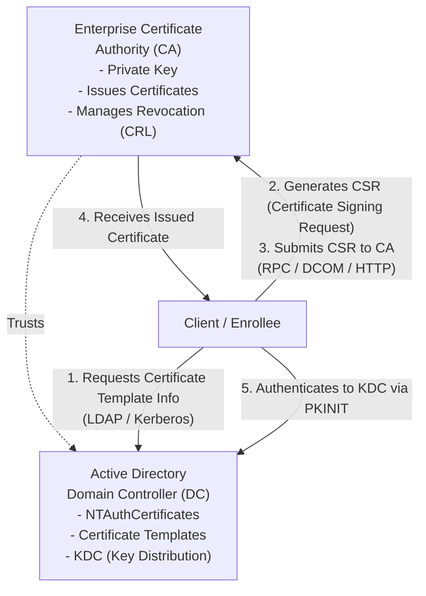

# 63.01 AD CS Architecture and Enumeration

## Executive Summary

Active Directory Certificate Services (AD CS) is Microsoft’s Public Key Infrastructure (PKI) implementation that provides everything necessary to issue, manage, renew, and revoke digital certificates. While primarily designed to enhance security (e.g., smart card authentication, code signing, encrypted file systems), misconfigurations within AD CS can lead to catastrophic domain-wide compromises. Understanding the underlying architecture and knowing how to enumerate it thoroughly is the foundational step before identifying vulnerabilities like ESC1, ESC2, etc.

## AD CS Architectural Overview

### The PKI Components in Active Directory



### 1. Enterprise Certificate Authority (CA)
An Enterprise CA is integrated with Active Directory. Unlike a Standalone CA, an Enterprise CA requires AD to function. It publishes its configuration, certificate templates, and the CA certificate itself to AD. The CA is responsible for verifying the identity of the requester based on AD authentication and issuing certificates according to predefined templates.

### 2. NTAuthCertificates Store
For a certificate to be used for Active Directory authentication (like Smart Card logon), the CA that issued the certificate must be trusted for authentication. This trust is established by publishing the CA's certificate to the `NTAuthCertificates` object in the AD configuration naming context (`CN=NTAuthCertificates,CN=Public Key Services,CN=Services,CN=Configuration,DC=domain,DC=local`). If an attacker compromises a CA whose cert is in this store, they can mint authentication certificates for any user.

### 3. Certificate Templates
Templates define the policies and rules for certificate issuance. They specify:
- **Extended Key Usage (EKU):** What the certificate can be used for (e.g., Client Authentication, Server Authentication, Code Signing).
- **Enrollment Permissions:** Who is allowed to read, enroll, or auto-enroll.
- **Subject Name Construction:** Whether the subject name is built from AD information (e.g., the user's `sAMAccountName`) or supplied in the request by the enrollee (critical for ESC1).
- **Issuance Requirements:** Whether manager approval or multiple signatures are required.

### 4. Enrollment Interfaces
Clients can interact with the CA through various interfaces:
- **MS-WCCE (Windows Client Certificate Enrollment Protocol):** Operates over RPC/DCOM (TCP 135 and dynamic ports). This is the standard mechanism for Windows domain-joined machines.
- **Web Enrollment:** HTTP/HTTPS interface often exposed at `/certsrv/`.
- **CES/CEP (Certificate Enrollment Web Services / Certificate Enrollment Policy Web Services):** Modern web-based enrollment.
- **NDES (Network Device Enrollment Service):** Implementation of SCEP, typically used for network devices and MDM solutions.

---

## The PKINIT Authentication Process

When a client uses a certificate for authentication, the process relies on the **PKINIT (Public Key Cryptography for Initial Authentication in Kerberos)** protocol.

1. **AS-REQ (Authentication Service Request):** The client sends an AS-REQ to the Key Distribution Center (KDC - running on a Domain Controller). Instead of encrypting the pre-authentication data with a password hash, the client signs a timestamp with their private key and includes their certificate.
2. **KDC Verification:** 
    - The KDC verifies the signature on the timestamp.
    - It checks if the certificate was issued by a CA in the `NTAuthCertificates` store.
    - It verifies the certificate chain, validity dates, and revocation status (CRL).
    - It maps the certificate to an AD user object (usually via the Subject Alternative Name (SAN) such as a User Principal Name (UPN)).
3. **AS-REP (Authentication Service Reply):** If valid, the KDC responds with an AS-REP containing the Ticket Granting Ticket (TGT), encrypted with a session key. The session key is encrypted with the client's public key (or derived via Diffie-Hellman, depending on the PKINIT variant).
4. **TGT Extraction:** The client decrypts the session key using their private key and retrieves the TGT, which can now be used for lateral movement.

---

## Enumeration Methodology

Active Directory Configuration Naming Context holds all the structural information about AD CS. Since standard domain users have read access to this partition, anyone can enumerate the entire PKI architecture.

### Key LDAP Objects
- **Enrollment Services:** `CN=Enrollment Services,CN=Public Key Services,CN=Services,CN=Configuration,DC=...`
  - Defines the CAs available in the domain.
- **Certificate Templates:** `CN=Certificate Templates,CN=Public Key Services,CN=Services,CN=Configuration,DC=...`
  - Contains all templates. Attributes like `msPKI-Certificate-Name-Flag` and `msPKI-Enrollment-Flag` dictate the security posture of the template.
- **NTAuthCertificates:** `CN=NTAuthCertificates...`
  - Defines which CAs are trusted for domain authentication.

### Tooling: Certipy

[Certipy](https://github.com/ly4k/Certipy) is the premier tool for Linux-based offensive AD CS enumeration and exploitation. It uses LDAP to pull down the configuration and highlights vulnerable templates based on known ESC (SpectreOps) attack paths.

```bash
# Basic Enumeration of all AD CS configurations
certipy find -u 'user@domain.local' -p 'password' -dc-ip 10.10.10.10 -vulnerable

# Output to stdout and save JSON/TXT files
certipy find -u 'user' -p 'password' -dc-ip 10.10.10.10 -stdout
```

**Key Certipy Output Elements:**
- **Certificate Authorities:** Identifies CA names, DNS names, and whether they are active.
- **Vulnerable Templates:** Flags ESC1, ESC2, ESC3, etc.
- **Permissions:** Shows who can enroll (`Enrollment Rights`) and who can modify templates or the CA itself (`Manage CA`, `Manage Certificates`).

### Tooling: Certify (Windows / C#)

[Certify](https://github.com/GhostPack/Certify) is the Windows equivalent, originally developed by SpecterOps.

```powershell
# Enumerate all vulnerable templates
Certify.exe find /vulnerable

# Enumerate CA configuration only
Certify.exe cas
```

### Tooling: BloodHound & Certipy Integration

Certipy can output BloodHound-compatible JSON files, mapping out the AD CS attack paths visually.

```bash
# Generate BloodHound data
certipy find -u 'user@domain.local' -p 'password' -dc-ip 10.10.10.10 -old-bloodhound
```
This generates a ZIP or JSON file that can be imported into BloodHound, displaying edges like `Enroll`, `WriteDacl`, `ManageCA`, making complex domain topologies instantly understandable.

---

## Defensive Considerations & OpSec

### OpSec during Enumeration
- **LDAP Queries:** Certipy and Certify rely heavily on large, complex LDAP queries targeting the Configuration partition. While standard users can perform these queries, excessive querying can trigger Advanced Threat Analytics (ATA) or Defender for Identity (MDI) alerts for LDAP Reconnaissance.
- **Traffic Patterns:** Tools query multiple sub-containers (`CN=Public Key Services,...`). Defending SOCs often profile standard LDAP queries vs. those made by offensive tools.

### Detection Engineering
1. **Audit Directory Service Changes:** Enable auditing on the `Public Key Services` container.
2. **Event ID 5136 (Directory Service Object Modified):** Monitor for changes to certificate templates, specifically the addition of `Enrollee Supplies Subject` flags or modification of DACLs.
3. **Event ID 4898:** Certificate Template modification events.
4. **LDAP Monitoring:** Alert on anomalous LDAP queries requesting specific AD CS attributes like `msPKI-Certificate-Name-Flag` in bulk.

## Summary of Misconfiguration Categories (ESC Paths)

Enumeration sets the stage for discovering the following common vulnerabilities:
- **[[02 - ESC1 - Misconfigured Certificate Templates]]:** Templates allowing SAN specification and Client Authentication.
- **[[03 - ESC2 - Any Purpose EKU Abuse]]:** Templates allowing any use, bypassing specific restrictions.
- **[[04 - ESC3 - Enrollment Agent Abuse]]:** Exploiting the Enrollment Agent EKU to request certs on behalf of others.
- **[[05 - ESC4 - Template Access Control Abuse]]:** Modifying insecure template ACLs.
- **ESC5:** Vulnerable PKI object permissions.
- **ESC6:** EDITF_ATTRIBUTESUBJECTALTNAME2 enabled on the CA.
- **ESC7:** Vulnerable CA Access Control.
- **ESC8:** NTLM Relay to AD CS Web Enrollment.

## Real-World Attack Scenario

**Context:** The attacker has just gained initial access to the internal network by compromising a standard user account (`jdoe`) via a phishing payload. The domain is `corp.local`. Seeking a rapid escalation path to Domain Admin, the attacker decides to investigate the environment for Active Directory Certificate Services (AD CS) misconfigurations, a commonly overlooked attack surface.

**Attacker Thought Process:**
1.  **Validate Access:** Ensure `jdoe` has standard domain read privileges.
2.  **Locate AD CS Infrastructure:** Query the Active Directory Configuration partition via LDAP to identify Enterprise Certificate Authorities (CAs).
3.  **Identify Vulnerable Templates:** Analyze published certificate templates, checking their Extended Key Usage (EKU) and enrollment permissions to map out known ESC (SpectreOps) attack paths.
4.  **Visualize the Attack Path:** Export the data into a format suitable for BloodHound to visually trace the exact steps needed to compromise a high-value target.

**Execution:**
The attacker establishes a SOCKS proxy into the network and runs `Certipy` from their attack infrastructure. They target the primary Domain Controller (`10.10.1.5`) to execute complex LDAP queries against the `Public Key Services` container.

```bash
# Enumerate all AD CS configurations and find vulnerable templates
certipy find -u 'jdoe@corp.local' -p 'P@ssw0rd123!' -dc-ip 10.10.1.5 -vulnerable -stdout

# Generate BloodHound compatible data for visual analysis
certipy find -u 'jdoe@corp.local' -p 'P@ssw0rd123!' -dc-ip 10.10.1.5 -old-bloodhound
```

**Outcome:**
The terminal output immediately reveals a CA server named `CORP-CA-01` and flags a custom template (`UserAuth-Legacy`) as vulnerable to ESC1 (Enrollee Supplies Subject). The attacker downloads the resulting `_BloodHound.zip` file, imports it into their local BloodHound GUI, and confirms that `Domain Users` have enrollment rights on `UserAuth-Legacy`. With this comprehensive map of the PKI architecture generated purely from standard LDAP queries, the attacker is now perfectly positioned to request a certificate on behalf of the Domain Administrator, setting the stage for a complete domain takeover.

## Chaining Opportunities
- **Initial Access -> Enumeration:** Use standard LDAP access obtained via LLMNR/NBT-NS poisoning or AS-REP Roasting to map the AD CS landscape.
- **Enumeration -> Exploitation:** The output of `certipy find` dictates the precise attack path, leading directly into ESC1 through ESC8 execution.

## Related Notes
- [[02 - ESC1 - Misconfigured Certificate Templates]]
- [[03 - ESC2 - Any Purpose EKU Abuse]]
- [[04 - ESC3 - Enrollment Agent Abuse]]
- [[05 - ESC4 - Template Access Control Abuse]]
- [[12 - BloodHound Data Analysis]]
- [[Kerberos Deep Dive]]
