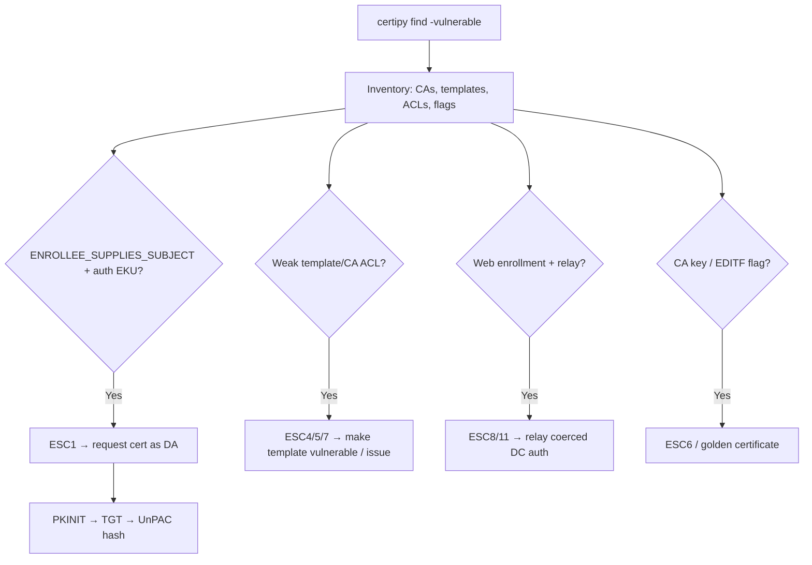

# 01 - AD CS Overview and Enumeration

## 1. Executive Summary

Active Directory Certificate Services (AD CS) is Microsoft's PKI — and one of the most productive modern AD attack surfaces. Certificates can be used for **authentication** (PKINIT/Schannel), so a misissued cert = impersonation of any user/computer, often **domain admin**, frequently from a low-priv user and **without touching a DC's LSASS**. The whole "ESC" family (ESC1–ESC16) lives here. Step one is always enumeration: find the CAs, the **enrollable templates**, and which of them are misconfigured. `Certipy find` (or Certify) does this and flags vulnerabilities automatically.

## 2. Service Overview & Architecture

A **Certificate Authority (CA)** (enterprise CA, an AD object under the PKI container) issues certs based on **certificate templates** (AD objects defining: who can enroll, EKUs, whether the **subject (SAN) is supplied by the requester**, whether manager approval/signatures are needed). Key concepts attackers care about:
- **EKU** (Extended Key Usage): `Client Authentication`, `Smart Card Logon`, `PKINIT Client Auth`, or **Any Purpose / no EKU / SubCA** → usable to authenticate.
- **`msPKI-Certificate-Name-Flag: ENROLLEE_SUPPLIES_SUBJECT`** → requester chooses the identity in the cert (the core of ESC1).
- **Enrollment rights** (template ACL) + **manager-approval / authorized-signatures** requirements.
- A cert that supports auth lets you request a **TGT via PKINIT** (Rubeus/Certipy) → then the user's NT hash via `UnPAC-the-hash`.

## 3. Enumeration

```bash
# Certipy (Linux) — the standard
certipy find -u user@domain -p 'Passw0rd' -dc-ip <dc> -stdout -vulnerable
certipy find -u user@domain -p 'Passw0rd' -dc-ip <dc> -bloodhound   # feed to BloodHound

# Certify (Windows)
Certify.exe find /vulnerable
Certify.exe cas            # list CAs + flags

# native
certutil -config "CA\CAName" -CAInfo
```
BloodHound (CE / with ADCS edges) shows certificate attack paths graphically.

## 4. What Enumeration Reveals (triage)

- **Enrollable templates with client-auth EKU + ENROLLEE_SUPPLIES_SUBJECT + no approval** → **ESC1** (see [[02 - AD CS Escalation Vulnerable Template Misconfigurations]]).
- **Any Purpose / SubCA / no EKU** templates → ESC2/ESC3-style abuse.
- **Weak template/PKI-object/CA ACLs** → ESC4/ESC5/ESC7 ([[03 - AD CS Escalation Access Control and CA Misconfiguration]]).
- **`EDITF_ATTRIBUTESUBJECTALTNAME2` on CA** → ESC6.
- **Web/RPC enrollment endpoints enabled** → ESC8/ESC11 relay ([[04 - AD CS NTLM Relay ESC8 and Coercion]]).
- **CA private key reachable / certs on disk** → theft + golden certificate ([[05 - AD CS Certificate Theft Golden Certificate and Persistence]]).

## 5. Mermaid Attack Flow



## 6. Post-Exploitation Direction
Any successful path yields a certificate → authenticate via PKINIT/Schannel → TGT → optionally extract the NT hash. The rest of the A-83 ADCS notes cover each ESC family.

## 7. Defense & Hardening
1. Run `certipy find -vulnerable` / PSPKIAudit yourself — inventory and remediate templates first.
2. Remove `ENROLLEE_SUPPLIES_SUBJECT` from auth-capable templates; require manager approval/authorized signatures; tighten template + CA + PKI-container ACLs.
3. Enable CA auditing + Certificate Services event logging; monitor `Certificate Services` events (4886/4887), enforce strong certificate mapping (KB5014754).

## 8. Chaining Opportunities
- Feeds every other ADCS note (02–05); pairs with coercion ([[04 - AD CS NTLM Relay ESC8 and Coercion]]).
- PKINIT/UnPAC-the-hash hands off to classic credential attacks in A-36.

## 9. Related Notes
- A-36 classics: **[[15 - DCSync Attack]]**, **[[09 - Golden Ticket Attack]]**. Enumeration base: **[[02 - AD Enumeration]]** (A-36).
- Network LDAP/Kerberos: **[[08 - LDAP (Ports 389-636) Pentesting]]**, **[[09 - Kerberos (Port 88) Pentesting]]**.

## 10. Tools
`certipy`, `Certify.exe`, `certutil`, `PSPKIAudit`, `BloodHound` (ADCS edges), `Rubeus` (PKINIT).
