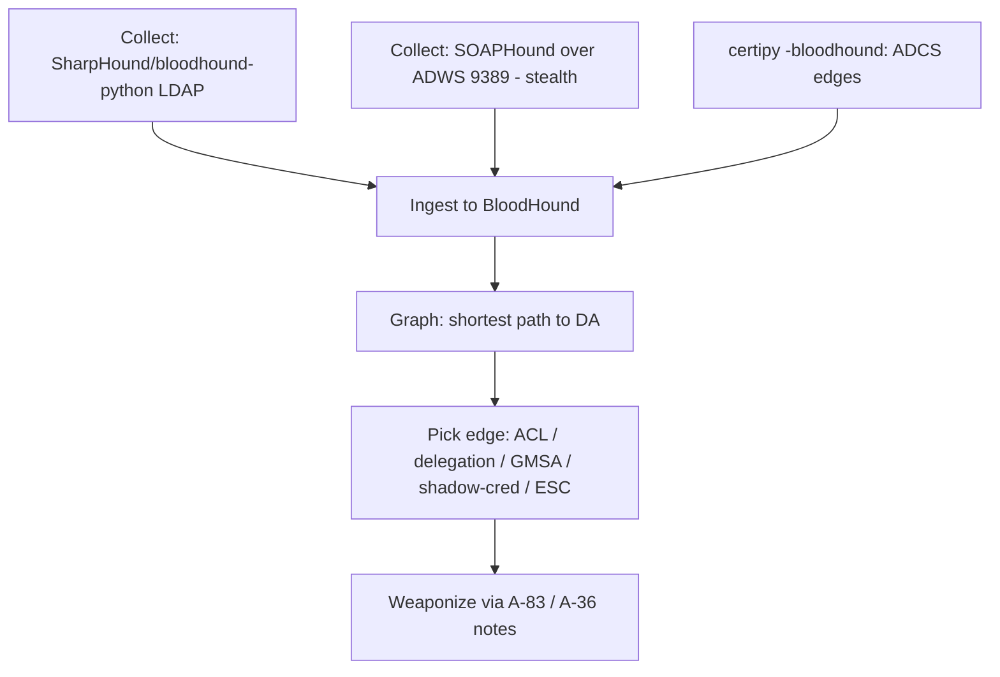

# 18 - ADWS Enumeration and BloodHound

## 1. Executive Summary

Enumeration is the backbone of every AD attack — you can't escalate what you can't see. **BloodHound** turns raw AD data into an **attack graph** (shortest path to Domain Admins, ACL edges, delegation, ADCS, Kerberoast targets). Classic collectors hammer **LDAP (389/636)**, which mature defenders monitor. **ADWS** (Active Directory Web Services, **TCP 9389**, the protocol behind the AD PowerShell module) is an alternative, less-monitored query channel; **SOAPHound** collects BloodHound-compatible data over ADWS to **evade LDAP-based detection**. This note covers modern collection + graph analysis to find the paths the rest of A-83/A-36 weaponize.

## 2. Concept Overview

AD exposes its directory via **LDAP** and via **ADWS** (SOAP/.NET over 9389, used by `Get-AD*` cmdlets). BloodHound ingests collected JSON (users, groups, sessions, ACLs, GPOs, certificates, delegation) and computes attack paths. Collecting over ADWS (SOAPHound) produces the same graph data while avoiding heavy LDAP query signatures.

## 3. Enumeration / Collection

```bash
# BloodHound CE collector (LDAP)
bloodhound-python -u user -p pw -d domain -dc <dc> -c All --zip
SharpHound.exe -c All --zipfilename loot       # Windows

# ADWS-based (stealthier) — SOAPHound
SOAPHound.exe --user domain\\user --password pw --dc dc01 -c -o output   # BloodHound-compatible
#   ADWS = TCP 9389

# Certipy → BloodHound ADCS data
certipy find -u user@domain -p pw -dc-ip <dc> -bloodhound
```

## 4. Analysis / What to Hunt

- **Shortest path to Domain Admins**; **Kerberoastable**/**ASREProastable** users; **ReadGMSAPassword** ([[11 - Reading GMSA and DMSA Passwords]]); **AddKeyCredentialLink** ([[06 - Shadow Credentials msDS-KeyCredentialLink Abuse]]).
- **ACL edges** (GenericAll/WriteDacl/WriteOwner/ForceChangePassword) → [[17 - ACL Abuse]] (A-36); **delegation** (Unconstrained/Constrained/RBCD) → A-83 notes 07-09; **DCSync** rights; **ADCS** edges (ESC paths).
- **Sessions** (where admins are logged in → token theft targets); **trust edges** for forest escalation.

```cypher
MATCH p=shortestPath((u:User {owned:true})-[*1..]->(g:Group {name:"DOMAIN ADMINS@DOMAIN"})) RETURN p
```

## 5. Mermaid Attack Flow



## 6. Operational Notes
- Run collection from a context that won't trip honeytokens; ADWS path avoids the most-watched LDAP queries but ADWS itself can be logged.

## 7. Post-Recon Direction
- Every identified edge maps to a specific exploitation note; BloodHound is the planning layer for the whole module.

## 8. Defense & Hardening
1. Monitor/limit bulk LDAP **and ADWS (9389)** queries; deploy **honeytoken** accounts/objects that alert on enumeration.
2. Reduce attack paths proactively (run BloodHound defensively): trim ACLs, delegation, stale admin sessions, ADCS misconfigs.
3. Tier admin sessions (limit where DAs log on → fewer session edges); alert on SharpHound/SOAPHound indicators.

## 9. Chaining & Related Notes
- Feeds essentially every A-83 + A-36 attack; base enumeration: **[[02 - AD Enumeration]]**, **[[23 - BloodHound — Attack Path Analysis]]** (A-36).
- Network LDAP layer: **[[08 - LDAP (Ports 389-636) Pentesting]]**.

## 10. Tools
`SharpHound`, `bloodhound-python`, `SOAPHound`, `BloodHound CE`, `certipy -bloodhound`, `ldapdomaindump`.
